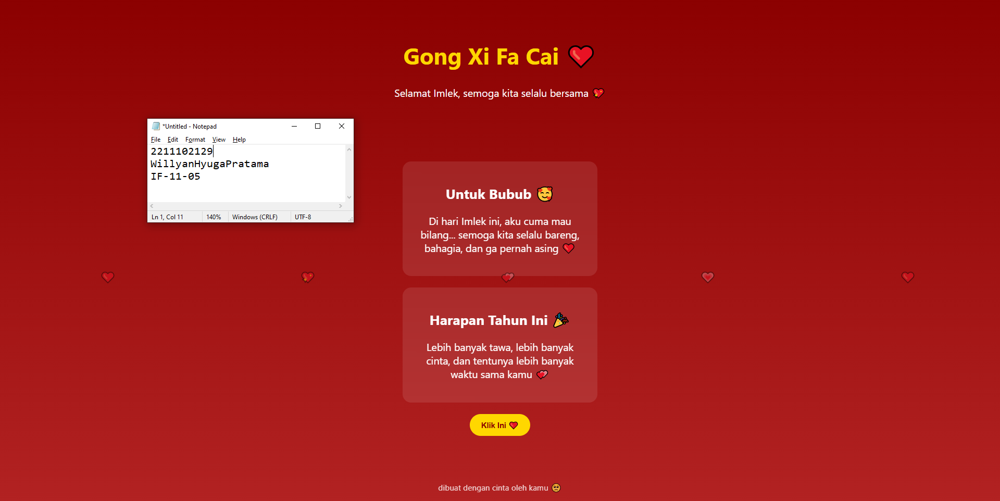

<div align="center">
  <br />
  <h1>LAPORAN PRAKTIKUM <br> APLIKASI BERBASIS PLATFORM </h1>
  <br />
  <h3>MODUL 3 <br> CSS </h3>
  <br />
  
  <br />
  <br />
  <br />
  <h3>Disusun Oleh :</h3>
  <p>
    <strong>Willyan Hyuga Pratama</strong>
    <br>
    <strong>2211102129</strong>
    <br>
    <strong>S1 IF-11-REG05</strong>
  </p>
  <br />
  <h3>Dosen Pengampu :</h3>
  <p>
    <strong>Dedi Agung Prabowo, S.Kom., M.Kom</strong>
  </p>
  <br />
  <br />
  <h4>Asisten Praktikum :</h4>
  <strong>Apri Pandu Wicaksono </strong>
  <br>
  <strong>Hamka Zaenul Ardi</strong>
  <br />
  <h3>LABORATORIUM HIGH PERFORMANCE <br>FAKULTAS INFORMATIKA <br>UNIVERSITAS TELKOM PURWOKERTO <br>2026 </h3>
</div>

<hr>

# Dasar Teori CSS (Cascading Style Sheets)

Cascading Style Sheets atau CSS adalah bahasa yang digunakan untuk mengatur tampilan dan desain dari halaman HTML. CSS memungkinkan pengembang untuk mengatur warna, ukuran, layout, animasi, dan berbagai aspek visual lainnya. Dengan CSS, tampilan website dapat dibuat lebih menarik tanpa mengubah struktur HTML.

Dalam project ini digunakan konsep pure CSS, yaitu penggunaan CSS tanpa bantuan JavaScript maupun framework seperti Bootstrap atau Tailwind. Hal ini bertujuan untuk melatih pemahaman dasar dalam styling serta meningkatkan kemampuan dalam membuat desain yang responsif dan interaktif hanya dengan CSS.

Selain itu, digunakan juga konsep animasi dalam CSS seperti @keyframes yang memungkinkan pembuatan efek gerak, misalnya animasi hati yang melayang. Properti seperti transition dan transform digunakan untuk memberikan efek interaktif ketika pengguna berinteraksi dengan elemen seperti tombol atau card.

Tema yang digunakan dalam project ini adalah perayaan Imlek yang identik dengan warna merah dan emas sebagai simbol keberuntungan, kebahagiaan, dan kemakmuran. Penggabungan tema budaya dengan konsep desain “bucin” (romantis) bertujuan untuk menciptakan tampilan yang menarik sekaligus memiliki nilai estetika dan emosional.

Dengan memanfaatkan HTML dan CSS secara optimal, halaman web sederhana dapat dikembangkan menjadi tampilan yang menarik, interaktif, dan bermakna tanpa memerlukan teknologi tambahan.

## Task 3: Project Bucin (Edisi Imlek)
### Souce code - html
```html
<!DOCTYPE html>
<html lang="id">
<head>
<meta charset="UTF-8">
<meta name="viewport" content="width=device-width, initial-scale=1.0">
<title>Imlek Bucin ❤️</title>
<link rel="stylesheet" href="style.css">
</head>
<body>

<header>
    <h1>Gong Xi Fa Cai ❤️</h1>
    <p>Selamat Imlek, semoga kita selalu bersama 💖</p>
</header>

<div class="container">

    <div class="card">
        <h2>Untuk Bubub 🥰</h2>
        <p>
            Di hari Imlek ini, aku cuma mau bilang...  
            semoga kita selalu bareng, bahagia, dan ga pernah asing ❤️
        </p>
    </div>

    <div class="card">
        <h2>Harapan Tahun Ini 🎉</h2>
        <p>
            Lebih banyak tawa, lebih banyak cinta,  
            dan tentunya lebih banyak waktu sama kamu 💕
        </p>
    </div>

    <button class="btn">Klik Ini ❤️</button>

</div>

<div class="heart" style="left:10%">❤️</div>
<div class="heart" style="left:30%">💖</div>
<div class="heart" style="left:50%">💕</div>
<div class="heart" style="left:70%">💗</div>
<div class="heart" style="left:90%">❤️</div>

<footer>
    dibuat dengan cinta oleh kamu 🥺
</footer>

</body>
</html>
```

### Source code - css

```css
body {
        margin: 0;
        font-family: 'Segoe UI', sans-serif;
        background: linear-gradient(to bottom, #8B0000, #B22222);
        color: #fff;
        text-align: center;
    }

    header {
        padding: 50px 20px;
    }

    h1 {
        font-size: 40px;
        color: gold;
    }

    p {
        font-size: 18px;
    }

    .container {
        padding: 20px;
    }

    .card {
        background: rgba(255,255,255,0.1);
        border-radius: 15px;
        padding: 20px;
        margin: 20px auto;
        width: 300px;
        backdrop-filter: blur(10px);
        transition: transform 0.3s;
    }

    .card:hover {
        transform: scale(1.05);
    }

    .btn {
        background: gold;
        color: #8B0000;
        padding: 10px 20px;
        border: none;
        border-radius: 20px;
        cursor: pointer;
        font-weight: bold;
    }

    .btn:hover {
        background: orange;
    }

    /* animasi hati */
    .heart {
        position: fixed;
        bottom: -50px;
        font-size: 20px;
        animation: floatUp 5s linear infinite;
    }

    @keyframes floatUp {
        0% {
            transform: translateY(0);
            opacity: 1;
        }
        100% {
            transform: translateY(-100vh);
            opacity: 0;
        }
    }

    footer {
        margin-top: 40px;
        padding: 20px;
        font-size: 14px;
        opacity: 0.8;
    }
```

Output:


# Penjelasan
Website ini merupakan halaman sederhana bertema perayaan Imlek yang dibuat menggunakan HTML dan pure CSS untuk menampilkan ucapan romantis dengan desain bernuansa merah dan emas. Halaman ini juga dilengkapi animasi dan efek interaktif untuk memberikan kesan menarik tanpa menggunakan JavaScript atau framework tambahan.