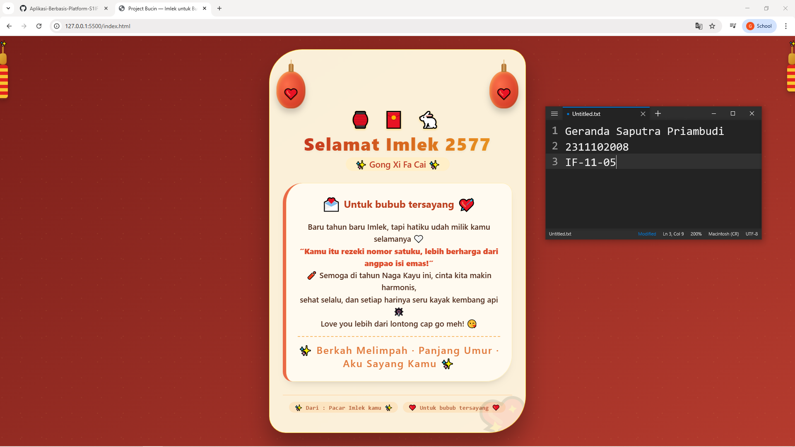

<div align="center">
  <br />
  <h1>LAPORAN PRAKTIKUM <br> APLIKASI BERBASIS PLATFORM </h1>
  <br />
  <h3>MODUL 3 <br> CSS </h3>
  <br />
  
  <br />
  <br />
  <br />
  <h3>Disusun Oleh :</h3>
  <p>
    <strong>Geranada Saputra Priambudi</strong>
    <br>
    <strong>2311102008</strong>
    <br>
    <strong>S1 IF-11-REG05</strong>
  </p>
  <br />
  <h3>Dosen Pengampu :</h3>
  <p>
    <strong>Dedi Agung Prabowo, S.Kom., M.Kom</strong>
  </p>
  <br />
  <br />
  <h4>Asisten Praktikum :</h4>
  <strong>Apri Pandu Wicaksono </strong>
  <br>
  <strong>Hamka Zaenul Ardi</strong>
  <br />
  <h3>LABORATORIUM HIGH PERFORMANCE <br>FAKULTAS INFORMATIKA <br>UNIVERSITAS TELKOM PURWOKERTO <br>2026 </h3>
</div>

<hr>

# Dasar Teori CSS (Cascading Style Sheets)

CSS (Cascading Style Sheets) adalah bahasa stylesheet yang digunakan untuk mengatur tampilan dan format dokumen yang ditulis dalam bahasa markup seperti HTML. CSS bertanggung jawab untuk aspek visual halaman web, termasuk tata letak, warna, font, spasi, animasi, dan responsivitas.

## Cara Kerja CSS
Parsing HTML → Membangun DOM Tree (Document Object Model)

Parsing CSS → Membangun CSSOM Tree (CSS Object Model)

Menggabungkan DOM + CSSOM → Render Tree

Layout (menghitung posisi dan ukuran setiap elemen)

Painting (mengisi pixel ke layar)


## Task 3: Project Bucin (Edisi Imlek)
### Souce code - html
```html
<!DOCTYPE html>
<html lang="id">

<head>
  <meta charset="UTF-8">
  <meta name="viewport" content="width=device-width, initial-scale=1.0, user-scalable=yes">
  <title>Project Bucin — Imlek untuk Bubub 🤍</title>
  <link rel="stylesheet" href="style.css">
</head>

<body>
  <div class="firecracker-left">
    <div class="cracker cracker-left">
      <div class="cracker-fuse"></div>
      <div class="cracker-top"></div>
      <div class="cracker-body">
        <div class="cracker-piece"></div>
        <div class="cracker-piece"></div>
        <div class="cracker-piece"></div>
        <div class="cracker-piece"></div>
        <div class="cracker-piece"></div>
      </div>
    </div>
  </div>

  <div class="firecracker-right">
    <div class="cracker cracker-right">
      <div class="cracker-fuse"></div>
      <div class="cracker-top"></div>
      <div class="cracker-body">
        <div class="cracker-piece"></div>
        <div class="cracker-piece"></div>
        <div class="cracker-piece"></div>
        <div class="cracker-piece"></div>
      </div>
    </div>
  </div>

  <div class="card">
    <div class="lanterns">
      <div class="lantern lantern-left">
        <div class="lantern-rope"></div>
      </div>
      <div class="lantern lantern-right">
        <div class="lantern-rope"></div>
      </div>
    </div>

    <div class="imlek-header">
      <div class="ornament">🏮 🧧 🐇</div>
      <h1>Selamat Imlek 2577</h1>
      <div class="sub">✨ Gong Xi Fa Cai ✨</div>
    </div>

    <div class="love-letter">
      <div class="greeting">
        <span>💌</span> Untuk bubub tersayang <span>💘</span>
      </div>
      <div class="bucin-message">
        Baru tahun baru Imlek, tapi hatiku udah milik kamu selamanya 🤍<br>
        <strong>“Kamu itu rezeki nomor satuku, lebih berharga dari angpao isi emas!”</strong><br>
        🧨 Semoga di tahun Naga Kayu ini, cinta kita makin harmonis,<br>
        sehat selalu, dan setiap harinya seru kayak kembang api 🎆<br>
        Love you lebih dari lontong cap go meh! 😘
      </div>
      <div class="indonesian-bless">
        ✨ Berkah Melimpah · Panjang Umur · Aku Sayang Kamu ✨
      </div>
    </div>

    <div class="footer-bucin">
      <span class="stamp">✨ Dari : Pacar Imlek kamu ✨</span>
      <span class="stamp">❤️ Untuk bubub tersayang ❤️</span>
    </div>
  </div>

</body>

</html>
```

### Source code - css

```css
* {
  margin: 0;
  padding: 0;
  box-sizing: border-box;
  user-select: none;
}

body {
  min-height: 100vh;
  background: linear-gradient(145deg, #7a1f1a 0%, #b53b2e 100%);
  font-family: 'Segoe UI', 'Poppins', 'Quicksand', system-ui, -apple-system, 'Microsoft YaHei', sans-serif;
  display: flex;
  justify-content: center;
  align-items: center;
  padding: 1.5rem;
  position: relative;
  overflow-x: hidden;
}

body::before {
  content: "";
  position: fixed;
  top: 0;
  left: 0;
  width: 100%;
  height: 100%;
  background-image: radial-gradient(circle at 10% 20%, rgba(255, 215, 140, 0.08) 2%, transparent 2.5%),
    radial-gradient(circle at 80% 70%, rgba(255, 200, 100, 0.1) 1.8%, transparent 2%);
  background-size: 48px 48px, 62px 62px;
  pointer-events: none;
  z-index: 0;
}

.card {
  position: relative;
  max-width: 620px;
  width: 100%;
  background: rgba(255, 248, 225, 0.96);
  backdrop-filter: blur(2px);
  border-radius: 80px 40px 90px 40px;
  box-shadow: 0 35px 55px rgba(0, 0, 0, 0.3), inset 0 1px 4px rgba(255, 245, 210, 0.8);
  padding: 2rem 2rem 3rem 2rem;
  transition: all 0.2s ease;
  border: 1px solid rgba(255, 215, 0, 0.7);
  z-index: 10;
  overflow: hidden;
}

.card::after {
  content: "💖";
  font-size: 100px;
  font-family: 'Segoe UI', sans-serif;
  position: absolute;
  bottom: -25px;
  right: -15px;
  opacity: 0.1;
  color: #d43b1c;
  transform: rotate(-10deg);
  pointer-events: none;
}

    // Selebihnya dapat cek pada file "style.css"
```
🔗 [Klik di sini untuk membuka file `style.css`](./style.css)


Output:


# Penjelasan
Website ini adalah halaman ucapan Imlek bergaya "bucin" (budak cinta) yang sepenuhnya menggunakan pure CSS tanpa JavaScript maupun framework. Halaman ini menampilkan pesan romantis untuk pasangan dengan elemen-elemen khas Imlek seperti lampion berayun (menggunakan animasi CSS @keyframes), petasan hiasan, koin melayang, serta kartu ucapan dengan gradien warna merah-emas yang hangat. Seluruh interaksi visual seperti efek hover pada kartu ucapan dan animasi apung pada koin dihasilkan murni dari CSS, menjadikannya contoh penerapan konsep Box Model, Flexbox, Positioning, Transition, serta Media Queries untuk tampilan responsif di berbagai perangkat.