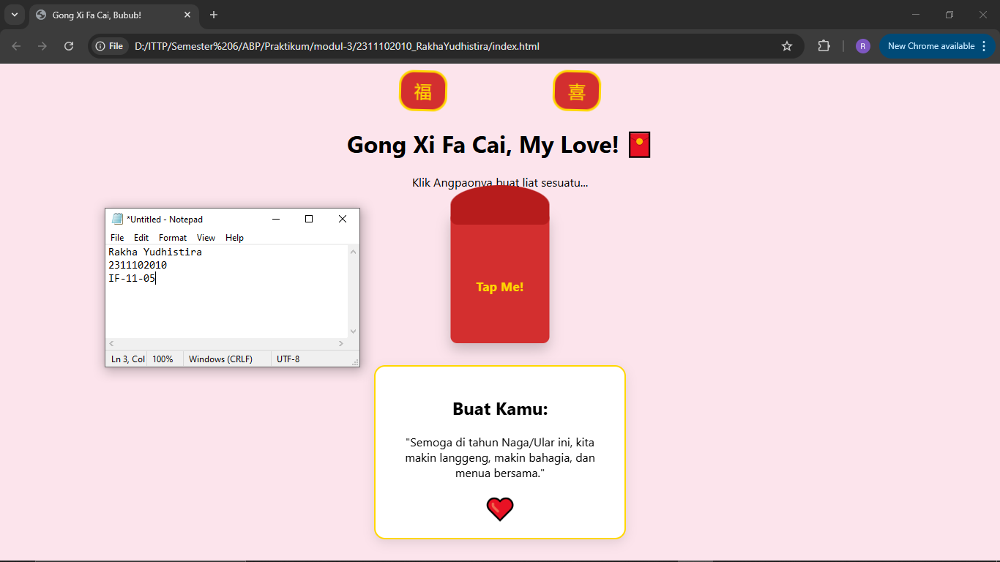

# Modul 3 

<div align="center">
  <br />
  <h1>LAPORAN PRAKTIKUM <br> APLIKASI BERBASIS PLATFORM </h1>
  <br />
  <h3>MODUL 3 <br> CSS </h3>
  <br />
  
  <br />
  <br />
  <br />
  <h3>Disusun Oleh :</h3>
  <p>
    <strong>Rakha Yudhistira</strong>
    <br>
    <strong>2311102010</strong>
    <br>
    <strong>S1 IF-11-REG05</strong>
  </p>
  <br />
  <h3>Dosen Pengampu :</h3>
  <p>
    <strong>Dedi Agung Prabowo, S.Kom., M.Kom</strong>
  </p>
  <br />
  <br />
  <h4>Asisten Praktikum :</h4>
  <strong>Apri Pandu Wicaksono </strong>
  <br>
  <strong>Hamka Zaenul Ardi</strong>
  <br />
  <h3>LABORATORIUM HIGH PERFORMANCE <br>FAKULTAS INFORMATIKA <br>UNIVERSITAS TELKOM PURWOKERTO <br>2026 </h3>
</div>

<hr>

# Dasar Teori

<p align="justify">
Cascading Style Sheets (CSS) adalah bahasa pemrograman yang digunakan untuk mengatur tampilan dan tata letak elemen pada dokumen HTML. Fungsi utamanya adalah memisahkan konten (struktur) dari desain (presentasi), sehingga pengembang dapat mengelola estetika situs secara terpusat. CSS bekerja dengan sistem Selector dan Declaration, di mana aturan gaya diterapkan pada elemen tertentu melalui properti dan nilai yang spesifik.

</p>

<p align="justify">
Dalam penerapannya, CSS menggunakan konsep Cascading dan Specificity untuk menentukan prioritas aturan jika terjadi konflik gaya pada satu elemen. Selain itu, setiap elemen dalam CSS diatur oleh prinsip Box Model, yang terdiri dari content, padding, border, dan margin. Untuk pengaturan tata letak yang kompleks dan responsif, CSS menyediakan modul modern seperti Flexbox dan Grid, serta fitur Pseudo-classes (seperti :hover atau :checked) yang memungkinkan pembuatan interaksi antarmuka tanpa memerlukan bantuan JavaScript.
</p>

# Source Code HTML
```
<!DOCTYPE html>
<html lang="id">
<head>
    <meta charset="UTF-8">
    <meta name="viewport" content="width=device-width, initial-scale=1.0">
    <title>Gong Xi Fa Cai, Bubub!</title>
    <link rel="stylesheet" href="style.css">
</head>
<body>
    <div class="container">
        <div class="lantern-box">
            <div class="lantern">福</div>
            <div class="lantern">喜</div>
        </div>

        <h1>Gong Xi Fa Cai, My Love! 🧧</h1>
        <p>Klik Angpaonya buat liat sesuatu...</p>

        <input type="checkbox" id="open-angpao">
        <label for="open-angpao" class="angpao">
            <div class="angpao-top"></div>
            <div class="angpao-body">Tap Me!</div>
        </label>

        <div class="secret-message">
            <h2>Buat Kamu:</h2>
            <p>"Semoga di tahun Naga/Ular ini, kita makin langgeng, makin bahagia, dan menua bersama."</p>
            <div class="heart">❤️</div>
        </div>
    </div>
</body>
</html>

```

# Source Code CSS

```
:root {
    --chinese-red: #d32f2f;
    --gold: #ffd700;
}

body {
    background-color: #fce4ec;
    display: flex;
    justify-content: center;
    align-items: center;
    height: 100vh;
    margin: 0;
    font-family: 'Segoe UI', Tahoma, Geneva, Verdana, sans-serif;
    overflow: hidden;
}

.container {
    text-align: center;
}

/* --- Lampion Style --- */
.lantern-box {
    display: flex;
    justify-content: space-around;
    margin-bottom: 20px;
}

.lantern {
    background-color: var(--chinese-red);
    width: 60px;
    height: 50px;
    border-radius: 20px;
    border: 3px solid var(--gold);
    color: var(--gold);
    font-size: 24px;
    line-height: 50px;
    position: relative;
    animation: swing 3s ease-in-out infinite;
}

@keyframes swing {
    0%, 100% { transform: rotate(-10deg); }
    50% { transform: rotate(10deg); }
}

/* --- Angpao (The Interaction) --- */
#open-angpao {
    display: none; /* Sembunyikan checkbox */
}

.angpao {
    display: block;
    width: 150px;
    height: 200px;
    background-color: var(--chinese-red);
    margin: 20px auto;
    border-radius: 10px;
    cursor: pointer;
    position: relative;
    transition: transform 0.3s;
    box-shadow: 0 10px 20px rgba(0,0,0,0.2);
}

.angpao-top {
    width: 150px;
    height: 60px;
    background-color: #b71c1c;
    border-radius: 10px 10px 50% 50%;
    position: absolute;
    top: 0;
    transition: 0.5s;
    z-index: 2;
}

.angpao-body {
    color: var(--gold);
    padding-top: 100px;
    font-weight: bold;
    font-size: 1.2rem;
}

/* --- Animasi Saat Angpao Diklik --- */
#open-angpao:checked + .angpao .angpao-top {
    transform: translateY(-40px) rotateX(180deg);
}

#open-angpao:checked + .angpao {
    transform: scale(0.9);
}

/* --- Pesan Rahasia Muncul --- */
.secret-message {
    opacity: 0;
    transform: translateY(20px);
    transition: 0.8s;
    padding: 20px;
    background: white;
    border-radius: 15px;
    border: 2px solid var(--gold);
    box-shadow: 0 5px 15px rgba(0,0,0,0.1);
    max-width: 300px;
    margin: 20px auto;
}

#open-angpao:checked ~ .secret-message {
    opacity: 1;
    transform: translateY(0);
}

.heart {
    color: red;
    font-size: 2rem;
    animation: pulse 1s infinite;
}

@keyframes pulse {
    0%, 100% { transform: scale(1); }
    50% { transform: scale(1.2); }
}

```


# Screenshoot Program



# Penjelasan
<p align="justify">

Implementasi Project Bucin ini menggunakan teknik Checkbox Hack, di mana elemen `<input type="checkbox">` yang tersembunyi berfungsi sebagai saklar logika untuk menggantikan JavaScript. Interaksi dipicu melalui elemen `<label>` yang, saat diklik, mengubah status checkbox menjadi :checked. Perubahan status ini kemudian ditangkap oleh CSS menggunakan sibling selector (~) untuk menggerakkan elemen, seperti memutar tutup amplop dengan properti transform dan menampilkan pesan rahasia melalui manipulasi opacity.

Secara visual, struktur ini memanfaatkan prinsip CSS Box Model dan Absolute Positioning untuk menyusun lapisan komponen dengan presisi. Estetika Imlek diperkuat melalui penggunaan variabel warna merah-emas serta CSS Animations (@keyframes) untuk memberikan efek dinamis pada lampion dan ikon hati. Dengan menggabungkan transisi halus dan selektor status, halaman ini mampu menciptakan pengalaman interaktif yang hidup hanya dengan mengandalkan kemampuan murni dari mesin render CSS.
</p>