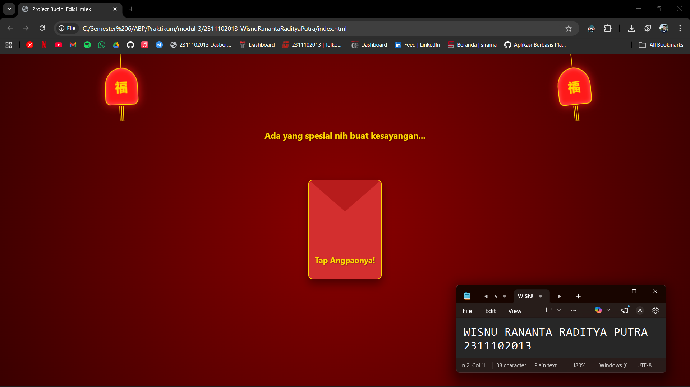
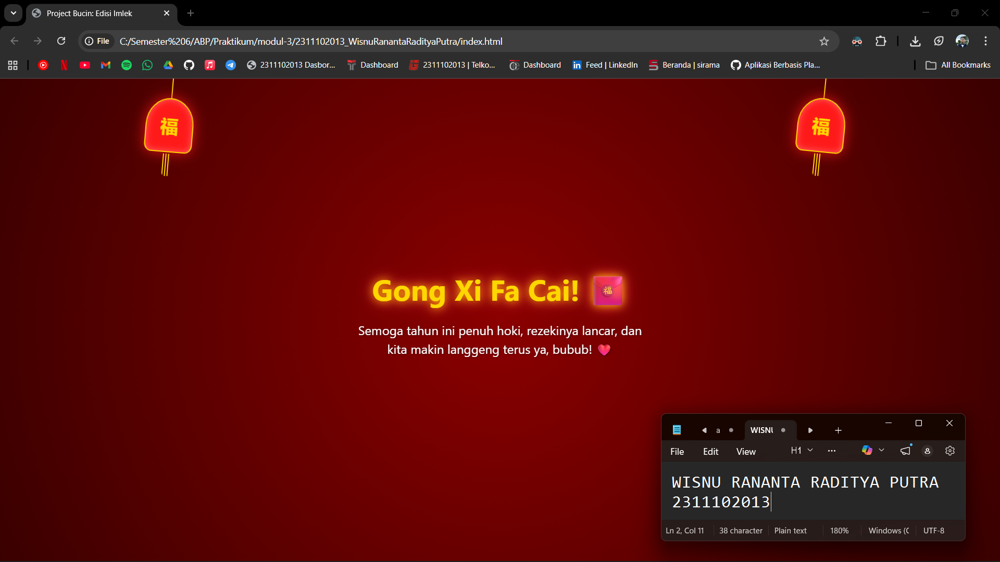

<div align="center">
  <br />
  <h1>LAPORAN PRAKTIKUM <br> APLIKASI BERBASIS PLATFORM </h1>
  <br />
  <h3>MODUL 3 <br> CSS </h3>
  <br />
  
  <br />
  <br />
  <br />
  <h3>Disusun Oleh :</h3>
  <p>
    <strong>Wisnu Rananta Raditya Putra</strong>
    <br>
    <strong>2311102013</strong>
    <br>
    <strong>S1 IF-11-REG05</strong>
  </p>
  <br />
  <h3>Dosen Pengampu :</h3>
  <p>
    <strong>Dedi Agung Prabowo, S.Kom., M.Kom</strong>
  </p>
  <br />
  <br />
  <h4>Asisten Praktikum :</h4>
  <strong>Apri Pandu Wicaksono </strong>
  <br>
  <strong>Hamka Zaenul Ardi</strong>
  <br />
  <h3>LABORATORIUM HIGH PERFORMANCE <br>FAKULTAS INFORMATIKA <br>UNIVERSITAS TELKOM PURWOKERTO <br>2026 </h3>
</div>

<hr>

# Dasar Teori CSS (Cascading Style Sheets)

<p align="justify">

CSS (Cascading Style Sheets) adalah bahasa yang digunakan untuk mengatur tampilan halaman web seperti warna, font, dan tata letak, sehingga memisahkan desain dari struktur HTML. CSS dapat diterapkan melalui inline, internal, atau external stylesheet, dengan sintaks yang terdiri dari selector, property, dan value. Selector digunakan untuk menargetkan elemen tertentu seperti tag, class, atau id. Dalam penggunaannya, CSS memiliki konsep penting seperti box model (content, padding, border, margin), layout (flexbox, grid, position), serta cascading dan specificity untuk menentukan prioritas gaya. Selain itu, CSS juga mendukung responsive design dengan media queries agar tampilan menyesuaikan berbagai ukuran layar, serta menyediakan fitur tambahan seperti pseudo-class, pseudo-element, animasi, dan berbagai satuan ukuran untuk meningkatkan fleksibilitas desain web.
</p>

## Cara Menggunakan CSS

<p align="justify">

Cara menggunakan CSS pada website adalah dengan menghubungkannya ke HTML untuk mengatur tampilan elemen seperti warna, ukuran, dan tata letak. CSS dapat diterapkan melalui tiga cara, yaitu inline CSS yang ditulis langsung pada tag HTML, internal CSS yang diletakkan di dalam tag ``<style>`` pada bagian ``<head>``, dan external CSS yang menggunakan file terpisah (cara ini paling disarankan karena lebih rapi dan bisa digunakan berulang). Dalam penggunaannya, CSS bekerja dengan konsep selector, property, dan value, di mana selector digunakan untuk memilih elemen HTML, lalu property menentukan apa yang ingin diubah, dan value menentukan nilainya. Dengan CSS, kita bisa membuat tampilan website menjadi lebih menarik, terstruktur, dan responsif sesuai ukuran layar perangkat.

</p>

## Contoh CSS

```css
p {
  color: green;
}
```

## Task 3: Project Bucin (Edisi Imlek)
### Souce code - html
```html
<!DOCTYPE html>
<html lang="id">
<head>
    <meta charset="UTF-8">
    <meta name="viewport" content="width=device-width, initial-scale=1.0">
    <title>Project Bucin: Edisi Imlek</title>
    <link rel="stylesheet" href="style.css">
</head>
<body>

    <!-- Lampion -->
    <div class="lantern left">
        <div class="wire"></div>
        <div class="lantern-body">福</div>
        <div class="tassel"></div>
    </div>
    <div class="lantern right">
        <div class="wire"></div>
        <div class="lantern-body">福</div>
        <div class="tassel"></div>
    </div>

    <div class="container">
        <input type="checkbox" id="tap-trigger">
        
        <!-- Teks pengantar sebelum angpao ditap -->
        <div class="intro-text">
            <p>Ada yang spesial nih buat kesayangan...</p>
        </div>

        <label for="tap-trigger" class="angpao">
            <div class="angpao-flap"></div>
            <span class="tap-text">Tap Angpaonya!</span>
        </label>

        <div class="message">
            <h1>Gong Xi Fa Cai! 🧧</h1>
            <p>Semoga tahun ini penuh hoki, rezekinya lancar, dan kita makin langgeng terus ya, bubub! ❤️</p>
        </div>
    </div>

</body>
</html>
```

### Source code - css

```css
/* Background */
body {
    margin: 0;
    padding: 0;
    display: flex;
    justify-content: center;
    align-items: center;
    height: 100vh;
    background: radial-gradient(circle at center, #8b0000 0%, #3a0000 100%);
    font-family: 'Segoe UI', Tahoma, Geneva, Verdana, sans-serif;
    overflow: hidden;
}

.container {
    position: relative;
    text-align: center;
    width: 100%;
    height: 100%;
    display: flex;
    flex-direction: column;
    justify-content: center;
    align-items: center;
}

/* Sembunyikan trigger */
#tap-trigger {
    display: none;
}

/* Lampion */
.lantern {
    position: absolute;
    top: -10px;
    z-index: 0;
    display: flex;
    flex-direction: column;
    align-items: center;
    transform-origin: top center;
    animation: sway 3s ease-in-out infinite;
}

/* Posisi lampion */
.lantern.left { left: 15%; animation-delay: 0.5s; }
.lantern.right { right: 15%; animation-delay: 0s; }

/* Tali lampion */
.wire {
    width: 2px;
    height: 40px;
    background: #ffd700;
}

/* Badan lampion */
.lantern-body {
    width: 70px;
    height: 80px;
    background: #ff1a1a;
    border-radius: 50% 50% 15% 15%;
    border: 2px solid #ffd700;
    color: #ffd700;
    display: flex;
    justify-content: center;
    align-items: center;
    font-size: 28px;
    font-weight: bold;
    box-shadow: 0 0 20px rgba(255, 26, 26, 0.8), inset 0 0 10px #ff6666;
}

/* bagian bawah lampion */
.tassel {
    width: 12px;
    height: 35px;
    background: repeating-linear-gradient(90deg, #ffd700 0px, #ffd700 2px, transparent 2px, transparent 4px);
    border-radius: 0 0 5px 5px;
    margin-top: 2px;
}

/* Animasi lampion */
@keyframes sway {
    0%, 100% { transform: rotate(6deg); }
    50% { transform: rotate(-6deg); }
}

/* --- TEKS PENGANTAR --- */
.intro-text {
    position: absolute;
    top: 20%;
    color: #ffd700;
    font-size: 1.2rem;
    font-weight: bold;
    text-shadow: 1px 1px 3px rgba(0,0,0,0.5);
    transition: all 0.5s ease;
    z-index: 1;
}

/* --- ANGPAO --- */
.angpao {
    display: block;
    width: 160px;
    height: 220px;
    background-color: #d32f2f;
    border: 2px solid #ffd700;
    border-radius: 10px;
    cursor: pointer;
    position: relative;
    z-index: 2;
    transition: all 0.8s cubic-bezier(0.68, -0.55, 0.265, 1.55);
    box-shadow: 0 10px 20px rgba(0,0,0,0.4);
    margin-top: 40px; /* Jarak dari teks pengantar */
}

.angpao-flap {
    position: absolute;
    top: 0;
    left: 0;
    width: 0;
    height: 0;
    border-left: 80px solid transparent;
    border-right: 80px solid transparent;
    border-top: 70px solid #b71c1c;
    border-radius: 8px 8px 0 0;
}

.tap-text {
    position: absolute;
    bottom: 30px;
    left: 0;
    width: 100%;
    color: #ffd700;
    font-weight: bold;
    font-size: 1.1rem;
    text-align: center;
    text-shadow: 1px 1px 2px rgba(0,0,0,0.5);
    animation: pulse 1.5s infinite;
}

@keyframes pulse {
    0% { transform: scale(1); }
    50% { transform: scale(1.1); color: #fffacd; }
    100% { transform: scale(1); }
}

/* --- PESAN UCAPAN --- */
.message {
    position: absolute;
    transform: scale(0.1);
    opacity: 0;
    z-index: 1;
    transition: all 0.8s cubic-bezier(0.68, -0.55, 0.265, 1.55);
    color: #ffd700;
    width: 80%;
    max-width: 450px;
    text-align: center;
    pointer-events: none;
}

.message h1 {
    font-size: 2.8rem;
    margin-bottom: 10px;
    text-shadow: 2px 2px 5px rgba(0,0,0,0.6);
    margin-top: 0;
    animation: glow 2s ease-in-out infinite alternate;
}

.message p {
    font-size: 1.2rem;
    line-height: 1.5;
    color: #fff;
    text-shadow: 1px 1px 3px rgba(0,0,0,0.5);
}

@keyframes glow {
    from { text-shadow: 0 0 10px #ffd700, 0 0 20px #ff0000; }
    to { text-shadow: 0 0 20px #ffaa00, 0 0 30px #ff4da6; }
}

/* --- CHECKBOX (INTERAKSI TANPA JS) --- */

/* Saat ditap, teks pengantar pudar */
#tap-trigger:checked ~ .intro-text {
    opacity: 0;
    transform: translateY(-20px);
}

/* Saat ditap, angpao hilang */
#tap-trigger:checked ~ .angpao {
    transform: translateY(200px) scale(0);
    opacity: 0;
    pointer-events: none;
}

/* Saat ditap, pesan utama muncul! */
#tap-trigger:checked ~ .message {
    transform: scale(1);
    opacity: 1;
    z-index: 3;
}
```


Output:



# Penjelasan
<p align="justify">
Kode ini merupakan halaman web bertema Imlek untuk Bubub yang interaktif menggunakan HTML dan CSS tanpa JavaScript. Saat pertama dibuka, pengguna melihat dekorasi lampion, teks pengantar, dan angpao di tengah layar. Angpao berfungsi sebagai tombol yang bisa diklik untuk menampilkan pesan utama.
</p>
<p align="justify">
Interaksi dibuat menggunakan teknik checkbox hack, yaitu saat angpao diklik, checkbox aktif dan CSS mengubah tampilan: teks pengantar menghilang, angpao menghilang, dan pesan ucapan muncul dengan animasi. CSS juga digunakan untuk membuat tampilan menarik dengan background merah, animasi lampion, serta efek pada teks dan elemen lainnya.
</p>