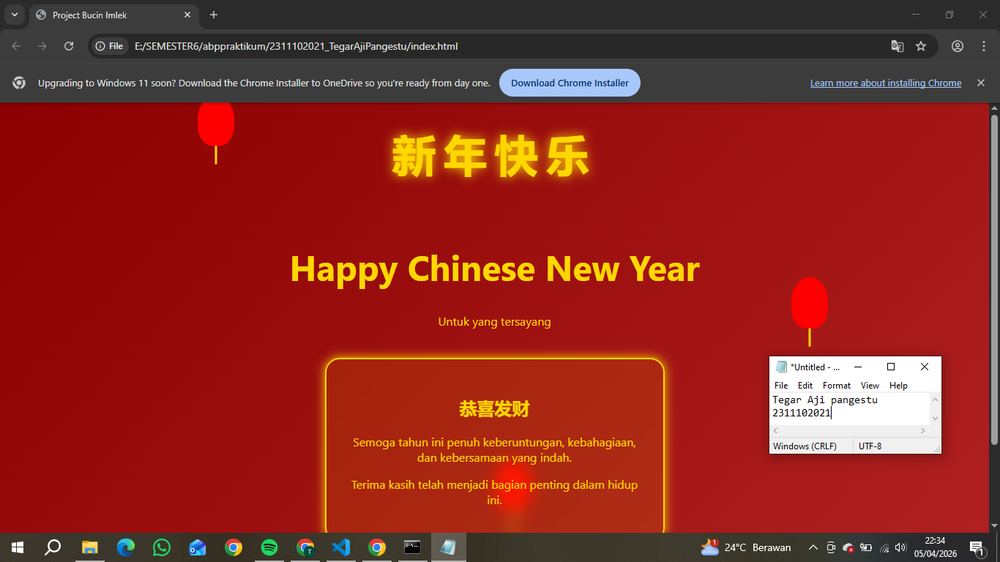

<div align="center">
  <br />
  <h1>LAPORAN PRAKTIKUM <br> APLIKASI BERBASIS PLATFORM </h1>
  <br />
  <h3>MODUL 1 <br> Instalasi dan GIT </h3>
  <br />
  
  <br />
  <br />
  <br />
  <h3>Disusun Oleh :</h3>
  <p>
    <strong>Tegar Aji Pangestu</strong>
    <br>
    <strong>2311102021</strong>
    <br>
    <strong>S1 IF-11-REG05</strong>
  </p>
  <br />
  <h3>Dosen Pengampu :</h3>
  <p>
    <strong>Dedi Agung Prabowo, S.Kom., M.Kom</strong>
  </p>
  <br />
  <br />
  <h4>Asisten Praktikum :</h4>
  <strong>Apri Pandu Wicaksono </strong>
  <br>
  <strong>Hamka Zaenul Ardi</strong>
  <br />
  <h3>LABORATORIUM HIGH PERFORMANCE <br>FAKULTAS INFORMATIKA <br>UNIVERSITAS TELKOM PURWOKERTO <br>2026 </h3>
</div>

<hr>

# Dasar Teori

pembuatan halaman web ini berfokus pada penggunaan bahasa markup HTML (HyperText Markup Language) dan CSS (Cascading Style Sheets). HTML digunakan untuk menyusun struktur dasar halaman, seperti judul, paragraf, dan pembagian konten, sehingga informasi dapat ditampilkan secara terorganisir. Sementara itu, CSS digunakan untuk mengatur tampilan visual halaman, seperti warna, ukuran teks, tata letak, serta efek animasi. Dengan memisahkan HTML dan CSS ke dalam file yang berbeda, pengelolaan kode menjadi lebih rapi, mudah dikembangkan, dan mengikuti prinsip pemrograman web yang baik.

Selain itu, penggunaan CSS murni tanpa bantuan JavaScript maupun framework bertujuan untuk melatih pemahaman dasar dalam mendesain tampilan web secara mandiri. CSS memungkinkan pembuatan berbagai efek visual seperti animasi, gradasi warna, dan dekorasi elemen tanpa memerlukan kode tambahan dari library eksternal. Dalam konteks proyek ini, konsep desain yang digunakan mengacu pada tema perayaan Imlek dengan dominasi warna merah dan emas yang melambangkan keberuntungan dan kemakmuran. Hal ini menunjukkan bahwa CSS tidak hanya berfungsi untuk memperindah tampilan, tetapi juga dapat menyampaikan makna dan suasana tertentu melalui elemen visual.

# Tugas 3 - Project Bucin(Edisi Imlek)
## 1. Source code index.html
```<!-- 2311102021
Tegar Aji pangestu
S1IF-11-05 -->
<!DOCTYPE html>
<html lang="id">
<head>
    <meta charset="UTF-8">
    <meta name="viewport" content="width=device-width, initial-scale=1.0">
    <title>Project Bucin Imlek</title>
    <link rel="stylesheet" href="style.css">
</head>
<body>

<!-- Lantern -->
<div class="lantern l1"></div>
<div class="lantern l2"></div>
<div class="lantern l3"></div>

<!-- Tulisan China -->
<div class="chinese-text">
    新年快乐
</div>

<div class="container">
    <h1>Happy Chinese New Year</h1>
    <p class="subtitle">Untuk yang tersayang</p>

    <div class="card">
        <h2>恭喜发财</h2>
        <p>
            Semoga tahun ini penuh keberuntungan, kebahagiaan,
            dan kebersamaan yang indah.
        </p>
        <p>
            Terima kasih telah menjadi bagian penting dalam hidup ini.
        </p>
    </div>

    <div class="footer">
        Dibuat dengan tulus
    </div>
</div>

</body>
</html>
```
## 2. Source Code style.css
```
body {
    margin: 0;
    font-family: 'Segoe UI', sans-serif;
    background: linear-gradient(135deg, #8B0000, #B22222);
    color: #FFD700;
    text-align: center;
    overflow-x: hidden;
}

/* Tulisan China */
.chinese-text {
    font-size: 60px;
    margin-top: 30px;
    font-weight: bold;
    letter-spacing: 10px;
    text-shadow: 0 0 15px gold;
    animation: fadeIn 2s ease-in-out;
}

/* Animasi muncul */
@keyframes fadeIn {
    from {
        opacity: 0;
        transform: translateY(-20px);
    }
    to {
        opacity: 1;
        transform: translateY(0);
    }
}

/* Container */
.container {
    padding: 50px 20px;
}

/* Judul */
h1 {
    font-size: 3em;
}

/* Subtitle */
.subtitle {
    margin-bottom: 40px;
}

/* Card */
.card {
    background: rgba(255, 215, 0, 0.1);
    border: 2px solid gold;
    border-radius: 20px;
    padding: 30px;
    max-width: 400px;
    margin: auto;
    backdrop-filter: blur(10px);
    animation: glow 2s infinite;
}

/* Glow effect */
@keyframes glow {
    0% { box-shadow: 0 0 10px gold; }
    50% { box-shadow: 0 0 30px gold; }
    100% { box-shadow: 0 0 10px gold; }
}

/* Lantern */
.lantern {
    width: 50px;
    height: 70px;
    background: red;
    border-radius: 50% 50% 40% 40%;
    position: absolute;
    top: -100px;
    animation: fall 6s linear infinite;
}

/* Tali lantern */
.lantern::after {
    content: "";
    width: 3px;
    height: 25px;
    background: gold;
    position: absolute;
    bottom: -25px;
    left: 50%;
    transform: translateX(-50%);
}

/* Animasi jatuh */
@keyframes fall {
    0% { transform: translateY(-100px); }
    100% { transform: translateY(110vh); }
}

/* Posisi lantern */
.l1 { left: 20%; animation-delay: 0s; }
.l2 { left: 50%; animation-delay: 2s; }
.l3 { left: 80%; animation-delay: 4s; }

/* Footer */
.footer {
    margin-top: 50px;
    color: white;
}
```
Output:


# Penjelasan
Program ini merupakan halaman web sederhana yang dibuat menggunakan HTML dan CSS untuk menampilkan ucapan perayaan Imlek dengan tampilan yang menarik. Struktur halaman disusun menggunakan HTML yang terdiri dari elemen judul, teks ucapan, serta sebuah kartu (card) sebagai wadah utama pesan. Sementara itu, CSS digunakan untuk mengatur tampilan visual seperti warna latar belakang gradasi merah, warna teks emas, serta tata letak agar terlihat rapi dan estetis. Selain itu, ditambahkan animasi menggunakan CSS seperti efek muncul pada teks dan gerakan jatuh pada elemen lantern untuk memberikan kesan dinamis tanpa menggunakan JavaScript. Keseluruhan program menunjukkan bagaimana HTML dan CSS da
