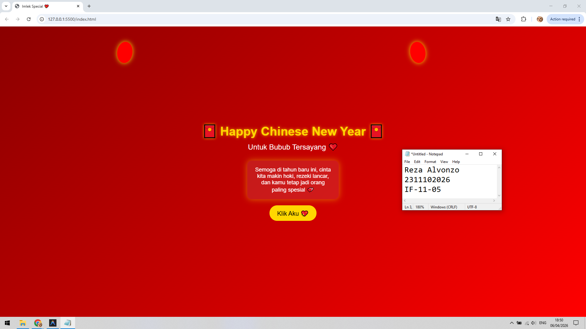

<div align="center">
  <br />
  <h1>LAPORAN PRAKTIKUM <br> APLIKASI BERBASIS PLATFORM </h1>
  <br />
  <h3>MODUL 3 <br> CSS </h3>
  <br />
  
  <br />
  <br />
  <br />
  <h3>Disusun Oleh :</h3>
  <p>
    <strong>Reza Alvonzo</strong>
    <br>
    <strong>2311102026</strong>
    <br>
    <strong>S1 IF-11-REG05</strong>
  </p>
  <br />
  <h3>Dosen Pengampu :</h3>
  <p>
    <strong>Dedi Agung Prabowo, S.Kom., M.Kom</strong>
  </p>
  <br />
  <br />
  <h4>Asisten Praktikum :</h4>
  <strong>Apri Pandu Wicaksono </strong>
  <br>
  <strong>Hamka Zaenul Ardi</strong>
  <br />
  <h3>LABORATORIUM HIGH PERFORMANCE <br>FAKULTAS INFORMATIKA <br>UNIVERSITAS TELKOM PURWOKERTO <br>2026 </h3>
</div>

<hr>

# Dasar Teori CSS (Cascading Style Sheets)

CSS (Cascading Style Sheets) adalah bahasa yang digunakan untuk mengatur tampilan dan format dari dokumen yang ditulis menggunakan HTML. CSS memungkinkan pengembang untuk memisahkan antara struktur (HTML) dan presentasi (tampilan) sehingga kode menjadi lebih terorganisir, mudah dikelola, dan reusable.

CSS bekerja dengan cara memberikan style (gaya) pada elemen HTML melalui selector tertentu. Style tersebut dapat berupa warna, ukuran, posisi, layout, hingga animasi.

Konsep utama dalam CSS meliputi:

Selector → untuk memilih elemen HTML yang akan diberi style
Property → atribut yang ingin diubah (misalnya: color, font-size)
Value → nilai dari property tersebut

CSS merupakan komponen penting dalam pengembangan web yang berfungsi untuk mengatur tampilan dan layout halaman. Dengan penggunaan CSS yang baik, aplikasi web akan memiliki tampilan yang menarik, responsif, dan mudah dikembangkan.

## Task 3: Project Bucin (Edisi Imlek)
### Souce code - html
```html
<!DOCTYPE html>
<html lang="id">
<head>
    <meta charset="UTF-8">
    <title>Imlek Special 💖</title>
    <link rel="stylesheet" href="style.css">
</head>
<body>

    <div class="container">
        <h1 class="title">🧧 Happy Chinese New Year 🧧</h1>
        <p class="subtitle">Untuk Bubub Tersayang ❤️</p>

        <div class="card">
            <p>
                Semoga di tahun baru ini, cinta kita makin hoki, 
                rezeki lancar, dan kamu tetap jadi orang paling spesial 💕
            </p>
        </div>

        <button class="btn-love">Klik Aku 💖</button>
    </div>

    <div class="lantern"></div>
    <div class="lantern lantern2"></div>

</body>
</html>
```

### Source code - css

```css
* {
    margin: 0;
    padding: 0;
    box-sizing: border-box;
}

body {
    font-family: 'Poppins', sans-serif;
    min-height: 100vh;
    background: linear-gradient(135deg, #8B0000, #FF0000);
    background-repeat: no-repeat;
    color: white;
    text-align: center;
    overflow-x: hidden;
}

.container {
    min-height: 100vh;

    display: flex;
    flex-direction: column;
    justify-content: center;
    align-items: center;
}

.title {
    font-size: 40px;
    color: gold;
    text-shadow: 0 0 10px rgba(255, 215, 0, 0.8);
    margin-bottom: 10px;
}

.subtitle {
    font-size: 24px;
    margin-bottom: 30px;
}

.card {
    background: rgba(255, 255, 255, 0.1);
    padding: 20px;
    width: 300px;
    border-radius: 15px;
    backdrop-filter: blur(10px);
    box-shadow: 0 0 20px rgba(255, 215, 0, 0.5);
    margin-bottom: 20px;
    font-size: 18px;
}

.btn-love {
    background: gold;
    border: none;
    padding: 12px 25px;
    font-size: 20px;
    border-radius: 25px;
    cursor: pointer;
    transition: all 0.3s ease;
}

.btn-love:hover {
    background: white;
    color: red;
    transform: scale(1.1);
}

.lantern {
    width: 50px;
    height: 70px;
    background: red;
    border-radius: 50%;
    position: fixed;
    top: 50px;
    left: 20%;
    animation: swing 3s infinite ease-in-out;
    box-shadow: 0 0 15px gold;
}

.lantern2 {
    left: 70%;
    animation-delay: 1s;
}

@keyframes swing {
    0% { transform: rotate(-10deg); }
    50% { transform: rotate(10deg); }
    100% { transform: rotate(-10deg); }
}
```


Output:


# Penjelasan
Kode CSS tersebut digunakan untuk mengatur tampilan halaman bertema Imlek agar terlihat menarik, terpusat, dan responsif tanpa menggunakan JavaScript. Penggunaan flexbox pada .container memungkinkan seluruh konten berada di tengah layar, sementara properti seperti background, box-shadow, dan animation digunakan untuk memberikan efek visual seperti gradasi warna, bayangan, dan animasi lampion agar tampilan lebih hidup.
