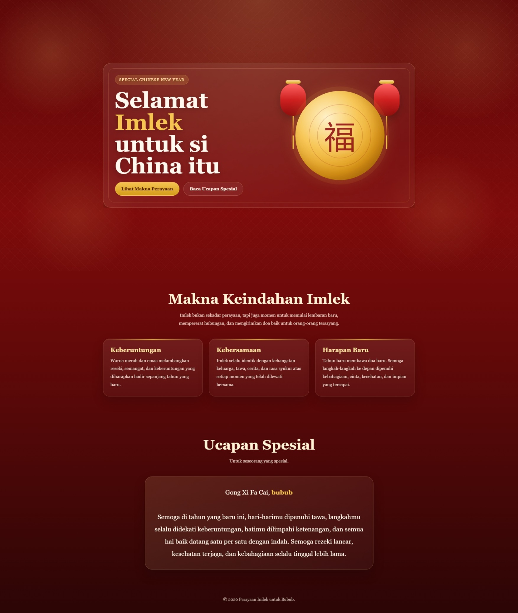

<div align="center">
  <br />
  <h1>LAPORAN PRAKTIKUM <br> APLIKASI BERBASIS PLATFORM </h1>
  <br />
  <h3>MODUL 3 <br> CSS </h3>
  <br />
  
  <br />
  <br />
  <br />
  <h3>Disusun Oleh :</h3>
  <p>
    <strong>Muhammad Aulia Muzzaki Nugraha</strong>
    <br>
    <strong>2311102051</strong>
    <br>
    <strong>S1 IF-11-REG05</strong>
  </p>
  <br />
  <h3>Dosen Pengampu :</h3>
  <p>
    <strong>Dedi Agung Prabowo, S.Kom., M.Kom</strong>
  </p>
  <br />
  <br />
  <h4>Asisten Praktikum :</h4>
  <strong>Apri Pandu Wicaksono </strong>
  <br>
  <strong>Hamka Zaenul Ardi</strong>
  <br />
  <h3>LABORATORIUM HIGH PERFORMANCE <br>FAKULTAS INFORMATIKA <br>UNIVERSITAS TELKOM PURWOKERTO <br>2026 </h3>
</div>

<hr>

# Dasar Teori CSS (Cascading Style Sheets)

CSS (Cascading Style Sheets) adalah bahasa yang digunakan untuk mengatur tampilan dan format halaman web. CSS bekerja bersama HTML dengan memisahkan struktur (HTML) dan desain (CSS), sehingga halaman web menjadi lebih rapi, fleksibel, dan mudah dikelola.

## Prinsip Utama CSS

- **Selector**  
  Menentukan elemen HTML yang akan diberi gaya  
  Contoh: `p`, `.class`, `#id`

- **Property**  
  Jenis gaya yang ingin diubah  
  Contoh: `color`, `font-size`, `margin`

- **Value**  
  Nilai dari property  
  Contoh: `red`, `16px`

## Contoh CSS

```css
p {
  color: blue;
  font-size: 14px;
}
```

## Task 3: Project Bucin (Edisi Imlek)
### Souce code - html
```html
<!DOCTYPE html>
<html lang="id">
<head>
  <meta charset="UTF-8" />
  <meta name="viewport" content="width=device-width, initial-scale=1.0" />
  <title>Perayaan Imlek untuk Bubub</title>
  <link rel="stylesheet" href="style.css" />
</head>
<body>
  <header class="hero">
    <div class="container">
      <div class="hero-card">
        <div>
          <span class="label">Special Chinese New Year</span>
          <h1>Selamat <span class="accent">Imlek</span><br>untuk si China itu</h1>
          
          <div class="actions">
            <a href="#makna" class="btn btn-primary">Lihat Makna Perayaan</a>
            <a href="#ucapan" class="btn btn-secondary">Baca Ucapan Spesial</a>
          </div>
        </div>

        <div class="visual" aria-hidden="true">
          <div class="lantern left-lantern"></div>
          <div class="lantern right-lantern"></div>
          <div class="moon">
            <div class="character">福</div>
          </div>
        </div>
      </div>
    </div>
  </header>

  <main>
    <section class="section" id="makna">
      <div class="container">
        <h2 class="section-title">Makna Keindahan Imlek</h2>
        <p class="section-subtitle">
          Imlek bukan sekadar perayaan, tapi juga momen untuk memulai lembaran baru,
          mempererat hubungan, dan mengirimkan doa baik untuk orang-orang tersayang.
        </p>

        <div class="grid">
          <article class="card">
            <h3>Keberuntungan</h3>
            <p>
              Warna merah dan emas melambangkan rezeki, semangat, dan keberuntungan yang diharapkan
              hadir sepanjang tahun yang baru.
            </p>
          </article>

          <article class="card">
            <h3>Kebersamaan</h3>
            <p>
              Imlek selalu identik dengan kehangatan keluarga, tawa, cerita, dan rasa syukur atas
              setiap momen yang telah dilewati bersama.
            </p>
          </article>

          <article class="card">
            <h3>Harapan Baru</h3>
            <p>
              Tahun baru membawa doa baru. Semoga langkah-langkah ke depan dipenuhi kebahagiaan,
              cinta, kesehatan, dan impian yang tercapai.
            </p>
          </article>
        </div>
      </div>
    </section>

    <section class="section blessing" id="ucapan">
      <div class="container">
        <h2 class="section-title">Ucapan Spesial</h2>
        <p class="section-subtitle">
          Untuk seseorang yang spesial.
        </p>

        <div class="blessing-box">
          <p>
            Gong Xi Fa Cai, <strong>bubub</strong><br><br>
            Semoga di tahun yang baru ini, hari-harimu dipenuhi tawa,
            langkahmu selalu didekati keberuntungan, hatimu dilimpahi ketenangan,
            dan semua hal baik datang satu per satu dengan indah.
            Semoga rezeki lancar, kesehatan terjaga, dan kebahagiaan selalu tinggal lebih lama.
          </p>
        </div>
      </div>
    </section>
  </main>

  <footer>
    <div class="container">
        <p>&copy; 2026 Perayaan Imlek untuk Bubub.</p>
  </footer>
</body>
</html>
```

### Source code - css

```css
* {
  box-sizing: border-box;
  margin: 0;
  padding: 0;
}

:root {
  --red: #8f1010;
  --red-soft: #b71c1c;
  --gold: #f5c451;
  --gold-soft: #ffe6a3;
  --cream: #fff6e8;
  --dark: #2b0d0d;
  --shadow: 0 18px 40px rgba(0, 0, 0, 0.18);
}

body {
  font-family: Georgia, "Times New Roman", serif;
  color: var(--cream);
  background:
    radial-gradient(circle at top, rgba(255, 215, 130, 0.22), transparent 30%),
    linear-gradient(180deg, #5f0909 0%, #7f0b0b 35%, #2c0505 100%);
  min-height: 100vh;
  overflow-x: hidden;
}

body::before,
body::after {
  content: "";
  position: fixed;
  inset: 0;
  pointer-events: none;
  z-index: 0;
}

body::before {
  background:
    radial-gradient(
      circle at 10% 20%,
      rgba(255, 220, 120, 0.16),
      transparent 12%
    ),
    radial-gradient(
      circle at 90% 18%,
      rgba(255, 220, 120, 0.14),
      transparent 14%
    ),
    radial-gradient(
      circle at 15% 80%,
      rgba(255, 220, 120, 0.1),
      transparent 12%
    ),
    radial-gradient(
      circle at 85% 78%,
      rgba(255, 220, 120, 0.1),
      transparent 12%
    );
}

body::after {
  opacity: 0.08;
  background-image:
    linear-gradient(45deg, transparent 48%, #fff 49%, transparent 50%),
    linear-gradient(-45deg, transparent 48%, #fff 49%, transparent 50%);
  background-size: 36px 36px;
  mix-blend-mode: screen;
}

// Selebihnya dapat cek pada file "style.css"
```
🔗 [Klik di sini untuk membuka file `style.css`](./style.css)


Output:


# Penjelasan
Sebuah halaman website bertema perayaan Imlek yang dibuat menggunakan HTML untuk struktur dan CSS murni untuk tampilan. Halaman ini terdiri dari beberapa bagian utama seperti hero section yang menampilkan judul dan visual dekoratif (bulan dan lampion), bagian penjelasan makna Imlek yang disusun dalam bentuk card, serta bagian ucapan spesial yang berisi pesan hangat. Secara keseluruhan, desainnya mengusung nuansa merah dan emas khas Imlek dengan layout modern menggunakan CSS seperti grid dan flexbox, serta memanfaatkan efek visual seperti gradient, shadow, dan pseudo-element untuk membuat dekorasi tanpa gambar.