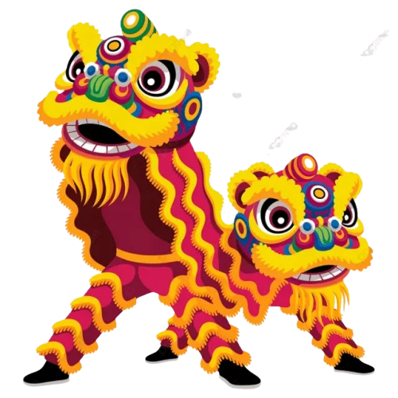
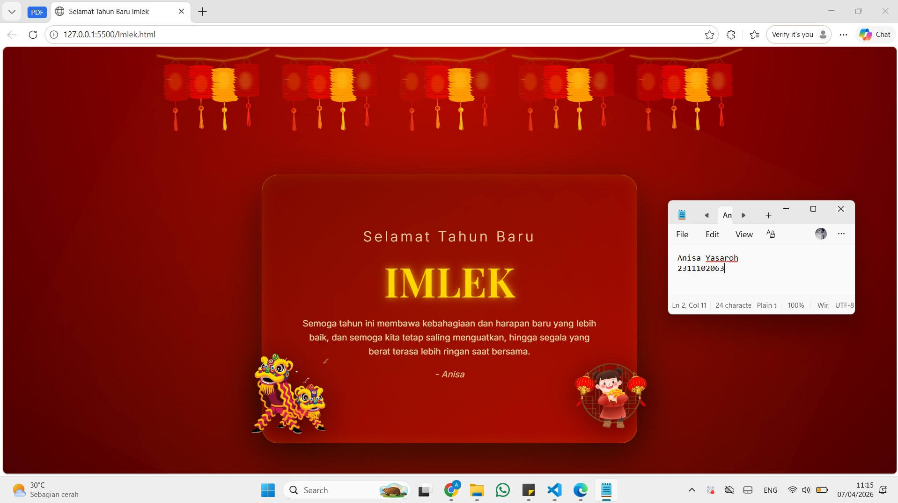

<div align="center">
  <br />
  <h1>LAPORAN PRAKTIKUM <br> APLIKASI BERBASIS PLATFORM </h1>
  <br />
  <h3>MODUL 3 <br> CSS </h3>
  <br />
  
  <br />
  <br />
  <br />
  <h3>Disusun Oleh :</h3>
  <p>
    <strong>Anisa Yasaroh</strong>
    <br>
    <strong>2311102063</strong>
    <br>
    <strong>S1 IF-11-REG05</strong>
  </p>
  <br />
  <h3>Dosen Pengampu :</h3>
  <p>
    <strong>Dedi Agung Prabowo, S.Kom., M.Kom</strong>
  </p>
  <br />
  <br />
  <h4>Asisten Praktikum :</h4>
  <strong>Apri Pandu Wicaksono </strong>
  <br>
  <strong>Hamka Zaenul Ardi</strong>
  <br />
  <h3>LABORATORIUM HIGH PERFORMANCE <br>FAKULTAS INFORMATIKA <br>UNIVERSITAS TELKOM PURWOKERTO <br>2026 </h3>
</div>

<hr>

## 1. Dasar Teori

Cascading Style Sheets (CSS) adalah bahasa berbasis aturan yang dikembangkan oleh W3C pada 1996 untuk menambahkan gaya pada elemen HTML. CSS memisahkan konten dan tampilan visual, sehingga HTML hanya mengatur struktur konten, sedangkan CSS mengatur desain visual dan estetika halaman web. Struktur CSS terdiri dari selector dan declaration block, di mana selector menunjuk elemen HTML yang ingin diubah, dan declaration block memuat properti dan nilainya yang dipisahkan titik koma serta dibungkus kurung kurawal. Misalnya, `<p> This is a paragraph. </p>` dapat diberi gaya dengan `p { color: blue; font-size: 16px; }.`

CSS dapat diterapkan dengan tiga jenis, yaitu internal, external, dan inline. Internal CSS ditempatkan di dalam tag `<style>` pada halaman HTML dan dimuat setiap kali halaman di-refresh; cara ini memudahkan pratinjau template tetapi memperlambat loading dan tidak bisa digunakan di halaman lain. External CSS diletakkan di file `.css` terpisah dan dihubungkan ke halaman HTML dengan tag `<link>`, memungkinkan penggunaan gaya yang sama di banyak halaman, meskipun waktu loading bisa sedikit lebih lama. Inline CSS ditulis langsung pada atribut `style` di elemen HTML, memudahkan perubahan cepat pada satu elemen atau pratinjau, tetapi kurang efisien jika banyak elemen yang ingin diberi gaya. Dengan CSS, desain halaman web menjadi lebih rapi, terstruktur, dan mudah dikelola tanpa mengubah konten HTML.

## 2. Penjelasan Kode CSS 

Berikut adalah kode HTML dan CSS untuk membuat kartu ucapan Tahun Baru Imlek. Halaman menampilkan kotak ucapan di tengah layar yang berisi judul, pesan, dan gambar dekoratif, dengan styling CSS untuk mengatur warna, gradien, dan bayangan.

### Task 3: Project Bucin (Edisi Imlek)

## 1. Source Code HTML
```html
<!-- 2311102063
Anisa Yasaroh
IF-11-REG05 -->

<!DOCTYPE html>
<html lang="id">

<head>
  <meta charset="UTF-8">
  <title>Selamat Tahun Baru Imlek</title>
  <link href="https://fonts.googleapis.com/css2?family=Playfair+Display:wght@600&family=Inter:wght@300;400&display=swap"
    rel="stylesheet">
  <link rel="stylesheet" href="style.css">
</head>

<body>

  <div class="lampion-row">
    
    
    
    
    
  </div>

  <div class="box">
    
    

    <h2>Selamat Tahun Baru</h2>
    <h1>IMLEK</h1>

    <p>
      Semoga tahun ini membawa kebahagiaan dan harapan baru yang lebih baik,
      dan semoga kita tetap saling menguatkan, hingga segala yang berat terasa lebih ringan saat bersama.
    </p>

    <p class="nama">- Anisa</p>
  </div>

</body>

</html>
```

## 2. Source Code CSS
```css
/* 2311102063
   Anisa Yasaroh
   IF-11-REG05
*/

body {
  margin: 0;
  height: 100vh;
  font-family: 'Inter', sans-serif;
  display: flex;
  flex-direction: column;
  align-items: center;
  justify-content: flex-start;
  background: radial-gradient(circle at top, #b30000, #4d0000);
  color: #f5e6b3;
  overflow: hidden;
}

.lampion-row {
  position: absolute;
  top: 0;
  left: 50%;
  transform: translateX(-50%);
  display: flex;
  gap: 2px;
  margin: 0;
  padding: 0;
}

.lampion-row img {
  width: 200px;
  height: auto;
  display: block;
}

.box {
  position: relative;
  text-align: center;
  padding: 90px 60px;
  border-radius: 28px;
  background: linear-gradient(145deg, #7a0000, #a80000);
  border: 1px solid rgba(255, 215, 0, 0.3);
  box-shadow: 0 25px 70px rgba(0, 0, 0, 0.6), inset 0 0 20px rgba(255, 215, 0, 0.1);
  max-width: 520px;
  margin-top: 220px;
  z-index: 1;
}

.box::before {
  content: "";
  position: absolute;
  top: -50%;
  left: -50%;
  width: 200%;
  height: 200%;
  background: radial-gradient(circle, rgba(255, 215, 0, 0.08), transparent);
  transform: rotate(25deg);
  z-index: -1;
}

h2 {
  font-weight: 300;
  letter-spacing: 4px;
  margin: 0;
  opacity: 0.9;
}

h1 {
  font-family: 'Playfair Display', serif;
  font-size: 70px;
  margin: 15px 0;
  color: gold;
  text-shadow: 0 0 10px rgba(255, 215, 0, 0.6), 0 0 20px rgba(255, 215, 0, 0.4);
}

p {
  font-size: 15px;
  line-height: 1.6;
  opacity: 0.9;
}

p.nama {
  margin-top: 15px;
  font-style: italic;
  opacity: 0.8;
}

.img-left,
.img-right {
  position: absolute;
  bottom: 20px;
  width: 130px;
  transform: scale(1.1);
  filter: drop-shadow(0 10px 25px rgba(0, 0, 0, 0.6));
  z-index: 0;
}

.img-left {
  left: -20px;
}

.img-right {
  right: -20px;
}
```

### Hasil Tampilan (Screenshot)


## Penjelasan Code

Kode HTML ini disusun untuk membuat struktur halaman ucapan Imlek. Bagian `<div class="lampion-row">` menampung beberapa tag `` untuk lampion, yang disusun berjajar rapat di atas halaman. Kotak ucapan dibuat dengan `<div class="box">` yang berisi judul `<h2>` dan `<h1>`, paragraf `<p>` untuk pesan, dan nama pengirim `<p class="nama">`. Di dalam kotak juga ada gambar barongsai kiri dan kanan yang diberi kelas `img-left` dan `img-right` untuk memudahkan pengaturan posisinya.

CSS digunakan untuk menata tampilan seluruh elemen. Body diatur dengan `flex` untuk menata elemen secara vertikal, background menggunakan radial gradient merah, `.lampion-row` memakai `flex` dengan `gap: 2px` agar lampion berjajar rapat. `.box` menggunakan padding, border-radius, background gradient, dan box-shadow untuk efek cahaya dan kedalaman. Gambar barongsai diatur dengan `position: absolute` dan efek drop-shadow agar berada di sisi kotak ucapan dan terlihat menonjol. Semua properti CSS ini bekerja sama untuk menata layout, posisi, ukuran, dan efek visual tiap elemen.