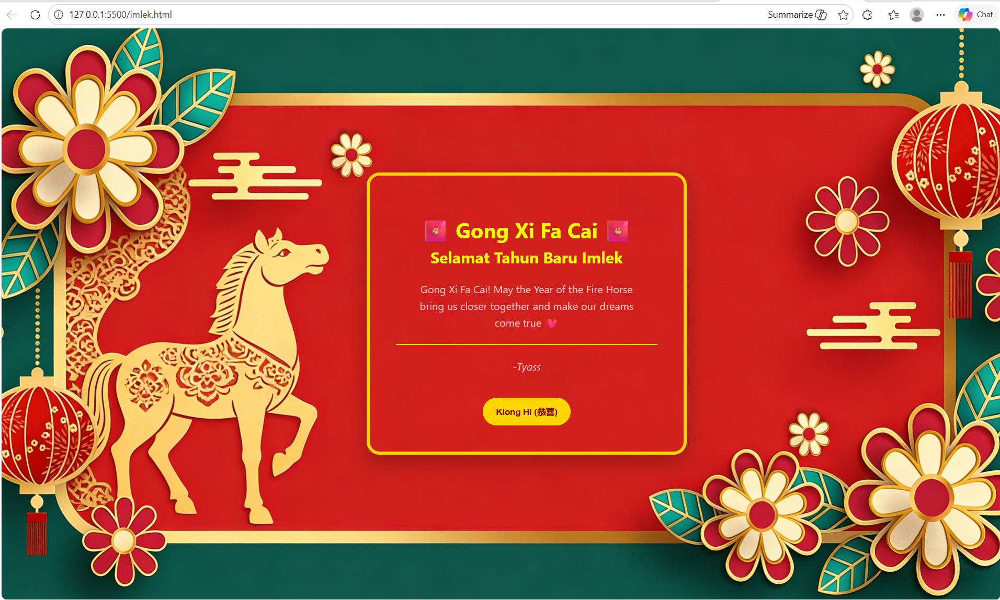

<div align="center">
  <br />
  <h1>LAPORAN PRAKTIKUM <br> APLIKASI BERBASIS PLATFORM </h1>
  <br />
  <h3>MODUL 3 <br> CSS </h3>
  <br />
  
  <br />
  <br />
  <br />
  <h3>Disusun Oleh :</h3>
  <p>
    <strong>Fitri Kusumaningtyas</strong>
    <br>
    <strong>2311102068</strong>
    <br>
    <strong>S1 IF-11-REG05</strong>
  </p>
  <br />
  <h3>Dosen Pengampu :</h3>
  <p>
    <strong>Dedi Agung Prabowo, S.Kom., M.Kom</strong>
  </p>
  <br />
  <br />
  <h4>Asisten Praktikum :</h4>
  <strong>Apri Pandu Wicaksono </strong>
  <br>
  <strong>Hamka Zaenul Ardi</strong>
  <br />
  <h3>LABORATORIUM HIGH PERFORMANCE <br>FAKULTAS INFORMATIKA <br>UNIVERSITAS TELKOM PURWOKERTO <br>2026 </h3>
</div>

<hr>

## 1. Dasar Teori

Cascading Style Sheets (CSS) merupakan bahasa pemrograman yang digunakan untuk menentukan bagaimana dokumen dan website akan disajikan. CSS dibuat oleh Word Wide Web Consortium (W3C) pada 1996. CSS berisi kumpulan perintah yang digunakan untuk menjelaskan tampilan halaman situs web dalam mark-up language, seperti HTML yang terkenal sebagai bahasa pemrograman standar dan sering digunakan dalam proses pembuatan website. CSS berfungsi untuk membantu para web designer agar dapat mengubah dan menambahkan, baik teks, gambar, hingga latar belakang sebuah halaman HTML.

## 2. Source Code

Berikut adalah kode HTML dan CSS untuk membuat kartu ucapan Tahun Baru Imlek.

### Task 3: Project Bucin (Edisi Imlek)

### Source Code HTML
```html
<!DOCTYPE html>
<!-- Fitri Kusumaningtyas (2311102068) -->
<html lang="id">
<head>
    <meta charset="UTF-8">
    <title>Ucapan Imlek</title>
    <link rel="stylesheet" href="imlek.css">
</head>
<body>

<!-- Dekorasi -->
<div class="lantern left"></div>
<div class="lantern right"></div>

<div class="coin coin1"></div>
<div class="coin coin2"></div>

<div class="card">
    <h1>🧧 Gong Xi Fa Cai 🧧</h1>
    <h2>Selamat Tahun Baru Imlek</h2>

    <p>
        Gong Xi Fa Cai! May the Year of the Fire Horse bring us closer 
        together and make our dreams come true ❤️
    </p>

    <div class="divider"></div>

    <p class="from">
        -Tyass
    </p>

    <button>Kiong Hi (恭喜)</button>
</div>

</body>
</html>

```

## 2. Source Code CSS
```css
/* Fitri Kusumaningtyas
   2311102068
*/
body {
    margin: 0;
    height: 100vh;
    display: flex;
    justify-content: center;
    align-items: center;
    font-family: 'Segoe UI', sans-serif;

    background-image: url('bg_imlek.png');
    background-size: cover;
    background-position: center;
    background-repeat: no-repeat;
}

.card {
    padding: 40px;
    border-radius: 20px;
    text-align: center;
    width: 400px;
    box-shadow: 0 10px 30px rgba(0,0,0,0.3);
    border: 5px solid gold;
    margin-left: 80px;
}

h1 {
    color: #f1fd00;
    margin-bottom: 5px;
}

h2 {
    color: #f1fd00;
    margin-top: 0;
}

p {
    color: #f6c2c2;
    line-height: 1.6;
    margin: 20px;
}

.divider {
    height: 2px;
    background: gold;
    margin: 10px 0;
}

.from {
    font-style: italic;
    color: #f6c2c2;
}

button {
    margin-top: 15px;
    padding: 12px 20px;
    background: gold;
    border: none;
    border-radius: 25px;
    color: #8b0000;
    font-weight: bold;
    cursor: pointer;
    transition: 0.3s;
}

button:hover {
    background: #ffd700;
    transform: scale(1.05);
}
```

### Screenshot output


## Penjelasan Code

Halaman kartu ucapan Tahun Baru Imlek ini dibuat menggunakan HTML sebagai struktur konten dan CSS sebagai pengatur tampilan. Pada bagian HTML, elemen utama berupa `<div class="card">` digunakan sebagai wadah utama kartu ucapan. Di dalamnya terdapat elemen `<h1>` yang menampilkan judul utama “Gong Xi Fa Cai”, kemudian `<h2>` sebagai subjudul ucapan Tahun Baru Imlek. Selanjutnya terdapat elemen `<p>` yang berisi pesan ucapan, diikuti `<div class="divider">` sebagai garis pemisah, serta `<p class="from">` untuk menampilkan nama pengirim. Terakhir, tombol `<button>` digunakan sebagai elemen interaktif tambahan dengan teks bertema Imlek.

Pada bagian CSS, selector `body` digunakan untuk mengatur tampilan latar belakang halaman, seperti penggunaan gambar background, pengaturan posisi tengah menggunakan `display: flex`, serta penyesuaian font. Kelas `.card` digunakan untuk mengatur tampilan kartu agar terlihat seperti kotak ucapan, dengan properti seperti `padding` untuk memberi jarak di dalam kartu, `border-radius` untuk membuat sudut membulat, `box-shadow` untuk memberikan efek bayangan, serta `border` berwarna emas untuk memperkuat tema Imlek.

Elemen `.divider` digunakan untuk membuat garis pemisah dengan warna emas agar memisahkan isi pesan dan tanda tangan. Tombol `<button>` diberi styling tambahan seperti warna latar, border radius, dan efek hover agar tampilan lebih menarik.