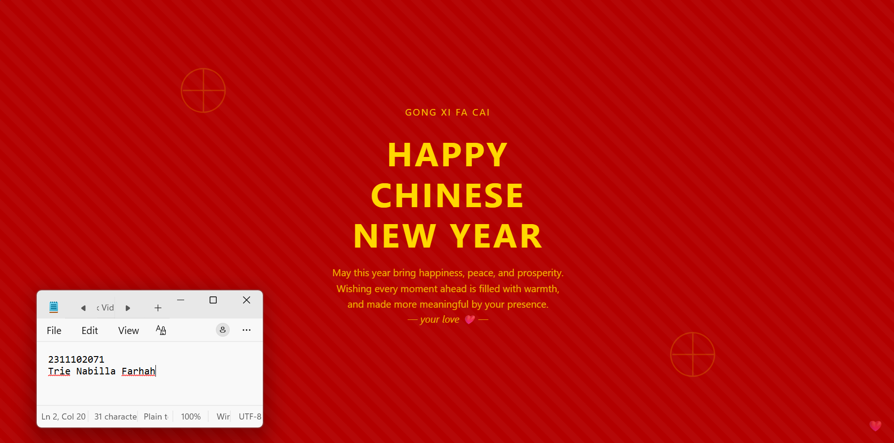

<div align="center">
  <br />
  <h1>LAPORAN PRAKTIKUM <br> APLIKASI BERBASIS PLATFORM </h1>
  <br />
  <h3>MODUL 3 <br> CSS </h3>
  <br />
  
  <br />
  <br />
  <br />
  <h3>Disusun Oleh :</h3>
  <p>
    <strong>Trie Nabilla Farhah</strong>
    <br>
    <strong>2311102071</strong>
    <br>
    <strong>S1 IF-11-REG05</strong>
  </p>
  <br />
  <h3>Dosen Pengampu :</h3>
  <p>
    <strong>Dedi Agung Prabowo, S.Kom., M.Kom</strong>
  </p>
  <br />
  <br />
  <h4>Asisten Praktikum :</h4>
  <strong>Apri Pandu Wicaksono </strong>
  <br>
  <strong>Hamka Zaenul Ardi</strong>
  <br />
  <h3>LABORATORIUM HIGH PERFORMANCE <br>FAKULTAS INFORMATIKA <br>UNIVERSITAS TELKOM PURWOKERTO <br>2026 </h3>
</div>

<hr>

## 1. Dasar Teori

CSS (Cascading Style Sheets) merupakan bahasa stylesheet yang digunakan untuk mengatur tampilan dan tata letak elemen pada halaman web, dengan memisahkan struktur konten (HTML) dari aspek presentasi seperti warna, font, ukuran, dan posisi. Konsep cascading pada CSS menentukan prioritas aturan gaya berdasarkan sumber penulisan dan tingkat spesifisitas selector, sehingga konflik antar gaya dapat diselesaikan secara sistematis dan menghasilkan tampilan yang konsisten serta efisien dalam pengelolaan.

Secara teoritis, CSS didasarkan pada beberapa konsep utama seperti selector untuk memilih elemen, inheritance untuk pewarisan gaya dari elemen induk, specificity untuk menentukan prioritas aturan, serta box model yang menggambarkan elemen sebagai kotak yang terdiri dari content, padding, border, dan margin. Dengan konsep-konsep tersebut, CSS menjadi fondasi penting dalam membangun antarmuka web yang terstruktur, responsif, dan mudah dikembangkan.

## 2. Penjelasan Kode CSS 

Berikut adalah kode HTML dan CSS untuk membuat kartu ucapan Tahun Baru Imlek. Halaman menampilkan kotak ucapan di tengah layar yang berisi judul, pesan, dan gambar dekoratif, dengan styling CSS untuk mengatur warna, gradien, dan bayangan.

### Task 3: Project Bucin (Edisi Imlek)

## 1. Source Code HTML
```html
<!-- 2311102071
Trie Nabilla Farhah
IF-11-REG05 -->

<!DOCTYPE html>
<html lang="en">

<head>
    <meta charset="UTF-8">
    <title>Happy Chinese New Year</title>

    <!-- Hubungkan ke CSS -->
    <link rel="stylesheet" href="style.css">

</head>

<body>

    <div class="spark spark1"></div>
    <div class="spark spark2"></div>

    <div class="container">
        <div class="top-text">GONG XI FA CAI</div>

        <h1>
            HAPPY<br>
            CHINESE<br>
            NEW YEAR
        </h1>

        <p class="desc">
            May this year bring happiness, peace, and prosperity.<br>
            Wishing every moment ahead is filled with warmth,<br>
            and made more meaningful by your presence.
        </p>

        <div class="love">— your love ❤️ —</div>
    </div>

    <div class="heart">❤️</div>

</body>

</html>

```

## 2. Source Code CSS
```css
/* 2311102071
   Trie Nabilla Farhah
   IF-11-REG05
*/

{
    margin: 0;
    padding: 0;
    box-sizing: border-box;
    font-family: 'Segoe UI', sans-serif;
}

body {
    height: 100vh;
    display: flex;
    justify-content: center;
    align-items: center;
    background: #b30000;
    color: gold;
    text-align: center;
    position: relative;
}

/* subtle pattern */
body::before {
    content: "";
    position: absolute;
    width: 100%;
    height: 100%;
    background: repeating-linear-gradient(45deg,
            rgba(255, 255, 255, 0.03),
            rgba(255, 255, 255, 0.03) 10px,
            transparent 10px,
            transparent 20px);
}

/* container */
.container {
    max-width: 600px;
    padding: 20px;
    z-index: 1;
}

/* top text */
.top-text {
    font-size: 13px;
    letter-spacing: 2px;
    margin-bottom: 20px;
    opacity: 0.9;
}

/* title */
h1 {
    font-size: 48px;
    line-height: 1.2;
    letter-spacing: 3px;
    margin-bottom: 15px;
}

/* romantic line */
.love {
    font-size: 14px;
    color: #ffd700cc;
    margin-bottom: 20px;
    font-style: italic;
    animation: fadeIn 2s ease;
}

/* desc */
.desc {
    font-size: 14px;
    line-height: 1.6;
    color: #ffd700cc;
}

/* spark decor */
.spark {
    position: absolute;
    width: 70px;
    height: 70px;
    border: 2px solid gold;
    border-radius: 50%;
    opacity: 0.25;
    animation: pulse 3s infinite;
}

.spark::before,
.spark::after {
    content: "";
    position: absolute;
    width: 2px;
    height: 100%;
    background: gold;
    left: 50%;
    transform: translateX(-50%);
}

.spark::after {
    transform: rotate(90deg);
}

.spark1 {
    top: 15%;
    left: 20%;
}

.spark2 {
    bottom: 15%;
    right: 20%;
}

/* tiny heart */
.heart {
    position: absolute;
    bottom: 20px;
    right: 20px;
    font-size: 16px;
    opacity: 0.6;
    animation: beat 1.5s infinite;
}

/* animations */
@keyframes pulse {
    0% {
        transform: scale(0.9);
        opacity: 0.2;
    }

    50% {
        transform: scale(1.1);
        opacity: 0.4;
    }

    100% {
        transform: scale(0.9);
        opacity: 0.2;
    }
}

@keyframes fadeIn {
    from {
        opacity: 0;
    }

    to {
        opacity: 1;
    }
}

@keyframes beat {

    0%,
    100% {
        transform: scale(1);
    }

    50% {
        transform: scale(1.3);
    }
}
```

### Hasil Tampilan (Screenshot)


## Penjelasan Code

Kode HTML ini disusun untuk membuat struktur halaman ucapan Imlek yang sederhana namun menarik. Bagian `<div class="container">` digunakan sebagai wadah utama yang menampung seluruh konten seperti teks judul, deskripsi, dan elemen tambahan. Judul utama ditampilkan menggunakan tag `<h1>` dengan format bertingkat untuk memberikan penekanan visual, sedangkan paragraf `<p class="desc">` digunakan untuk menampilkan pesan ucapan. Selain itu, terdapat elemen dekoratif seperti `<div class="spark">` dan `<div class="heart">` yang berfungsi sebagai ornamen visual agar tampilan tidak terlihat kosong dan lebih hidup.

CSS digunakan untuk mengatur tampilan dan efek visual dari seluruh elemen pada halaman. Bagian body menggunakan display: flex untuk memposisikan konten tepat di tengah layar, serta background berwarna merah dengan tambahan body::before untuk memberikan pola garis halus. Elemen teks seperti judul dan deskripsi diatur ukuran, warna, dan jaraknya agar terlihat elegan dengan nuansa emas. Dekorasi seperti .spark dibuat menggunakan border dan pseudo-element untuk membentuk pola lingkaran dengan garis, sedangkan .heart diberi animasi. Animasi seperti @keyframes pulse, fadeIn, dan beat digunakan untuk memberikan efek bergerak, sehingga tampilan halaman menjadi lebih dinamis dan menarik.