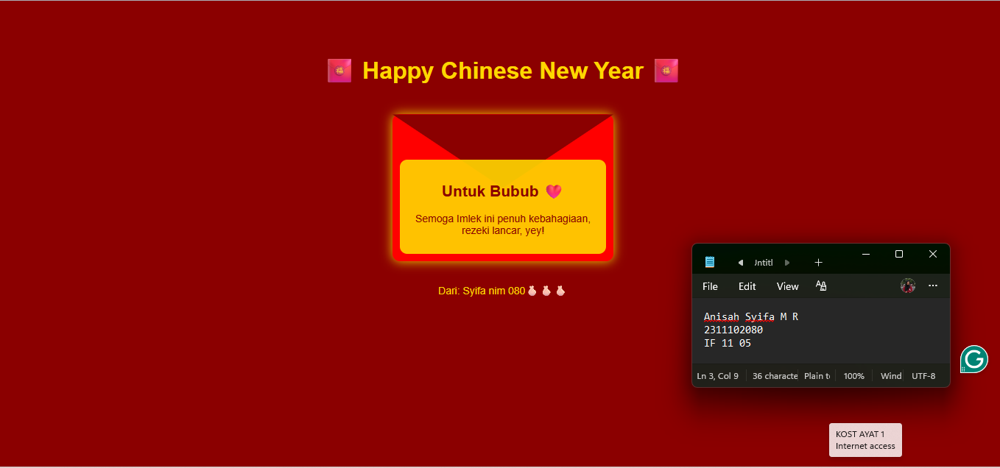

<div align="center">
  <br />
  <h1>LAPORAN PRAKTIKUM <br> APLIKASI BERBASIS PLATFORM </h1>
  <br />
  <h3>MODUL 3 <br> CSS </h3>
  <br />
  
  <br />
  <br />
  <br />
  <h3>Disusun Oleh :</h3>
  <p>
    <strong>Anisah Syifa Mustika Riyanto</strong>
    <br>
    <strong>2311102080</strong>
    <br>
    <strong>S1 IF-11-REG05</strong>
  </p>
  <br />
  <h3>Dosen Pengampu :</h3>
  <p>
    <strong>Dedi Agung Prabowo, S.Kom., M.Kom</strong>
  </p>
  <br />
  <br />
  <h4>Asisten Praktikum :</h4>
  <strong>Apri Pandu Wicaksono </strong>
  <br>
  <strong>Hamka Zaenul Ardi</strong>
  <br />
  <h3>LABORATORIUM HIGH PERFORMANCE <br>FAKULTAS INFORMATIKA <br>UNIVERSITAS TELKOM PURWOKERTO <br>2026</h3>
</div>

<hr>

### Dasar Teori

CSS (Cascading Style Sheets) merupakan bahasa yang digunakan untuk mengatur tampilan dan gaya dari halaman web yang dibuat menggunakan HTML. CSS memungkinkan pengembang untuk memisahkan antara struktur konten (HTML) dengan desain visual, sehingga tampilan halaman menjadi lebih rapi, konsisten, dan mudah dikelola.

Dengan CSS, berbagai aspek visual dapat diatur, seperti warna, ukuran teks, jenis font, jarak antar elemen, posisi, hingga tata letak halaman. Selain itu, CSS juga mendukung pembuatan efek visual seperti bayangan (shadow), animasi sederhana, dan bentuk tertentu.

Konsep utama dalam CSS adalah penggunaan selector, property, dan value. Selector digunakan untuk memilih elemen HTML yang akan diberi gaya, sedangkan property adalah atribut yang ingin diubah (misalnya warna atau ukuran), dan value merupakan nilai dari property tersebut.

CSS dapat dituliskan dalam tiga cara, yaitu:

Inline CSS → langsung di dalam tag HTML
Internal CSS → di dalam tag `<style>` pada file HTML
External CSS → dipisahkan dalam file .css (cara yang digunakan pada proyek ini)

Pada proyek ini digunakan external CSS, karena lebih terstruktur, mudah dibaca, dan memudahkan pemeliharaan kode.

### Tugas 3 - Project Bucin (Edisi Imlek)

#### Source Code - HTML

```
<!DOCTYPE html>
<html lang="id">
<head>
    <meta charset="UTF-8">
    <meta name="viewport" content="width=device-width, initial-scale=1.0">
    <title>Angpao Bucin Imlek</title>
    <link rel="stylesheet" href="style.css">
</head>
<body>

<div class="container">

    <h1>🧧 Happy Chinese New Year 🧧</h1>

    <div class="envelope">
        <div class="message">
            <h2>Untuk Bubub ❤️</h2>
            <p>
                Semoga Imlek ini penuh kebahagiaan,
                rezeki lancar, yey!
            </p>
        </div>
    </div>

    <p class="footer">Dari: Syifa nim 080🫰🏻🫰🏻🫰🏻

</div>

</body>
</html>

```

#### Source Code - CSS

```
body {
    margin: 0;
    font-family: Arial, sans-serif;
    background: #8b0000;
    color: gold;
    text-align: center;
}

.container {
    padding: 50px 20px;
}

h1 {
    margin-bottom: 40px;
}

/* Amplop Angpao */
.envelope {
    width: 300px;
    height: 200px;
    background: red;
    margin: auto;
    position: relative;
    border-radius: 10px;
    box-shadow: 0 0 15px gold;
}

/* Tutup amplop */
.envelope::before {
    content: "";
    position: absolute;
    top: 0;
    left: 0;
    width: 100%;
    height: 50%;
    background: darkred;
    clip-path: polygon(0 0, 100% 0, 50% 100%);
}

/* Isi pesan */
.message {
    position: absolute;
    bottom: 10px;
    left: 10px;
    right: 10px;
    background: rgba(255, 215, 0, 0.9);
    color: #8b0000;
    padding: 10px;
    border-radius: 10px;
    font-size: 14px;
}

.footer {
    margin-top: 30px;
    font-size: 14px;
}

```

### Hasil Output



### Deskripsi Kode

```
Kode ini terdiri dari file HTML dan CSS yang dipisahkan. Pada bagian HTML, tag <head> digunakan untuk menghubungkan file CSS melalui <link rel="stylesheet" href="style.css">. Di dalam <body>, terdapat <div class="container"> sebagai pembungkus utama yang berisi judul menggunakan <h1>, elemen <div class="envelope"> sebagai bentuk amplop angpao, serta <div class="message"> untuk menampilkan pesan ucapan. Bagian akhir menggunakan <p class="footer"> sebagai penutup.

Pada CSS, elemen body diatur dengan warna merah dan teks emas khas Imlek serta rata tengah. Class .container diberi padding agar tampilan lebih rapi. Amplop dibuat menggunakan .envelope dengan position: relative, lalu bagian tutupnya dibentuk menggunakan pseudo-element ::before dan clip-path. Pesan di dalam amplop diatur dengan position: absolute agar berada di dalam elemen tersebut. Beberapa properti seperti border-radius dan box-shadow digunakan untuk memperindah tampilan agar lebih menarik.
```
