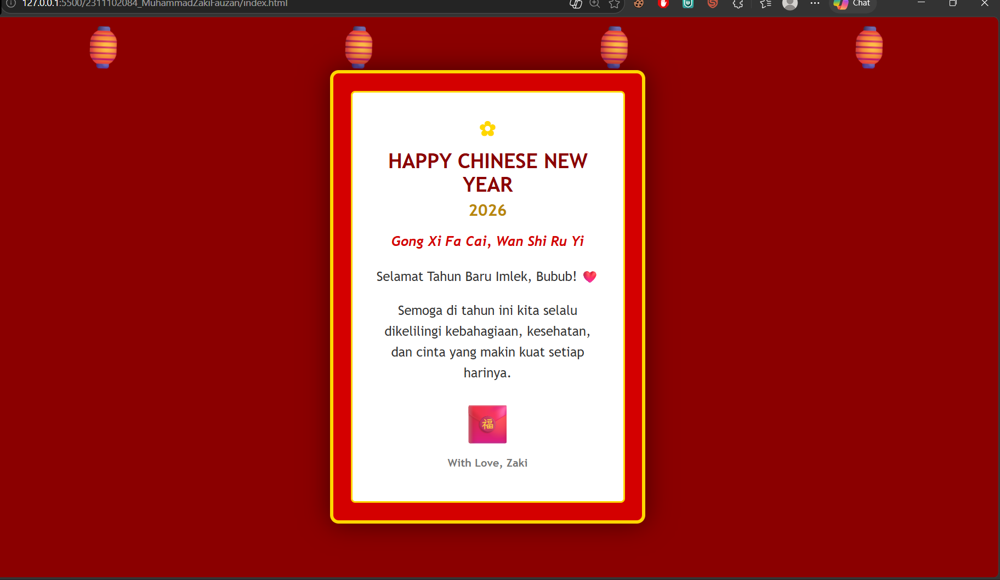

<div align="center">
  <br />
  <h1>LAPORAN PRAKTIKUM <br> APLIKASI BERBASIS PLATFORM </h1>
  <br />
  <h3>MODUL 3 <br> CSS </h3>
  <br />
  
  <br />
  <br />
  <br />
  <h3>Disusun Oleh :</h3>
  <p>
    <strong>Muhammad Zaki Fauzan</strong>
    <br>
    <strong>2311102084</strong>
    <br>
    <strong>S1 IF-11-REG05</strong>
  </p>
  <br />
  <h3>Dosen Pengampu :</h3>
  <p>
    <strong>Dedi Agung Prabowo, S.Kom., M.Kom</strong>
  </p>
  <br />
  <br />
  <h4>Asisten Praktikum :</h4>
  <strong>Apri Pandu Wicaksono </strong>
  <br>
  <strong>Hamka Zaenul Ardi</strong>
  <br />
  <h3>LABORATORIUM HIGH PERFORMANCE <br>FAKULTAS INFORMATIKA <br>UNIVERSITAS TELKOM PURWOKERTO <br>2026 </h3>
</div>

<hr>

# Dasar Teori CSS (Cascading Style Sheets)

CSS (Cascading Style Sheets) adalah bahasa pemrograman yang berfungsi untuk mengatur estetika dan tata letak sebuah halaman desain web agar terlihat lebih menarik dan terstruktur. Jika HTML berperan sebagai kerangka atau struktur dasar sebuah bangunan, maka CSS adalah cat, furnitur, dan dekorasi yang menentukan warna, ukuran font, hingga posisi elemen di dalam layar. Dengan memisahkan konten (HTML) dari desain (CSS), kamu bisa mengubah seluruh tampilan halaman dengan lebih mudah dan efisien hanya melalui satu file pengaturan saja.
## Metode Penempatan CSS

Terdapat tiga cara utama untuk menerapkan CSS ke dalam dokumen HTML:

Inline CSS: Ditulis langsung di dalam atribut style pada tag HTML.

Internal CSS: Ditulis di dalam tag ```<style>``` pada bagian ```<head>```.

External CSS: Ditulis di file terpisah dengan ekstensi .css dan dihubungkan menggunakan tag ``<link>``. (Metode yang direkomendasikan untuk proyek skala menengah-besar).

## Contoh CSS

```css
p {
  color: yellow;
  font-size: 14px;
}
```

## Task 3: Project Bucin (Edisi Imlek)
### Souce code - html
```html
<!DOCTYPE html>
<html lang="id">
<head>
    <meta charset="UTF-8">
    <meta name="viewport" content="width=device-width, initial-scale=1.0">
    <title>Gong Xi Fa Cai - Project Bucin</title>
    <link rel="stylesheet" href="style.css">
</head>
<body>

    <div class="sky">
        <div class="lantern-top">🏮</div>
        <div class="lantern-top">🏮</div>
        <div class="lantern-top">🏮</div>
        <div class="lantern-top">🏮</div>
    </div>

    <main class="card">
        <div class="border-inner">
            <header>
                <div class="ornament">✿</div>
                <h1>Happy Chinese New Year</h1>
                <p class="year">2026</p>
            </header>

            <section class="content">
                <p class="greeting">Gong Xi Fa Cai, Wan Shi Ru Yi</p>
                <div class="message-box">
                    <p>Selamat Tahun Baru Imlek, Bubub! ❤️</p>
                    <p>Semoga di tahun ini kita selalu dikelilingi kebahagiaan, kesehatan, dan cinta yang makin kuat setiap harinya.</p>
                </div>
            </section>

            <footer>
                <div class="angpao">🧧</div>
                <p class="signature">With Love, Zaki</p>
            </footer>
        </div>
    </main>

</body>
</html>
```

### Source code - css

```css
body {
    margin: 0;
    padding: 0;
    background-color: #8b0000;
    height: 100vh;
    display: flex;
    justify-content: center;
    align-items: center;
    font-family: 'Trebuchet MS', sans-serif;
    overflow: hidden;
}

.sky {
    position: absolute;
    top: 0;
    width: 100%;
    display: flex;
    justify-content: space-around;
}

.lantern-top {
    font-size: 50px;
    animation: swing 3s ease-in-out infinite;
    transform-origin: top center;
}

@keyframes swing {
    0%, 100% { transform: rotate(-12deg); }
    50% { transform: rotate(12deg); }
}

.card {
    background-color: #d40000;
    padding: 20px;
    border: 4px solid #ffd700;
    border-radius: 10px;
    box-shadow: 0 0 30px rgba(0,0,0,0.5);
    width: 320px;
    position: relative;
    z-index: 10;
}

.border-inner {
    border: 2px solid #ffd700;
    padding: 25px;
    border-radius: 5px;
    background-color: #fff;
    text-align: center;
}

.ornament {
    color: #ffd700;
    font-size: 24px;
    margin-bottom: 10px;
}

h1 {
    color: #8b0000;
    font-size: 1.5rem;
    margin: 0;
    text-transform: uppercase;
}

.year {
    color: #b8860b;
    font-weight: bold;
    font-size: 1.2rem;
    margin: 5px 0;
}

.greeting {
    color: #d40000;
    font-style: italic;
    font-weight: bold;
    margin-bottom: 20px;
}

.message-box {
    color: #333;
    font-size: 0.95rem;
    line-height: 1.6;
}

.angpao {
    font-size: 45px;
    margin-top: 15px;
    animation: float 2.5s ease-in-out infinite;
}

@keyframes float {
    0%, 100% { transform: translateY(0); }
    50% { transform: translateY(-15px); }
}

.signature {
    margin-top: 10px;
    font-size: 0.8rem;
    color: #777;
    font-weight: bold;
}
```


Output:


# Penjelasan
Penerapan Pure CSS pada proyek website perayaan Imlek ini merupakan sebuah eksplorasi desain yang memaksimalkan potensi fitur-fitur modern front-end tanpa ketergantungan pada library pihak ketiga. Seluruh komponen visual, mulai dari ayunan lampion yang dinamis hingga tata letak kartu bernuansa emas, dikonstruksi sepenuhnya menggunakan CSS Keyframes dan Flexbox untuk memastikan performa rendering yang ringan namun tetap menghadirkan estetika oriental yang imersif dan responsif.. 