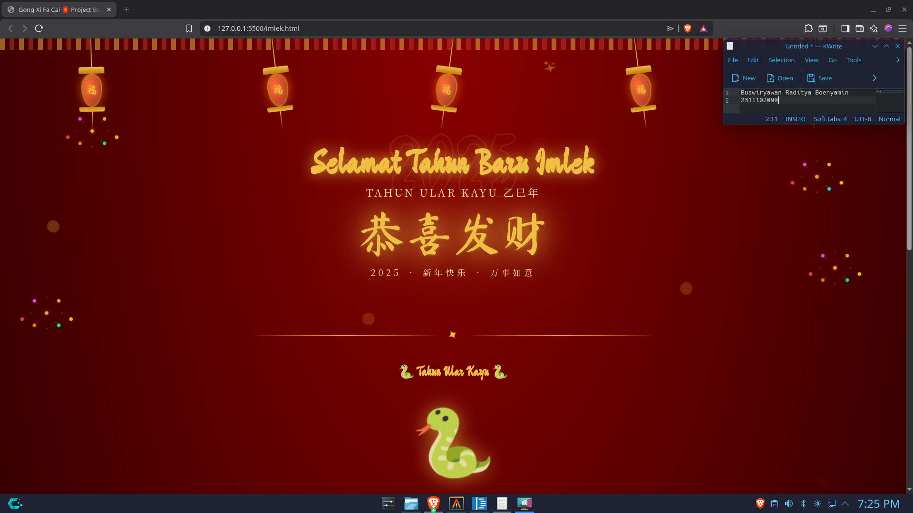

<div align="center">
  <br />
  <h1>LAPORAN PRAKTIKUM <br> APLIKASI BERBASIS PLATFORM </h1>
  <br />
  <h3>MODUL 3 <br> CSS </h3>
  <br />
  
  <br />
  <br />
  <br />
  <h3>Disusun Oleh :</h3>
  <p>
    <strong>Buswiryawan Raditya Boenyamin</strong>
    <br>
    <strong>2311102090</strong>
    <br>
    <strong>S1 IF-11-REG05</strong>
  </p>
  <br />
  <h3>Dosen Pengampu :</h3>
  <p>
    <strong>Dedi Agung Prabowo, S.Kom., M.Kom</strong>
  </p>
  <br />
  <br />
  <h4>Asisten Praktikum :</h4>
  <strong>Apri Pandu Wicaksono </strong>
  <br>
  <strong>Hamka Zaenul Ardi</strong>
  <br />
  <h3>LABORATORIUM HIGH PERFORMANCE <br>FAKULTAS INFORMATIKA <br>UNIVERSITAS TELKOM PURWOKERTO <br>2026 </h3>
</div>

<hr>

# Dasar Teori

## CSS (Cascading Style Sheets)

*Cascading Style Sheets* (CSS) merupakan bahasa yang membantu memperindah tampilan dari laman web yang telah dibangun dengan HTML. CSS mendeskripsikan bagaimana bentuk tampilan elemen HTML seharusnya saat ditampilkan pada laman browser.

Format penulisan CSS secara umum terdiri dari:
- **Selector** — elemen HTML yang akan ditambahkan CSS
- **Declaration Block** — kumpulan deklarasi yang terdiri dari *property* dan *value*, dipisahkan dengan titik koma dan diapit kurung kurawal

Contoh:
```css
h1 {
    color: blue;
    font-size: 12px;
}
```

---

## 1. Cara Menyisipkan CSS

Terdapat tiga cara untuk menyisipkan atau mendefinisikan CSS ke dalam HTML:

### a) External Style Sheet
Menyisipkan CSS dengan memanggil file berekstensi `.css` ke dalam file HTML menggunakan tag `<link/>` di dalam elemen `<head>`.

```html
<head>
    <link rel="stylesheet" type="text/css" href="myStyleSheet.css">
</head>
```

### b) Internal Style Sheet
Menyisipkan CSS menggunakan tag `<style></style>` di dalam elemen `<head>`. Biasanya digunakan ketika satu halaman membutuhkan *style* CSS yang berbeda dari yang sudah dipanggil di *External Style Sheet*.

```html
<head>
    <style>
        body {
            background-color: blue;
        }
        h1 {
            color: maroon;
            margin-left: 40px;
        }
    </style>
</head>
```

### c) Inline Style
Menyisipkan CSS dengan menambahkan atribut `style` langsung pada elemen HTML. Biasanya digunakan hanya untuk satu elemen yang membutuhkan *style* berbeda.

```html
<h1 style="color:lightblue; font-size:30px;">Praktikum Web Programming</h1>
```

---

## 2. Selector

Selector pada CSS digunakan untuk menemukan elemen HTML yang akan diberi *style*. Terdapat beberapa bentuk selector:

```css
/* Selector dengan Elemen HTML */
p {
    text-align: center;
    color: red;
}

/* Selector dengan Id Elemen HTML */
#para1 {
    text-align: center;
    color: red;
}

/* Selector dengan Class Elemen HTML */
p.center {
    text-align: center;
    color: red;
}
```

---

## 3. Font Properties

CSS dapat menangani kebutuhan tampilan teks melalui *font properties*.

| Font Properties | Keterangan |
|----------------|------------|
| `font-family`  | Menentukan jenis font yang digunakan |
| `font-size`    | Mengatur ukuran font |
| `font-style`   | Mengatur style font (normal, italic, oblique) |
| `font-weight`  | Mengatur ketebalan font (normal atau bold) |

Contoh penerapan:
```css
p.example {
    font-family: Arial;
    font-size: 20px;
    color: lightblue;
    font-style: italic;
    font-weight: bold;
}
```

---

## 4. List Properties

HTML menyediakan elemen list menggunakan tag `<ul>` (*unordered list*) dan `<ol>` (*ordered list*), dengan elemen item menggunakan tag `<li>`.

### CSS Properties untuk Elemen List

**Lists Specified Properties:**

| Property | Keterangan |
|----------|------------|
| `list-style-image` | Membuat sebuah gambar menjadi penanda *list* |
| `list-style-position` | Mengatur posisi penanda *list* di dalam atau di luar konten |
| `list-style-type` | Mengatur jenis penanda *list* |

**Lists General Properties:**

| Property | Keterangan |
|----------|------------|
| `background-color` | Mengatur warna latar belakang elemen *list* |
| `padding` | Mengatur ruang jarak elemen konten dengan pembatas pada bagian dalam |
| `margin` | Mengatur ruang jarak elemen konten dengan pembatas pada bagian luar |

Contoh penerapan:
```css
ul.listsatu {
    background-color: tomato;
    margin: 10px 5px 10px 5px;
    list-style-type: lower-alpha;
    list-style-position: inside;
}

ol.listdua {
    background-color: lightblue;
    list-style-type: lower-roman;
    padding: 5px 5px 15px 15px;
    list-style-position: inside;
}
```

---

## 5. Alignment of Text

CSS dapat mengatur *alignment* atau perataan teks menggunakan property `text-align`.

| Properties | Value | Keterangan |
|------------|-------|------------|
| `text-align` | `center` | Membuat teks menjadi rata tengah |
| | `left` | Membuat teks menjadi rata kiri |
| | `right` | Membuat teks menjadi rata kanan |
| | `justify` | Membuat paragraf menjadi rata kanan dan kiri |

Contoh penerapan:
```css
h1 {
    text-align: center;
}
h2 {
    text-align: left;
}
h3 {
    text-align: right;
}
```

---

## 6. Colors

CSS dapat menangani pengaturan warna secara lebih lengkap dibandingkan atribut HTML biasa.

| Properties | Keterangan | Value |
|------------|------------|-------|
| `background-color` | Mengatur warna latar belakang elemen HTML | Color Names, RGB, Hex, HSL |
| `color` | Mengatur warna teks elemen HTML | RGBA (dengan opacity), HSLA (dengan opacity) |

Contoh penerapan:
```css
body {
    background-color: HSL(20%, 40%, 70%);
    color: orange;
}

#teks {
    color: #2F3CDF;
}

/* dengan opacity sebesar 0.5 */
input.text-field {
    background-color: RGBA(32, 55, 122, 0.5);
}
```

---

## 7. Span & Div

**Span** merupakan elemen HTML yang menangani perubahan konten pada satu baris, menggunakan tag `<span></span>`.

**Div** merupakan elemen HTML yang digunakan untuk membuat *section* yang mengelompokkan beberapa elemen HTML di dalamnya, menggunakan tag `<div></div>`.

Contoh penerapan:
```html
<div class="section1">
    <p>Content of <span class="mark">Property</span></p>
</div>
```

```css
.section1 {
    background-color: lightgrey;
    padding: 10px 5px 10px 5px;
}

.mark {
    background-color: tomato;
    font-style: italic;
    font-weight: bold;
    padding: 10px 10px 10px 10px;
}
```

# Tugas 3: Project Bucin (Edisi Imlek)
Nah ini pesenan khusus nih, kalian bikin halaman untuk perayaan Imlek (demi si bubub). Jadi kalian buat halaman tapi cuma boleh pake pure CSS ga boleh pake JS ataupun framework styling kaya Bootstrap atau Tailwindcss.
```
<!-- 2311102090_Buswiryawan Raditya Boenyamin_S1IF-11-05 -->
<!DOCTYPE html>
<html lang="id">
<head>
  <meta charset="UTF-8" />
  <meta name="viewport" content="width=device-width, initial-scale=1.0"/>
  <title>Gong Xi Fa Cai 🧧 Project Bucin Imlek</title>
  <style>
    @import url('https://fonts.googleapis.com/css2?family=Noto+Serif+SC:wght@400;700;900&family=Ma+Shan+Zheng&family=Cinzel+Decorative:wght@700&display=swap');

    :root {
      --red: #c0392b;
      --dark-red: #7b0d0d;
      --gold: #f0c040;
      --gold-light: #fde68a;
      --gold-dark: #b7860b;
      --cream: #fdf6e3;
      --black: #1a0a0a;
    }

    * { margin: 0; padding: 0; box-sizing: border-box; }

    body {
      background-color: var(--dark-red);
      background-image:
        radial-gradient(ellipse at top, #8b0000 0%, #4a0000 60%, #1a0000 100%);
      min-height: 100vh;
      font-family: 'Noto Serif SC', serif;
      overflow-x: hidden;
      color: var(--gold);
    }

    /* ========== LANTERN ANIMATION ========== */
    .lanterns {
      position: fixed;
      top: 0; left: 0; right: 0;
      display: flex;
      justify-content: space-around;
      z-index: 10;
      pointer-events: none;
    }

    .lantern {
      display: flex;
      flex-direction: column;
      align-items: center;
      animation: swing 3s ease-in-out infinite;
      transform-origin: top center;
    }

    .lantern:nth-child(2) { animation-delay: -1s; }
    .lantern:nth-child(3) { animation-delay: -2s; }
    .lantern:nth-child(4) { animation-delay: -0.5s; }
    .lantern:nth-child(5) { animation-delay: -1.5s; }

    @keyframes swing {
      0%, 100% { transform: rotate(-8deg); }
      50% { transform: rotate(8deg); }
    }

    .lantern-string {
      width: 2px;
      height: 60px;
      background: linear-gradient(to bottom, #b7860b, #f0c040);
    }

    .lantern-body {
      width: 44px;
      height: 70px;
      background: radial-gradient(ellipse at 35% 35%, #ff6b35, #c0392b 60%, #7b0d0d);
      border-radius: 50% 50% 50% 50% / 40% 40% 60% 60%;
      border: 2px solid var(--gold-dark);
      box-shadow: 0 0 20px rgba(255, 100, 0, 0.7), inset 0 0 15px rgba(255, 200, 0, 0.3);
      position: relative;
    }

    .lantern-body::before {
      content: '福';
      font-family: 'Ma Shan Zheng', serif;
      position: absolute;
      top: 50%; left: 50%;
      transform: translate(-50%, -50%);
      font-size: 22px;
      color: var(--gold);
      text-shadow: 0 0 8px rgba(255,200,0,0.8);
    }

    .lantern-cap {
      width: 54px;
      height: 14px;
      background: linear-gradient(to bottom, var(--gold), var(--gold-dark));
      border-radius: 4px 4px 0 0;
    }

    .lantern-bottom {
      width: 54px;
      height: 10px;
      background: linear-gradient(to bottom, var(--gold-dark), var(--gold));
      border-radius: 0 0 4px 4px;
    }

    .lantern-tassel {
      width: 2px;
      height: 40px;
      background: linear-gradient(to bottom, var(--gold), transparent);
    }

    /* ========== MAIN CONTAINER ========== */
    .container {
      max-width: 900px;
      margin: 0 auto;
      padding: 160px 24px 60px;
    }

    /* ========== FIREWORKS ========== */
    .firework {
      position: fixed;
      pointer-events: none;
      z-index: 1;
    }

    .firework::before,
    .firework::after {
      content: '';
      position: absolute;
      width: 6px;
      height: 6px;
      border-radius: 50%;
      background: var(--gold);
      box-shadow:
        0 0 6px var(--gold),
        30px -30px 0 #ff4444,
        -30px -30px 0 #ff8800,
        30px 30px 0 #ffdd00,
        -30px 30px 0 #ff44ff,
        50px 0 0 #00ffff,
        -50px 0 0 #ff4444,
        0 50px 0 #ffdd00,
        0 -50px 0 #ff8800;
      animation: burst 2.5s ease-in-out infinite;
      opacity: 0;
    }

    .firework::after {
      box-shadow:
        0 0 6px #ff4444,
        20px -20px 0 var(--gold),
        -20px -20px 0 #ff44ff,
        20px 20px 0 #00ffcc,
        -20px 20px 0 #ff8800,
        40px 10px 0 #ffdd00,
        -40px 10px 0 #ff4444;
      animation-delay: 1.25s;
    }

    .firework-1 { top: 20%; left: 10%; }
    .firework-2 { top: 30%; right: 10%; }
    .firework-3 { top: 60%; left: 5%; }
    .firework-4 { top: 50%; right: 8%; }

    @keyframes burst {
      0% { opacity: 0; transform: scale(0.3); }
      20% { opacity: 1; transform: scale(1.4); }
      80% { opacity: 0.6; transform: scale(1); }
      100% { opacity: 0; transform: scale(0.5); }
    }

    /* ========== HERO SECTION ========== */
    .hero {
      text-align: center;
      padding: 40px 20px 60px;
      position: relative;
    }

    .hero-year {
      font-family: 'Ma Shan Zheng', serif;
      font-size: clamp(80px, 20vw, 180px);
      color: transparent;
      -webkit-text-stroke: 3px var(--gold);
      text-stroke: 3px var(--gold);
      line-height: 1;
      opacity: 0.15;
      position: absolute;
      top: 0; left: 50%;
      transform: translateX(-50%);
      user-select: none;
      animation: fadeGlow 3s ease-in-out infinite alternate;
    }

    @keyframes fadeGlow {
      from { opacity: 0.1; text-shadow: none; }
      to   { opacity: 0.25; text-shadow: 0 0 40px rgba(240,192,64,0.4); }
    }

    .hero-title {
      font-family: 'Ma Shan Zheng', serif;
      font-size: clamp(36px, 8vw, 72px);
      color: var(--gold);
      text-shadow: 0 0 30px rgba(240,192,64,0.8), 2px 2px 0 var(--dark-red);
      position: relative;
      z-index: 2;
      animation: titleEntrance 1.2s cubic-bezier(0.175, 0.885, 0.32, 1.275) both;
    }

    @keyframes titleEntrance {
      from { opacity: 0; transform: translateY(-50px) scale(0.8); }
      to   { opacity: 1; transform: translateY(0) scale(1); }
    }

    .hero-subtitle {
      font-size: clamp(14px, 3vw, 22px);
      color: var(--gold-light);
      margin-top: 12px;
      letter-spacing: 4px;
      text-transform: uppercase;
      position: relative; z-index: 2;
      animation: titleEntrance 1.4s 0.2s cubic-bezier(0.175, 0.885, 0.32, 1.275) both;
    }

    .hero-chinese {
      font-family: 'Ma Shan Zheng', serif;
      font-size: clamp(50px, 12vw, 100px);
      color: var(--gold);
      text-shadow:
        0 0 40px rgba(240,192,64,1),
        0 0 80px rgba(240,192,64,0.6),
        3px 3px 0 var(--dark-red);
      margin: 20px 0;
      position: relative; z-index: 2;
      display: block;
      animation: pulseGold 2s ease-in-out infinite, titleEntrance 1s 0.4s both;
    }

    @keyframes pulseGold {
      0%, 100% { text-shadow: 0 0 40px rgba(240,192,64,1), 0 0 80px rgba(240,192,64,0.6), 3px 3px 0 var(--dark-red); }
      50% { text-shadow: 0 0 60px rgba(240,192,64,1), 0 0 120px rgba(240,192,64,0.8), 3px 3px 0 var(--dark-red); }
    }

    .hero-year-text {
      font-size: clamp(13px, 2.5vw, 18px);
      color: var(--gold-light);
      letter-spacing: 6px;
      position: relative; z-index: 2;
      animation: titleEntrance 1s 0.6s both;
    }

    /* ========== DIVIDER ========== */
    .divider {
      display: flex;
      align-items: center;
      gap: 16px;
      margin: 40px 0;
    }

    .divider-line {
      flex: 1;
      height: 1px;
      background: linear-gradient(to right, transparent, var(--gold-dark), var(--gold), var(--gold-dark), transparent);
    }

    .divider-icon {
      font-size: 28px;
      color: var(--gold);
      animation: spin 8s linear infinite;
    }

    @keyframes spin {
      from { transform: rotate(0deg); }
      to { transform: rotate(360deg); }
    }

    /* ========== CARDS ========== */
    .cards-grid {
      display: grid;
      grid-template-columns: repeat(auto-fit, minmax(240px, 1fr));
      gap: 24px;
      margin: 40px 0;
    }

    .card {
      background: linear-gradient(135deg, rgba(120,10,10,0.9), rgba(80,5,5,0.95));
      border: 1px solid var(--gold-dark);
      border-radius: 12px;
      padding: 32px 24px;
      text-align: center;
      position: relative;
      overflow: hidden;
      transition: transform 0.3s ease, box-shadow 0.3s ease;
      animation: cardEntrance 0.8s both;
    }

    .card:nth-child(1) { animation-delay: 0.2s; }
    .card:nth-child(2) { animation-delay: 0.4s; }
    .card:nth-child(3) { animation-delay: 0.6s; }

    @keyframes cardEntrance {
      from { opacity: 0; transform: translateY(40px); }
      to   { opacity: 1; transform: translateY(0); }
    }

    .card::before {
      content: '';
      position: absolute;
      top: -50%; left: -50%;
      width: 200%; height: 200%;
      background: radial-gradient(circle at center, rgba(240,192,64,0.08), transparent 60%);
      pointer-events: none;
    }

    .card:hover {
      transform: translateY(-6px);
      box-shadow: 0 16px 40px rgba(0,0,0,0.5), 0 0 20px rgba(240,192,64,0.2);
    }

    .card-icon {
      font-size: 48px;
      display: block;
      margin-bottom: 12px;
      animation: bounce 2s ease-in-out infinite;
    }

    .card:nth-child(2) .card-icon { animation-delay: -0.5s; }
    .card:nth-child(3) .card-icon { animation-delay: -1s; }

    @keyframes bounce {
      0%, 100% { transform: translateY(0); }
      50% { transform: translateY(-8px); }
    }

    .card-title {
      font-family: 'Ma Shan Zheng', serif;
      font-size: 24px;
      color: var(--gold);
      margin-bottom: 8px;
    }

    .card-text {
      font-size: 14px;
      color: var(--gold-light);
      line-height: 1.6;
      opacity: 0.85;
    }

    .card-badge {
      position: absolute;
      top: 12px; right: 12px;
      background: var(--gold);
      color: var(--dark-red);
      font-size: 11px;
      font-weight: bold;
      padding: 3px 8px;
      border-radius: 20px;
      letter-spacing: 1px;
    }

    /* ========== MESSAGE BOX ========== */
    .message-box {
      background: linear-gradient(135deg, rgba(90,10,10,0.95), rgba(50,0,0,0.98));
      border: 2px solid var(--gold-dark);
      border-radius: 16px;
      padding: 40px;
      text-align: center;
      margin: 40px 0;
      position: relative;
      overflow: hidden;
    }

    .message-box::before,
    .message-box::after {
      content: '❧';
      font-size: 60px;
      color: var(--gold-dark);
      position: absolute;
      opacity: 0.3;
    }

    .message-box::before { top: 10px; left: 16px; }
    .message-box::after  { bottom: 10px; right: 16px; transform: scaleX(-1); }

    .message-greeting {
      font-family: 'Ma Shan Zheng', serif;
      font-size: clamp(20px, 4vw, 32px);
      color: var(--gold);
      text-shadow: 0 0 20px rgba(240,192,64,0.5);
      margin-bottom: 16px;
    }

    .message-body {
      font-size: clamp(13px, 2vw, 16px);
      color: var(--gold-light);
      line-height: 1.8;
      opacity: 0.9;
    }

    /* ========== ZODIAC ========== */
    .zodiac-section {
      text-align: center;
      margin: 40px 0;
    }

    .zodiac-title {
      font-family: 'Ma Shan Zheng', serif;
      font-size: 28px;
      color: var(--gold);
      margin-bottom: 24px;
    }

    .zodiac-snake {
      font-size: clamp(80px, 20vw, 140px);
      display: block;
      animation: float 4s ease-in-out infinite;
      filter: drop-shadow(0 0 20px rgba(240,192,64,0.6));
    }

    @keyframes float {
      0%, 100% { transform: translateY(0) rotate(-5deg); }
      50% { transform: translateY(-16px) rotate(5deg); }
    }

    .zodiac-desc {
      font-size: 15px;
      color: var(--gold-light);
      max-width: 500px;
      margin: 16px auto 0;
      line-height: 1.7;
      opacity: 0.85;
    }

    /* ========== FOOTER ========== */
    .footer {
      text-align: center;
      padding: 40px 20px;
      border-top: 1px solid rgba(240,192,64,0.2);
      margin-top: 40px;
    }

    .footer-text {
      font-family: 'Ma Shan Zheng', serif;
      font-size: 32px;
      color: var(--gold);
      animation: pulseGold 2s ease-in-out infinite;
    }

    .footer-sub {
      font-size: 12px;
      color: var(--gold-light);
      opacity: 0.6;
      margin-top: 8px;
      letter-spacing: 3px;
    }

    /* ========== FLOATING COINS ========== */
    .coin {
      position: fixed;
      font-size: 24px;
      pointer-events: none;
      z-index: 0;
      opacity: 0.4;
      animation: fallCoin linear infinite;
    }

    .coin-1 { left: 5%;  animation-duration: 8s;  animation-delay: 0s;   top: -30px; }
    .coin-2 { left: 20%; animation-duration: 11s; animation-delay: -3s;  top: -30px; }
    .coin-3 { left: 40%; animation-duration: 9s;  animation-delay: -6s;  top: -30px; }
    .coin-4 { left: 60%; animation-duration: 12s; animation-delay: -2s;  top: -30px; }
    .coin-5 { left: 75%; animation-duration: 10s; animation-delay: -8s;  top: -30px; }
    .coin-6 { left: 90%; animation-duration: 7s;  animation-delay: -4s;  top: -30px; }

    @keyframes fallCoin {
      from { transform: translateY(-50px) rotate(0deg); opacity: 0.4; }
      to   { transform: translateY(110vh) rotate(720deg); opacity: 0; }
    }

    /* ========== PATTERN BORDER ========== */
    .pattern-border {
      border: none;
      height: 24px;
      background-image: repeating-linear-gradient(
        90deg,
        var(--gold) 0px, var(--gold) 10px,
        transparent 10px, transparent 20px,
        var(--red) 20px, var(--red) 30px,
        transparent 30px, transparent 40px
      );
      opacity: 0.5;
      margin: 0;
    }
  </style>
</head>
<body>

  <!-- Floating Coins -->
  <span class="coin coin-1">🪙</span>
  <span class="coin coin-2">🧧</span>
  <span class="coin coin-3">🪙</span>
  <span class="coin coin-4">✨</span>
  <span class="coin coin-5">🪙</span>
  <span class="coin coin-6">🧧</span>

  <!-- Fireworks -->
  <div class="firework firework-1"></div>
  <div class="firework firework-2"></div>
  <div class="firework firework-3"></div>
  <div class="firework firework-4"></div>

  <!-- Lanterns -->
  <div class="lanterns">
    <div class="lantern">
      <div class="lantern-string"></div>
      <div class="lantern-cap"></div>
      <div class="lantern-body"></div>
      <div class="lantern-bottom"></div>
      <div class="lantern-tassel"></div>
    </div>
    <div class="lantern">
      <div class="lantern-string"></div>
      <div class="lantern-cap"></div>
      <div class="lantern-body"></div>
      <div class="lantern-bottom"></div>
      <div class="lantern-tassel"></div>
    </div>
    <div class="lantern">
      <div class="lantern-string"></div>
      <div class="lantern-cap"></div>
      <div class="lantern-body"></div>
      <div class="lantern-bottom"></div>
      <div class="lantern-tassel"></div>
    </div>
    <div class="lantern">
      <div class="lantern-string"></div>
      <div class="lantern-cap"></div>
      <div class="lantern-body"></div>
      <div class="lantern-bottom"></div>
      <div class="lantern-tassel"></div>
    </div>
    <div class="lantern">
      <div class="lantern-string"></div>
      <div class="lantern-cap"></div>
      <div class="lantern-body"></div>
      <div class="lantern-bottom"></div>
      <div class="lantern-tassel"></div>
    </div>
  </div>

  <hr class="pattern-border">

  <div class="container">

    <!-- HERO -->
    <section class="hero">
      <div class="hero-year" aria-hidden="true">2025</div>
      <h1 class="hero-title">Selamat Tahun Baru Imlek</h1>
      <p class="hero-subtitle">Tahun Ular Kayu 乙巳年</p>
      <span class="hero-chinese">恭喜发财</span>
      <p class="hero-year-text">2025 &bull; 新年快乐 &bull; 万事如意</p>
    </section>

    <div class="divider">
      <div class="divider-line"></div>
      <span class="divider-icon">✦</span>
      <div class="divider-line"></div>
    </div>

    <!-- ZODIAC -->
    <section class="zodiac-section">
      <h2 class="zodiac-title">🐍 Tahun Ular Kayu 🐍</h2>
      <span class="zodiac-snake">🐍</span>
      <p class="zodiac-desc">
        Ular melambangkan kebijaksanaan, keanggunan, dan intuisi yang tajam.
        Di tahun ini, semoga kamu diberi kelancaran rezeki, kesehatan prima,
        dan keberuntungan mengalir seperti sungai emas tanpa henti.
      </p>
    </section>

    <div class="divider">
      <div class="divider-line"></div>
      <span class="divider-icon">❋</span>
      <div class="divider-line"></div>
    </div>

    <!-- CARDS -->
    <div class="cards-grid">
      <div class="card">
        <span class="card-badge">福</span>
        <span class="card-icon">🏮</span>
        <h3 class="card-title">Kesehatan & Kebahagiaan</h3>
        <p class="card-text">Semoga kesehatan selalu menyertaimu di setiap langkah perjalanan hidup yang indah ini.</p>
      </div>
      <div class="card">
        <span class="card-badge">禄</span>
        <span class="card-icon">💰</span>
        <h3 class="card-title">Rezeki Melimpah</h3>
        <p class="card-text">恭喜发财 — Semoga harta dan kemakmuran terus mengalir deras menyirami hidupmu.</p>
      </div>
      <div class="card">
        <span class="card-badge">寿</span>
        <span class="card-icon">🌸</span>
        <h3 class="card-title">Panjang Umur</h3>
        <p class="card-text">Panjang umur dan penuh keberkahan. Setiap hari adalah anugerah yang patut disyukuri.</p>
      </div>
    </div>

    <!-- MESSAGE -->
    <div class="message-box">
      <p class="message-greeting">💌 Pesan Spesial Untuk Bubub 💌</p>
      <p class="message-body">
        Di hari yang penuh kegembiraan ini, semoga setiap doamu terkabul,
        setiap impianmu terwujud, dan setiap senyummu membawa cahaya bagi
        orang-orang di sekitarmu. <br><br>
        万事如意 — Semoga semua yang kamu inginkan menjadi kenyataan.<br>
        身体健康 — Semoga selalu sehat dan bersemangat.<br>
        心想事成 — Semoga apa yang kamu pikirkan menjadi kenyataan. 🧧
      </p>
    </div>

    <!-- FOOTER -->
    <footer class="footer">
      <p class="footer-text">新年快乐！🧧🏮🎊</p>
      <p class="footer-sub">SELAMAT TAHUN BARU IMLEK 2025 &bull; PROJECT BUCIN EDISI IMLEK</p>
    </footer>
  </div>

  <hr class="pattern-border">

</body>
</html>

```
Output:



