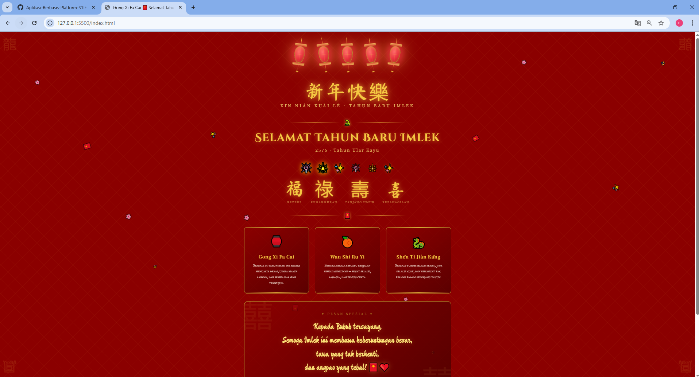

<div align="center">
  <br />
  <h1>LAPORAN PRAKTIKUM <br> APLIKASI BERBASIS PLATFORM </h1>
  <br />
  <h3>MODUL 3 <br> CSS </h3>
  <br />
  
  <br />
  <br />
  <br />
  <h3>Disusun Oleh :</h3>
  <p>
    <strong>Syiva Qaila Natasa Sugama</strong>
    <br>
    <strong>2311102106</strong>
    <br>
    <strong>S1 IF-11-REG05</strong>
  </p>
  <br />
  <h3>Dosen Pengampu :</h3>
  <p>
    <strong>Dedi Agung Prabowo, S.Kom., M.Kom</strong>
  </p>
  <br />
  <br />
  <h4>Asisten Praktikum :</h4>
  <strong>Apri Pandu Wicaksono </strong>
  <br>
  <strong>Hamka Zaenul Ardi</strong>
  <br />
  <h3>LABORATORIUM HIGH PERFORMANCE <br>FAKULTAS INFORMATIKA <br>UNIVERSITAS TELKOM PURWOKERTO <br>2026 </h3>
</div>

<hr>

# Dasar Teori CSS (Cascading Style Sheets)

CSS (Cascading Style Sheets)
CSS adalah bahasa stylesheet yang digunakan untuk mengatur tampilan dan tata letak elemen-elemen HTML pada halaman web. Kata cascading merujuk pada mekanisme prioritas aturan gaya, di mana aturan yang lebih spesifik akan menimpa aturan yang lebih umum, sehingga memungkinkan pengelolaan tampilan yang terstruktur dan terorganisir.

Selektor CSS
Selektor adalah pola yang digunakan CSS untuk menarget elemen HTML tertentu yang akan diberi gaya. Terdapat berbagai jenis selektor, mulai dari selektor elemen (seperti body, div), selektor kelas (.card), selektor ID (#header), hingga selektor pseudo-class (:hover) dan pseudo-element (::before, ::after) yang memungkinkan penargetan elemen secara sangat spesifik tanpa mengubah struktur HTML.

CSS Responsive Design dengan Media Query
Media Query adalah fitur CSS yang memungkinkan penerapan gaya berbeda berdasarkan kondisi tertentu, seperti lebar layar perangkat. Dengan sintaks @media (max-width: 500px), halaman Imlek ini menyesuaikan ukuran font, jarak lentera, dan tata letak kartu secara otomatis pada layar kecil seperti smartphone, memastikan pengalaman visual yang optimal di berbagai perangkat tanpa perlu framework CSS eksternal.

## Task 3: Project Bucin (Edisi Imlek)
### Souce code - html
```html
<!DOCTYPE html>
<html lang="id">
<head>
  <meta charset="UTF-8" />
  <meta name="viewport" content="width=device-width, initial-scale=1.0" />
  <title>Gong Xi Fa Cai 🧧 Selamat Tahun Baru Imlek</title>
  <link rel="preconnect" href="https://fonts.googleapis.com" />
  <link href="https://fonts.googleapis.com/css2?family=Noto+Serif+SC:wght@400;700;900&family=Ma+Shan+Zheng&family=Cinzel+Decorative:wght@700&family=IM+Fell+English+SC&display=swap" rel="stylesheet" />
  <link rel="stylesheet" href="style.css">
</head>
<body>
  <span class="corner corner-tl">龍</span>
  <span class="corner corner-tr">龍</span>
  <span class="corner corner-bl">鳳</span>
  <span class="corner corner-br">鳳</span>

  <div class="confetti-wrap" aria-hidden="true">
    <span class="petal">🌸</span>
    <span class="petal">🧧</span>
    <span class="petal">✨</span>
    <span class="petal">🌸</span>
    <span class="petal">🎊</span>
    <span class="petal">🌸</span>
    <span class="petal">🧧</span>
    <span class="petal">🌸</span>
    <span class="petal">✨</span>
    <span class="petal">🎊</span>
    <span class="petal">🌸</span>
    <span class="petal">🧧</span>
    <span class="petal">🌸</span>
    <span class="petal">✨</span>
    <span class="petal">🎊</span>
  </div>

  <div class="page">

    <div class="lantern-row" role="img" aria-label="Dekorasi lentera Imlek">
      <div class="lantern">
        <div class="lantern-string"></div>
        <div class="lantern-cap"></div>
        <div class="lantern-body"></div>
        <div class="lantern-base"></div>
        <div class="lantern-tassel"></div>
      </div>
      <div class="lantern">
        <div class="lantern-string"></div>
        <div class="lantern-cap"></div>
        <div class="lantern-body"></div>
        <div class="lantern-base"></div>
        <div class="lantern-tassel"></div>
      </div>
      <div class="lantern">
        <div class="lantern-string"></div>
        <div class="lantern-cap"></div>
        <div class="lantern-body"></div>
        <div class="lantern-base"></div>
        <div class="lantern-tassel"></div>
      </div>
      <div class="lantern">
        <div class="lantern-string"></div>
        <div class="lantern-cap"></div>
        <div class="lantern-body"></div>
        <div class="lantern-base"></div>
        <div class="lantern-tassel"></div>
      </div>
      <div class="lantern">
        <div class="lantern-string"></div>
        <div class="lantern-cap"></div>
        <div class="lantern-body"></div>
        <div class="lantern-base"></div>
        <div class="lantern-tassel"></div>
      </div>
    </div>

    <section class="hero">
      <span class="hero-badge">新年快樂</span>
      <p class="hero-sub">Xīn Nián Kuài Lè · Tahun Baru Imlek</p>
    </section>

    <div class="divider">
      <span class="divider-line"></span>
      <span class="divider-icon">🐍</span>
      <span class="divider-line"></span>
    </div>

    <h1 class="main-title">Selamat Tahun Baru Imlek</h1>
    <p class="subtitle">2576 · Tahun Ular Kayu</p>

    <div class="fireworks" role="img" aria-label="Kembang api perayaan">
      <span class="fw">🎆</span>
      <span class="fw">🎇</span>
      <span class="fw">✨</span>
      <span class="fw">🎆</span>
      <span class="fw">🎇</span>
      <span class="fw">✨</span>
    </div>

    <div class="hanzi-section">
      <div class="hanzi-char">
        <span class="hanzi-big">福</span>
        <span class="hanzi-label">Rezeki</span>
      </div>
      <div class="hanzi-char">
        <span class="hanzi-big">祿</span>
        <span class="hanzi-label">Kemakmuran</span>
      </div>
      <div class="hanzi-char">
        <span class="hanzi-big">壽</span>
        <span class="hanzi-label">Panjang Umur</span>
      </div>
      <div class="hanzi-char">
        <span class="hanzi-big">喜</span>
        <span class="hanzi-label">Kebahagiaan</span>
      </div>
    </div>

    <div class="divider">
      <span class="divider-line"></span>
      <span class="divider-icon">🧧</span>
      <span class="divider-line"></span>
    </div>

    <div class="cards">
      <div class="card">
        <span class="card-icon">🏮</span>
        <h2 class="card-title">Gong Xi Fa Cai</h2>
        <p class="card-text">Semoga di tahun baru ini rezeki mengalir deras, usaha makin lancar, dan semua harapan terwujud.</p>
      </div>
      <div class="card">
        <span class="card-icon">🍊</span>
        <h2 class="card-title">Wan Shi Ru Yi</h2>
        <p class="card-text">Semoga segala sesuatu berjalan sesuai keinginan — sehat selalu, bahagia, dan penuh cinta.</p>
      </div>
      <div class="card">
        <span class="card-icon">🐉</span>
        <h2 class="card-title">Shēn Tǐ Jiàn Kāng</h2>
        <p class="card-text">Semoga tubuh selalu sehat, jiwa selalu kuat, dan semangat tak pernah padam sepanjang tahun.</p>
      </div>
    </div>

    <div class="message-banner">
      <p class="message-label">✦ Pesan Spesial ✦</p>
      <p class="message-text">
        Kepada Bubub tersayang,<br/>
        Semoga Imlek ini membawa keberuntungan besar,<br/>
        tawa yang tak berhenti,<br/>
        dan angpao yang tebal! 🧧❤️
      </p>
      <p class="message-from">— Dengan sepenuh hati 心 —</p>
    </div>

    <footer class="footer">
      <p class="footer-hanzi">恭喜發財</p>
      <p class="footer-text">Gōng Xǐ Fā Cái · May prosperity find you always</p>
    </footer>

  </div>
</body>
</html>
```

### Source code - css

```css
body {
      background-color: var(--red-dark);
      color: var(--cream);
      font-family: 'IM Fell English SC', serif;
      overflow-x: hidden;
      min-height: 100vh;
    }

    body::before {
      content: '';
      position: fixed;
      inset: 0;
      background-image:
        repeating-linear-gradient(
          45deg,
          transparent,
          transparent 40px,
          rgba(245,200,66,0.04) 40px,
          rgba(245,200,66,0.04) 42px
        ),
        repeating-linear-gradient(
          -45deg,
          transparent,
          transparent 40px,
          rgba(245,200,66,0.04) 40px,
          rgba(245,200,66,0.04) 42px
        );
      pointer-events: none;
      z-index: 0;
    }

    .confetti-wrap {
      position: fixed;
      inset: 0;
      pointer-events: none;
      z-index: 1;
      overflow: hidden;
    }

    .petal {
      position: absolute;
      top: -60px;
      font-size: 1.4rem;
      animation: fall linear infinite;
      opacity: 0.8;
    }

    // Selebihnya dapat cek pada file "style.css"
```
🔗 [Klik di sini untuk membuka file `style.css`](./style.css)


Output:


# Penjelasan
Website yang dibuat merupakan sebuah halaman perayaan Tahun Baru Imlek (Chinese New Year) yang ditujukan sebagai ucapan spesial, dengan tema warna merah dan emas yang identik dengan budaya Tionghoa. Halaman ini dibangun menggunakan pure HTML dan CSS tanpa menggunakan JavaScript maupun framework styling seperti Bootstrap atau Tailwind CSS, sehingga seluruh efek visual dan animasi yang tampil dihasilkan murni melalui kemampuan CSS modern.