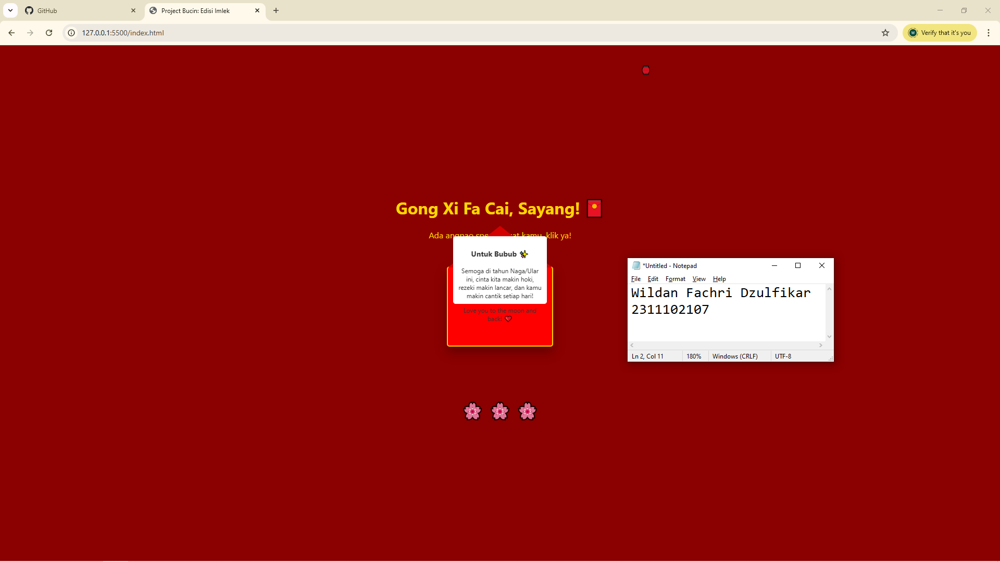

<div align="center">
  <br />
  <h1>LAPORAN PRAKTIKUM <br> APLIKASI BERBASIS PLATFORM </h1>
  <br />
  <h3>MODUL 3 <br> CSS </h3>
  <br />
  
  <br />
  <br />
  <br />
  <h3>Disusun Oleh :</h3>
  <p>
    <strong>Wildan Fachri Dzulfikar</strong>
    <br>
    <strong>2311102107</strong>
    <br>
    <strong>S1 IF-11-REG05</strong>
  </p>
  <br />
  <h3>Dosen Pengampu :</h3>
  <p>
    <strong>Dedi Agung Prabowo, S.Kom., M.Kom</strong>
  </p>
  <br />
  <br />
  <h4>Asisten Praktikum :</h4>
  <strong>Apri Pandu Wicaksono </strong>
  <br>
  <strong>Hamka Zaenul Ardi</strong>
  <br />
  <h3>LABORATORIUM HIGH PERFORMANCE <br>FAKULTAS INFORMATIKA <br>UNIVERSITAS TELKOM PURWOKERTO <br>2026 </h3>
</div>

<hr>

# Dasar Teori CSS (Cascading Style Sheets)

CSS adalah bahasa style sheet yang digunakan untuk mengatur tampilan visual dokumen yang ditulis dalam bahasa markup (seperti HTML).

Pemisahan Kekhawatiran (Separation of Concerns): CSS memungkinkan pemisahan antara konten (HTML) dan desain (CSS). Ini memudahkan pemeliharaan kode dan konsistensi desain di seluruh halaman web.

Cascading: Kata "Cascading" (beriam) merujuk pada aturan bagaimana browser menentukan gaya mana yang diterapkan jika ada lebih dari satu aturan yang bertabrakan.

CSS memungkinkan kita membuat situs web yang tampil baik di berbagai ukuran layar (HP, tablet, desktop) menggunakan Media Queries.

```@media (max-width: 600px) {
  body {
    background-color: lightblue;
  }
}
```

## Task 3: Project Bucin (Edisi Imlek)
### Souce code - html
```html
<!DOCTYPE html>
<html lang="id">
<head>
    <meta charset="UTF-8">
    <meta name="viewport" content="width=device-width, initial-scale=1.0">
    <title>Project Bucin: Edisi Imlek</title>
    <link rel="stylesheet" href="style.css">
</head>
<body>
    <div class="container">
        <div class="lantern-box">
            <div class="lantern">🏮</div>
            <div class="lantern">🏮</div>
        </div>

        <h1>Gong Xi Fa Cai, Sayang! 🧧</h1>
        <p>Ada angpao spesial buat kamu, klik ya!</p>

        <input type="checkbox" id="open-letter">
        <label for="open-letter" class="envelope">
            <div class="cap"></div>
            <div class="letter">
                <h3>Untuk Bubub ✨</h3>
                <p>Semoga di tahun Naga/Ular ini, cinta kita makin hoki, rezeki makin lancar, dan kamu makin cantik setiap hari!</p>
                <p>Love you to the moon and back! ❤️</p>
            </div>
        </label>
        
        <div class="flower">🌸 🌸 🌸</div>
    </div>
</body>
</html>
```

### Source code - css

```css
body {
    margin: 0;
    padding: 0;
    background-color: #8b0000;
    display: flex;
    justify-content: center;
    align-items: center;
    height: 100vh;
    font-family: 'Segoe UI', Tahoma, Geneva, Verdana, sans-serif;
    color: #ffd700; 
    overflow: hidden;
}

.container {
    text-align: center;
}

.lantern-box {
    position: absolute;
    top: 20px;
    width: 100%;
    display: flex;
    justify-content: space-around;
    animation: sway 3s ease-in-out infinite alternate;
}

@keyframes sway {
    from { transform: translateY(0); }
    to { transform: translateY(20px); }
}

#open-letter {
    display: none;
}

.envelope {
    position: relative;
    width: 200px;
    height: 150px;
    background-color: #ff0000;
    margin: 50px auto;
    display: block;
    cursor: pointer;
    border-radius: 5px;
    box-shadow: 0 10px 20px rgba(0,0,0,0.3);
    border: 2px solid #ffd700;
}

.cap {
    position: absolute;
    top: 0;
    width: 0;
    height: 0;
    border-left: 100px solid transparent;
    border-right: 100px solid transparent;
    border-top: 80px solid #d40000;
    z-index: 3;
    transition: transform 0.5s ease;
    transform-origin: top;
}

.letter {
    position: absolute;
    bottom: 0;
    left: 10px;
    width: 180px;
    height: 130px;
    background-color: #fff;
    color: #333;
    padding: 10px;
    box-sizing: border-box;
    transition: transform 0.5s ease;
    z-index: 2;
    border-radius: 5px;
    font-size: 12px;
}
#open-letter:checked + .envelope .cap {
    transform: rotateX(180deg);
    z-index: 1;
}

#open-letter:checked + .envelope .letter {
    transform: translateY(-80px);
    z-index: 2;
}

.flower {
    margin-top: 100px;
    font-size: 2rem;
    opacity: 0.8;
}
```

Output:


# Penjelasan
Website yang dibuat merupakan sebuah halaman perayaan Tahun Baru Imlek (Chinese New Year) yang ditujukan sebagai ucapan spesial, dengan tema warna merah dan emas yang identik dengan budaya Tionghoa. Halaman ini dibangun menggunakan pure HTML dan CSS tanpa menggunakan JavaScript maupun framework styling seperti Bootstrap atau Tailwind CSS, sehingga seluruh efek visual dan animasi yang tampil dihasilkan murni melalui kemampuan CSS modern.