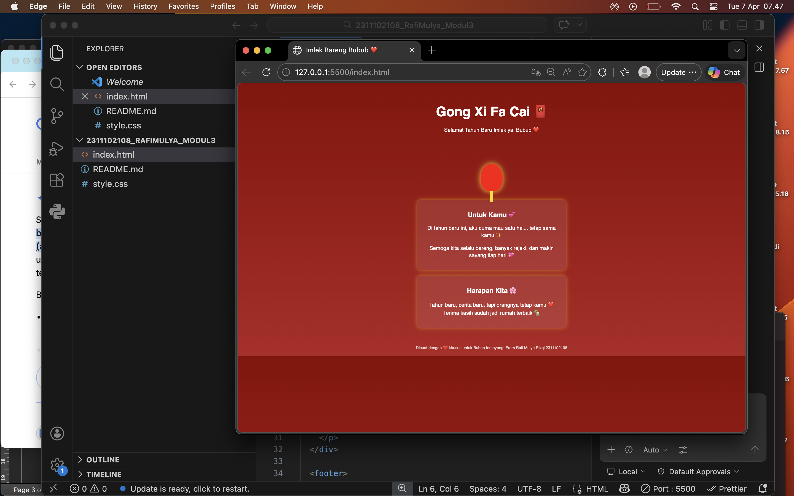

<div align="center">
  <br />
  <h1>LAPORAN PRAKTIKUM <br> APLIKASI BERBASIS PLATFORM </h1>
  <br />
  <h3>MODUL 3 <br> CSS </h3>
  <br />
  
  <br />
  <br />
  <br />
  <h3>Disusun Oleh :</h3>
  <p>
    <strong>Rafi Mulya Rizqi</strong>
    <br>
    <strong>2311102108</strong>
    <br>
    <strong>S1 IF-11-REG05</strong>
  </p>
  <br />
  <h3>Dosen Pengampu :</h3>
  <p>
    <strong>Dedi Agung Prabowo, S.Kom., M.Kom</strong>
  </p>
  <br />
  <br />
  <h4>Asisten Praktikum :</h4>
  <strong>Apri Pandu Wicaksono </strong>
  <br>
  <strong>Hamka Zaenul Ardi</strong>
  <br />
  <h3>LABORATORIUM HIGH PERFORMANCE <br>FAKULTAS INFORMATIKA <br>UNIVERSITAS TELKOM PURWOKERTO <br>2026 </h3>
</div>

<hr>

# Dasar Teori CSS (Cascading Style Sheets)

CSS (Cascading Style Sheets) adalah bahasa desain yang digunakan untuk mengontrol tampilan dan format visual dari dokumen yang ditulis dalam bahasa markup (seperti HTML). CSS memungkinkan pemisahan antara konten (HTML) dan presentasi (desain), sehingga kode menjadi lebih rapi, mudah dikelola, dan dapat digunakan kembali.

## Metode Penempatan CSS

Terdapat tiga cara utama untuk menerapkan CSS ke dalam dokumen HTML:

Inline CSS: Ditulis langsung di dalam atribut style pada tag HTML.

Internal CSS: Ditulis di dalam tag ```<style>``` pada bagian ```<head>```.

External CSS: Ditulis di file terpisah dengan ekstensi .css dan dihubungkan menggunakan tag ``<link>``. (Metode yang direkomendasikan untuk proyek skala menengah-besar).

## Contoh CSS

```css
p {
  color: blue;
  font-size: 14px;
}
```

## Task 3: Project Bucin (Edisi Imlek)
### Souce code - html
```html
<!DOCTYPE html>
<html lang="id">
<head>
  <meta charset="UTF-8">
  <meta name="viewport" content="width=device-width, initial-scale=1.0">
  <title>Imlek Bareng Bubub ❤️</title>
  <link rel="stylesheet" href="style.css">
</head>
<body>

  <header>
    <h1>Gong Xi Fa Cai 🧧</h1>
    <p>Selamat Tahun Baru Imlek ya, Bubub ❤️</p>
  </header>

  <div class="lantern"></div>

  <div class="card">
    <h2>Untuk Kamu 💕</h2>
    <p>
      Di tahun baru ini, aku cuma mau satu hal... tetap sama kamu ✨<br><br>
      Semoga kita selalu bareng, banyak rejeki, dan makin sayang tiap hari 💖
    </p>
  </div>

  <div class="card">
    <h2>Harapan Kita 🌸</h2>
    <p>
      Tahun baru, cerita baru, tapi orangnya tetap kamu ❤️<br>
      Terima kasih sudah jadi rumah terbaik 🏡
    </p>
  </div>

  <footer>
    Dibuat dengan ❤️ khusus untuk Bubub tersayang, From Rafi Mulya Rizqi 2311102108
  </footer>

</body>
</html>

```

### Source code - css

```css
body {
  margin: 0;
  font-family: 'Segoe UI', sans-serif;
  background: linear-gradient(to bottom, #8B0000, #B22222);
  color: #fff;
  text-align: center;
}

header {
  padding: 40px 20px;
}

h1 {
  font-size: 3em;
  margin-bottom: 10px;
}

p {
  font-size: 1.2em;
}

.lantern {
  width: 80px;
  height: 100px;
  background: red;
  border-radius: 50% 50% 40% 40%;
  position: relative;
  margin: 40px auto;
  box-shadow: 0 0 20px gold;
  animation: float 2s ease-in-out infinite alternate;
}

.lantern::before {
  content: "";
  width: 10px;
  height: 40px;
  background: gold;
  position: absolute;
  bottom: -40px;
  left: 50%;
  transform: translateX(-50%);
}

@keyframes float {
  from { transform: translateY(0); }
  to { transform: translateY(20px); }
}

.card {
  background: rgba(255,255,255,0.1);
  margin: 20px auto;
  padding: 20px;
  border-radius: 15px;
  width: 80%;
  max-width: 500px;
  box-shadow: 0 0 15px rgba(255,215,0,0.5);
}

footer {
  margin-top: 40px;
  padding: 20px;
  font-size: 0.9em;
  opacity: 0.8;
}

```


Output:


# Penjelasan
Penerapan Pure CSS pada proyek website perayaan Imlek ini merupakan sebuah eksperimen desain yang memadukan estetika tradisional oriental dengan kecanggihan logika styling modern, di mana setiap elemen visual seperti lampion yang bergoyang, kartu ucapan bernuansa emas, hingga mekanisme "buka angpao" digerakkan sepenuhnya oleh fitur bawaan CSS tanpa bantuan JavaScript. 