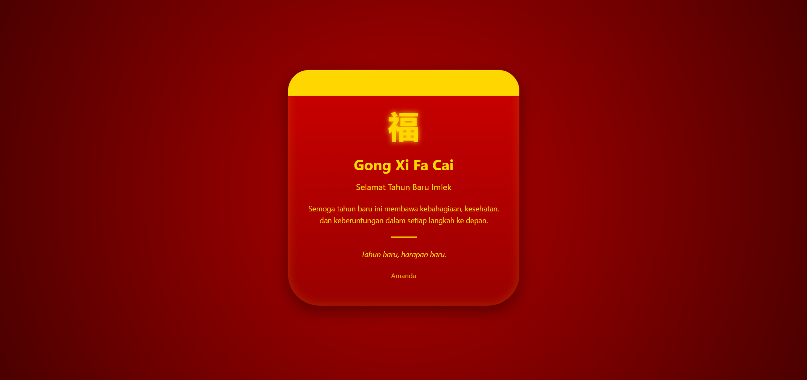

<div align="center">
  <br />
  <h1>LAPORAN PRAKTIKUM <br> APLIKASI BERBASIS PLATFORM </h1>
  <br />
  <h3>MODUL 4 <br> CSS </h3>
  <br />
  
  <br />
  <br />
  <br />
  <h3>Disusun Oleh :</h3>
  <p>
    <strong>Amanda Windhu Gustyas</strong>
    <br>
    <strong>2311102121</strong>
    <br>
    <strong>S1 IF-11-REG05</strong>
  </p>
  <br />
  <h3>Dosen Pengampu :</h3>
  <p>
    <strong>Dedi Agung Prabowo, S.Kom., M.Kom</strong>
  </p>
  <br />
  <br />
  <h4>Asisten Praktikum :</h4>
  <strong>Apri Pandu Wicaksono </strong>
  <br>
  <strong>Hamka Zaenul Ardi</strong>
  <br />
  <h3>LABORATORIUM HIGH PERFORMANCE <br>FAKULTAS INFORMATIKA <br>UNIVERSITAS TELKOM PURWOKERTO <br>2026 </h3>
</div>

<hr>

# Dasar Teori

CSS (Cascading Style Sheets) merupakan bahasa yang digunakan untuk mengatur tampilan dan desain dari halaman web yang dibuat menggunakan HTML. CSS berfungsi untuk mengontrol berbagai aspek visual seperti warna, ukuran teks, jenis font, tata letak, hingga efek visual lainnya sehingga tampilan website menjadi lebih menarik dan terstruktur. Dengan menggunakan CSS, pemisahan antara struktur (HTML) dan tampilan (CSS) dapat dilakukan, sehingga kode menjadi lebih rapi, mudah dikelola, serta memudahkan proses pengembangan dan pemeliharaan. CSS bekerja dengan cara memilih elemen HTML menggunakan selector, kemudian memberikan aturan berupa properti dan nilai untuk mengatur tampilannya. Dalam pengembangan web, CSS sangat penting karena dapat meningkatkan pengalaman pengguna melalui tampilan yang lebih estetis, konsisten, dan responsif.

# Tugas 3
## 1. Source Kode html
```
//2311102121
//Amanda Windhu Gustyas

<!DOCTYPE html>
<html lang="id">
<head>
    <meta charset="UTF-8">
    <title>Chinese New Year</title>
    <link rel="stylesheet" href="style.css">
</head>
<body>

    <div class="angpao">
        <div class="top-decor"></div>

        <div class="chinese-text">福</div>

        <h1>Gong Xi Fa Cai</h1>
        <h2>Selamat Tahun Baru Imlek</h2>

        <p>
            Semoga tahun baru ini membawa kebahagiaan, kesehatan, 
            dan keberuntungan dalam setiap langkah ke depan.
        </p>

        <div class="divider"></div>

        <p class="closing">
            Tahun baru, harapan baru.
        </p>

        <footer>Amanda</footer>
    </div>

</body>
</html>
```
## 2. Source Kode css

```
body {
    margin: 0;
    height: 100vh;
    display: flex;
    justify-content: center;
    align-items: center;
    font-family: 'Segoe UI', sans-serif;
    background: radial-gradient(circle, #b30000, #4b0000);
}

/* ANGPAO */
.angpao {
    width: 380px;
    padding: 50px 30px;
    text-align: center;
    color: gold;
    background: linear-gradient(180deg, #cc0000, #990000);
    border-radius: 40px 40px 60px 60px;
    position: relative;
    box-shadow: 
        0 10px 30px rgba(0,0,0,0.4),
        inset 0 0 20px rgba(255,215,0,0.2);
}

/* bagian atas emas */
.top-decor {
    position: absolute;
    top: 0;
    left: 0;
    width: 100%;
    height: 50px;
    background: linear-gradient(to right, gold, #ffd700, gold);
    border-radius: 40px 40px 0 0;
}

/* huruf china */
.chinese-text {
    font-size: 60px;
    color: gold;
    margin: 15px 0;
    font-weight: bold;
    text-shadow: 0 0 10px gold;
}

/* judul */
h1 {
    margin: 10px 0;
    font-size: 28px;
}

h2 {
    font-size: 16px;
    font-weight: normal;
    margin-bottom: 20px;
}

/* isi */
p {
    font-size: 14px;
    line-height: 1.6;
}

/* garis */
.divider {
    width: 50px;
    height: 2px;
    background: gold;
    margin: 20px auto;
}

/* penutup */
.closing {
    font-style: italic;
}

/* footer */
footer {
    margin-top: 20px;
    font-size: 13px;
    opacity: 0.8;
}

/* hover effect */
.angpao:hover {
    transform: translateY(-5px);
    transition: 0.3s;
}
```
Output:


# Penjelasan
Kode HTML pada program ini digunakan untuk membangun struktur halaman web yang terdiri dari elemen utama berupa <div class="angpao"> sebagai wadah tampilan bertema angpao. Di dalamnya terdapat elemen dekorasi, judul, teks, serta karakter Tiongkok “福” yang melambangkan keberuntungan. Sementara itu, CSS digunakan untuk mengatur tampilan visual agar lebih menarik, seperti memberikan warna merah dan emas khas Imlek, mengatur posisi konten di tengah layar menggunakan flexbox, serta menambahkan efek seperti border-radius untuk bentuk melengkung dan box-shadow untuk memberikan kesan kedalaman. Kombinasi HTML dan CSS ini menghasilkan tampilan halaman yang rapi, estetis, dan sesuai dengan konsep desain yang diinginkan.