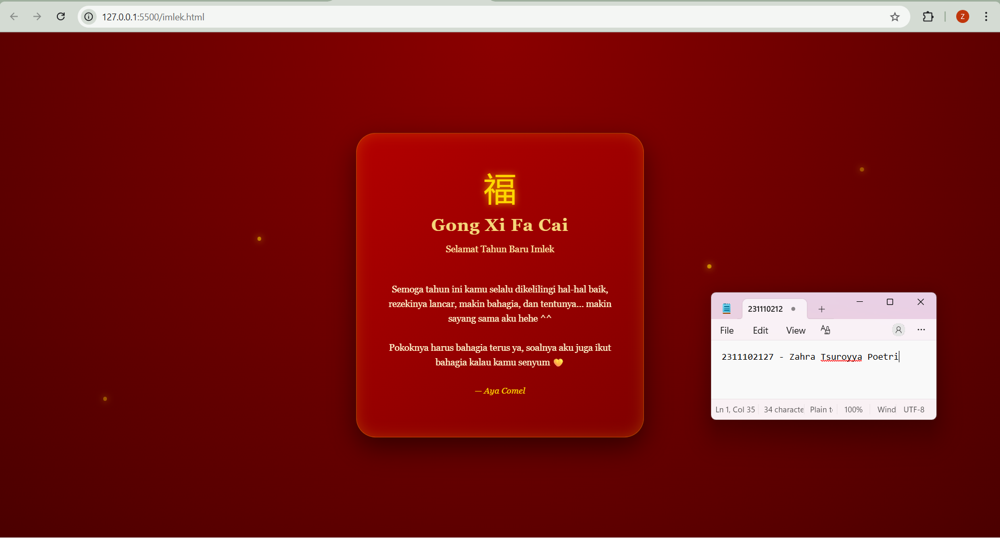

<div align="center">
  <br />
  <h1>LAPORAN PRAKTIKUM <br> APLIKASI BERBASIS PLATFORM </h1>
  <br />
  <h3>MODUL 3 <br> CSS </h3>
  <br />
  
  <br />
  <br />
  <br />
  <h3>Disusun Oleh :</h3>
  <p>
    <strong>Zahra Tsuroyya Poetri</strong>
    <br>
    <strong>2311102127</strong>
    <br>
    <strong>S1 IF-11-REG05</strong>
  </p>
  <br />
  <h3>Dosen Pengampu :</h3>
  <p>
    <strong>Dedi Agung Prabowo, S.Kom., M.Kom</strong>
  </p>
  <br />
  <br />
  <h4>Asisten Praktikum :</h4>
  <strong>Apri Pandu Wicaksono </strong>
  <br>
  <strong>Hamka Zaenul Ardi</strong>
  <br />
  <h3>LABORATORIUM HIGH PERFORMANCE <br>FAKULTAS INFORMATIKA <br>UNIVERSITAS TELKOM PURWOKERTO <br>2026</h3>
</div>

<hr>

### Dasar Teori

CSS (Cascading Style Sheets) merupakan bahasa yang digunakan untuk mengatur tampilan dan desain pada halaman website. CSS berfungsi untuk mengatur berbagai elemen visual seperti warna, font, margin, layout, background, serta menyesuaikan tampilan website dengan berbagai ukuran layar.

CSS bekerja dengan cara memisahkan antara struktur dan tampilan, di mana HTML digunakan untuk menyusun struktur konten, sedangkan CSS digunakan untuk mengatur desainnya. Dengan adanya pemisahan ini, pengelolaan dan pengembangan website menjadi lebih mudah, terutama dalam hal perawatan (maintainability) kode.

Selain itu, CSS juga mendukung pembuatan website yang responsif melalui penggunaan media query, sehingga tampilan website dapat menyesuaikan dengan berbagai perangkat seperti komputer, tablet, maupun smartphone.

Dalam pengembangan website, CSS biasanya dikombinasikan dengan HTML untuk menghasilkan tampilan yang lebih menarik, rapi, dan terstruktur.

### Tugas 3 - Project Bucin (Edisi Imlek)

#### Source Code - HTML

```
<!DOCTYPE html>
<html>
    <head>
        <title>Project Imlek</title>
        <link rel="stylesheet" href="style.css">
    </head>

    <body>

        <div class="card">

            <h1>🧧 Gong Xi Fa Cai 🧧</h1>

            

            <p class="subtitle">
                Selamat Tahun Baru Imlek ✨
            </p>

            <p class="message">
                Semoga di tahun yang baru ini dipenuhi dengan
                keberuntungan, kebahagiaan, dan kesehatan.
                Semoga setiap langkah membawa hal baik,
                dan setiap hari dipenuhi dengan senyuman.
            </p>

            <p class="bubub">
                Untuk sayangnya aku 💖
            </p>

        </div>

        <div class="lampion kiri"></div>
        <div class="lampion kanan"></div>

    </body>
</html>

```

#### Source Code - CSS
```
body{
    margin:0;
    height:100vh;
    display:flex;
    justify-content:center;
    align-items:center;
    background: radial-gradient(circle at top, #8b0000, #4b0000);
    font-family: 'Georgia', serif;
    overflow:hidden;
}

/* CARD */
.card{
    position:relative;
    background: linear-gradient(145deg, #b30000, #800000);
    padding:50px 40px;
    border-radius:30px;
    width:360px;
    text-align:center;
    color:#f5d77a;
    box-shadow: 
        0 15px 40px rgba(0,0,0,0.5),
        inset 0 0 20px rgba(255,215,0,0.2);
    border:1px solid rgba(255,215,0,0.3);
    z-index:2;
}

/* SYMBOL */
.symbol{
    font-size:50px;
    margin-bottom:10px;
    color:gold;
    text-shadow:0 0 10px rgba(255,215,0,0.8);
}

h1{
    margin:10px 0;
    font-size:26px;
    letter-spacing:1px;
}

.subtitle{
    font-size:14px;
    color:#ffe8a3;
    margin-bottom:20px;
}

.message{
    font-size:14px;
    line-height:1.6;
    color:#fff5cc;
    margin-bottom:25px;
    white-space: pre-line;
}

.signature{
    font-style:italic;
    font-size:13px;
    color:#ffd700;
}

/* PARTICLES */
.particles{
    position: fixed;
    width: 100%;
    height: 100%;
    top: 0;
    left: 0;
    pointer-events: none;
    z-index:1;
}

.particles span{
    position: absolute;
    width: 6px;
    height: 6px;
    background: rgba(255, 215, 0, 0.7);
    border-radius: 50%;
    animation: floatUp linear infinite;
    box-shadow: 0 0 10px rgba(255,215,0,0.8);
}

.particles span:nth-child(1){ left: 10%; animation-duration: 7s; }
.particles span:nth-child(2){ left: 25%; animation-duration: 5s; }
.particles span:nth-child(3){ left: 40%; animation-duration: 6s; }
.particles span:nth-child(4){ left: 55%; animation-duration: 8s; }
.particles span:nth-child(5){ left: 70%; animation-duration: 5.5s; }
.particles span:nth-child(6){ left: 85%; animation-duration: 7.5s; }

/* ANIMASI */
@keyframes floatUp{
    0%{
        bottom:-10px;
        opacity:0;
        transform: translateX(0);
    }
    50%{
        opacity:1;
    }
    100%{
        bottom:100%;
        opacity:0;
        transform: translateX(20px);
    }
}

```

### Hasil Output



### Deskripsi Kode

Kode HTML dan CSS tersebut digunakan untuk membuat halaman web sederhana bertema ucapan Gong Xi Fa Cai sesuai dengan tugas Project Bucin (Edisi Imlek). Halaman ini dibuat hanya menggunakan HTML dan CSS tanpa bantuan JavaScript maupun framework tambahan.

HTML digunakan untuk menyusun isi halaman seperti judul, teks ucapan, dan nama pengirim. Di dalamnya terdapat elemen utama berupa card yang berisi pesan ucapan. Selain itu, ditambahkan juga beberapa elemen untuk efek partikel pada background.

CSS digunakan untuk mengatur tampilan seperti warna latar belakang, posisi elemen di tengah, serta tampilan card agar lebih rapi. Selain itu, CSS juga digunakan untuk membuat animasi partikel yang bergerak menggunakan @keyframes.

Hasil dari kode tersebut adalah halaman ucapan Imlek sederhana yang sudah sesuai dengan ketentuan tugas, yaitu menggunakan pure CSS tanpa JavaScript atau framework.

### Refrensi
[1] Santoso, M. (2025). Perbandingan efektivitas bootstrap dan tailwind CSS dalam pengembangan UI web responsif. Jurnal Teknologi dan Sistem Informasi Bisnis, 7(4), 489–497.

[2] Sari, I. P., Azzahrah, A., Qathrunada, I. F., Lubis, N., & Anggraini, T. (2022). Perancangan sistem absensi pegawai kantoran secara online pada website berbasis HTML dan CSS. Fakultas Ilmu Komputer dan Teknologi Informasi, Universitas Muhammadiyah Sumatera Utara.