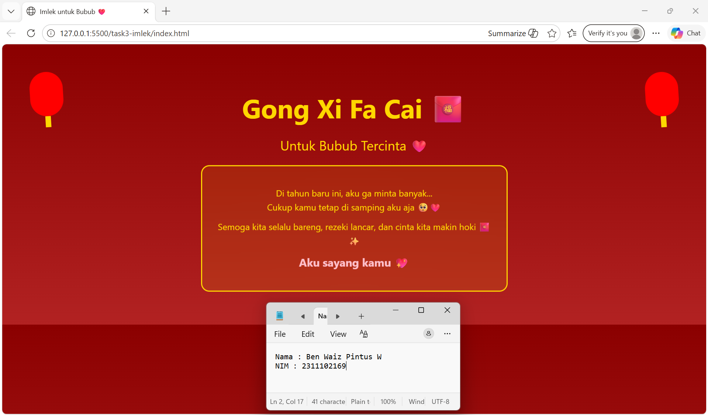

<div align="center">
  <br />
  <h1>LAPORAN PRAKTIKUM <br> APLIKASI BERBASIS PLATFORM </h1>
  <br />
  <h3>MODUL 3 <br> CSS </h3>
  <br />
  
  <br />
  <br />
  <br />
  <h3>Disusun Oleh :</h3>
  <p>
    <strong>Ben Waiz Pintus Widyosaputro</strong>
    <br>
    <strong>2311102169</strong>
    <br>
    <strong>S1 IF-11-REG05</strong>
  </p>
  <br />
  <h3>Dosen Pengampu :</h3>
  <p>
    <strong>Dedi Agung Prabowo, S.Kom., M.Kom</strong>
  </p>
  <br />
  <br />
  <h4>Asisten Praktikum :</h4>
  <strong>Apri Pandu Wicaksono </strong>
  <br>
  <strong>Hamka Zaenul Ardi</strong>
  <br />
  <h3>LABORATORIUM HIGH PERFORMANCE <br>FAKULTAS INFORMATIKA <br>UNIVERSITAS TELKOM PURWOKERTO <br>2026 </h3>
</div>

<hr>


# Dasar Teori

<p align="justify">
HTML (HyperText Markup Language) digunakan sebagai struktur utama untuk menyusun elemen seperti judul, paragraf, dan container sehingga konten dapat ditampilkan dengan rapi dan terorganisir. Sementara itu, CSS (Cascading Style Sheets) berperan dalam mengatur tampilan visual seperti warna, ukuran, layout, serta efek desain. Pada proyek ini digunakan konsep pure CSS, di mana seluruh styling dibuat secara manual, termasuk penerapan warna khas Imlek seperti merah dan emas yang melambangkan keberuntungan dan kemakmuran, serta penggunaan box model (margin, padding, border, dan content) untuk mengatur tata letak elemen.
</p>

<p align="justify">
CSS untuk menambah daya tarik visual tanpa memerlukan JavaScript, seperti penggunaan @keyframes dan properti animation untuk menciptakan efek gerak pada elemen tertentu. Dari sisi desain, aspek UI (User Interface) dan UX (User Experience) juga diperhatikan agar tampilan halaman tetap menarik dan nyaman dilihat. Penambahan elemen personal seperti ucapan romantis memberikan nilai emosional yang membuat halaman lebih interaktif dan engaging. Dengan demikian, proyek ini tidak hanya menerapkan dasar-dasar pengembangan web, tetapi juga menggabungkan unsur estetika dan pengalaman pengguna dalam satu halaman sederhana.
</p>

# Tugas 3 - Project Bucin (Edisi Imlek)
## 1. Source code index.html
```<!-- 2311102169
Ben Waiz Pintus W
S1IF-11-05 -->
<!DOCTYPE html>
<html lang="id">
<head>
    <meta charset="UTF-8">
    <title>Imlek untuk Bubub ❤️</title>
    <link rel="stylesheet" href="style.css">
</head>
<body>

    <div class="container">
        <h1>Gong Xi Fa Cai 🧧</h1>
        <h2>Untuk Bubub Tercinta ❤️</h2>

        <div class="card">
            <p>
                Di tahun baru ini, aku ga minta banyak...<br>
                Cukup kamu tetap di samping aku aja 🥺❤️
            </p>

            <p>
                Semoga kita selalu bareng, rezeki lancar,  
                dan cinta kita makin hoki 🧧✨
            </p>

            <p class="love">Aku sayang kamu 💖</p>
        </div>

        <div class="lantern left"></div>
        <div class="lantern right"></div>
    </div>

</body>
</html>
```

## 2. Source Code style.css
```body {
    margin: 0;
    font-family: "Segoe UI", sans-serif;
    background: linear-gradient(to bottom, #8B0000, #B22222);
    color: #FFD700;
    text-align: center;
}

.container {
    padding: 50px 20px;
}

h1 {
    font-size: 48px;
    margin-bottom: 10px;
    animation: fadeIn 2s ease;
}

h2 {
    font-weight: normal;
    margin-bottom: 30px;
}

.card {
    background: rgba(255, 215, 0, 0.1);
    border: 2px solid gold;
    border-radius: 15px;
    padding: 25px;
    max-width: 500px;
    margin: auto;
    backdrop-filter: blur(5px);
    animation: float 3s ease-in-out infinite;
}

.card p {
    margin: 10px 0;
    line-height: 1.6;
}

.love {
    font-size: 20px;
    font-weight: bold;
    color: pink;
}

/* Lantern */
.lantern {
    width: 60px;
    height: 80px;
    background: red;
    border-radius: 30px;
    position: absolute;
    top: 50px;
    animation: swing 2s infinite ease-in-out;
}

.lantern::after {
    content: "";
    width: 10px;
    height: 20px;
    background: gold;
    position: absolute;
    bottom: -20px;
    left: 25px;
}

.left {
    left: 50px;
}

.right {
    right: 50px;
}

/* Animations */
@keyframes swing {
    0% { transform: rotate(5deg); }
    50% { transform: rotate(-5deg); }
    100% { transform: rotate(5deg); }
}

@keyframes float {
    0% { transform: translateY(0); }
    50% { transform: translateY(-10px); }
    100% { transform: translateY(0); }
}

@keyframes fadeIn {
    from { opacity: 0; }
    to { opacity: 1; }
}
```

# Output


# Penjelasan
<p align="justify">
Program ini terdiri dari dua bagian utama, yaitu file HTML (imlek.html) dan file CSS (style.css). Pada file HTML, struktur halaman dibuat menggunakan elemen dasar seperti <h1> untuk judul utama “Gong Xi Fa Cai”, <h2> untuk subjudul, serta <div> sebagai container yang membungkus seluruh isi halaman. Terdapat juga elemen <p> yang berisi ucapan Imlek bernuansa romantis. Selain itu, ditambahkan elemen dekoratif berupa <div> dengan class lantern yang berfungsi sebagai ornamen lampion di sisi kiri dan kanan halaman. Semua elemen tersebut disusun secara sederhana agar mudah dipahami dan tetap fokus pada isi pesan yang ingin disampaikan.

Pada file CSS, digunakan berbagai properti untuk mempercantik tampilan halaman. Warna latar belakang dibuat menggunakan gradasi merah untuk menciptakan nuansa Imlek, sedangkan teks menggunakan warna emas agar terlihat kontras dan elegan. Elemen .card diberi border, padding, dan efek transparansi untuk menonjolkan isi ucapan. Selain itu, ditambahkan animasi menggunakan @keyframes seperti swing untuk membuat lampion terlihat bergoyang, float untuk efek melayang pada card, serta fadeIn untuk menampilkan teks secara perlahan. Properti position juga digunakan untuk mengatur letak lampion di sisi kiri dan kanan halaman. Dengan kombinasi ini, program berhasil menghasilkan tampilan yang menarik dan interaktif hanya dengan menggunakan HTML dan CSS tanpa bantuan JavaScript.
</p>