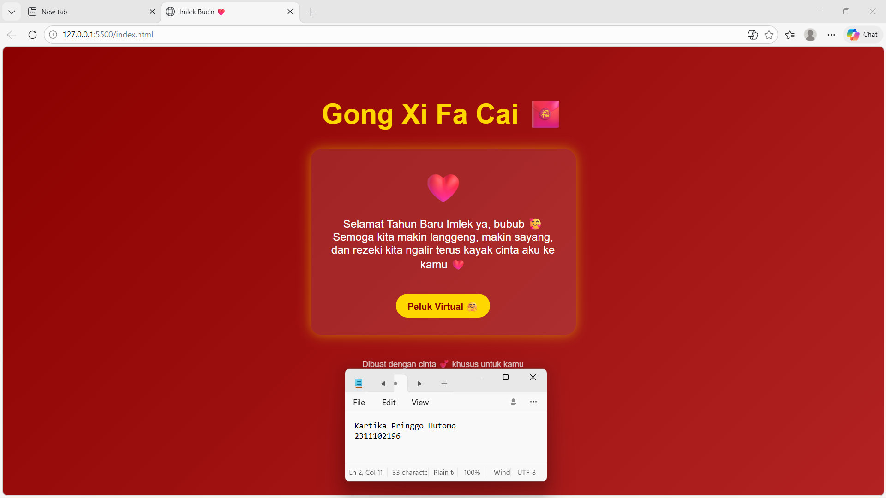

<div align="center">
  <br />
  <h1>LAPORAN PRAKTIKUM <br> APLIKASI BERBASIS PLATFORM </h1>
  <br />
  <h3>MODUL 3 <br> CSS </h3>
  <br />
  
  <br />
  <br />
  <br />
  <h3>Disusun Oleh :</h3>
  <p>
    <strong>Kartika Pringgo Hutomo</strong>
    <br>
    <strong>2311102196</strong>
    <br>
    <strong>S1 IF-11-REG05</strong>
  </p>
  <br />
  <h3>Dosen Pengampu :</h3>
  <p>
    <strong>Dedi Agung Prabowo, S.Kom., M.Kom</strong>
  </p>
  <br />
  <br />
  <h4>Asisten Praktikum :</h4>
  <strong>Apri Pandu Wicaksono </strong>
  <br>
  <strong>Hamka Zaenul Ardi</strong>
  <br />
  <h3>LABORATORIUM HIGH PERFORMANCE <br>FAKULTAS INFORMATIKA <br>UNIVERSITAS TELKOM PURWOKERTO <br>2026 </h3>
</div>

<hr>


# Dasar Teori

<p align="justify">
Dasar teori dalam pembuatan proyek halaman web “Project Bucin (Edisi Imlek)” ini mengacu pada penggunaan teknologi dasar pengembangan web yaitu HTML dan CSS tanpa memanfaatkan JavaScript maupun framework tambahan. HTML (HyperText Markup Language) digunakan sebagai struktur utama dalam membangun halaman, yang berfungsi untuk menyusun elemen-elemen seperti judul, paragraf, tombol, dan konten ucapan sehingga informasi dapat ditampilkan dengan rapi. Sementara itu, CSS (Cascading Style Sheets) berperan dalam memperindah tampilan halaman dengan mengatur warna, layout, jarak, serta menambahkan efek visual seperti bayangan dan sudut melengkung. Pada proyek ini digunakan konsep pure CSS, yaitu seluruh proses styling dilakukan secara manual tanpa bantuan library eksternal seperti Bootstrap atau Tailwind, sehingga memberikan pemahaman lebih mendalam terhadap dasar-dasar desain web. Selain itu, meskipun tidak menggunakan JavaScript, interaktivitas sederhana tetap dapat dihadirkan melalui fitur CSS seperti efek hover dan animasi menggunakan @keyframes, contohnya animasi detak pada ikon hati. Desain halaman juga mengusung tema Imlek dengan dominasi warna merah dan emas yang melambangkan keberuntungan dan kemakmuran, serta dipadukan dengan nuansa romantis sesuai konsep “bucin”, sehingga menghasilkan tampilan yang menarik dan sesuai dengan tujuan pembuatan halaman tersebut.

</p>


# Tugas 3 - Project Bucin (Edisi Imlek)
## 1. Source code index.html
```<!-- 2311102196
Kartika Pringgo Hutomo
S1IF-11-05 -->
<html lang="id">
<head>
  <meta charset="UTF-8">
  <meta name="viewport" content="width=device-width, initial-scale=1.0">
  <title>Imlek Bucin ❤️</title>
  <link rel="stylesheet" href="style.css">
</head>
<body>
  <div class="container">
    <h1>Gong Xi Fa Cai 🧧</h1>

    <div class="card">
      <div class="heart">❤️</div>
      <p class="message">
        Selamat Tahun Baru Imlek ya, bubub 🥰<br>
        Semoga kita makin langgeng, makin sayang, 
        dan rezeki kita ngalir terus kayak cinta aku ke kamu ❤️
      </p>
      <a href="#" class="btn">Peluk Virtual 🤗</a>
    </div>

    <footer>
      Dibuat dengan cinta 💕 khusus untuk kamu
    </footer>
  </div>
</body>
</html>

```

## 2. Source Code style.css
``` body {
  margin: 0;
  font-family: Arial, sans-serif;
  background: linear-gradient(135deg, #8B0000, #B22222);
  color: #fff;
  text-align: center;
}

.container {
  padding: 50px 20px;
}

h1 {
  font-size: 3em;
  color: gold;
}

.card {
  background: rgba(255, 255, 255, 0.1);
  border-radius: 20px;
  padding: 30px;
  margin: 30px auto;
  max-width: 400px;
  box-shadow: 0 0 20px rgba(255, 215, 0, 0.5);
}

.heart {
  font-size: 50px;
  animation: beat 1s infinite;
}

@keyframes beat {
  0% { transform: scale(1); }
  50% { transform: scale(1.2); }
  100% { transform: scale(1); }
}
.message {
  font-size: 1.2em;
  margin-top: 20px;
}

.btn {
  display: inline-block;
  margin-top: 20px;
  padding: 10px 20px;
  background: gold;
  color: #8B0000;
  border-radius: 30px;
  text-decoration: none;
  font-weight: bold;
  transition: 0.3s;
}

.btn:hover {
  background: #ffd700;
  transform: scale(1.1);
}

footer {
  margin-top: 40px;
  font-size: 0.9em;
  opacity: 0.8;
}

```
**Source Codenya:** [style.css](./style.css)

# Output


# Penjelasan
<p align="justify">
Berikut penjelasan kode **tanpa menggunakan tanda kurung sudut**:

Kode pada proyek Halaman Imlek Bucin terdiri dari dua bagian utama yaitu file index.html sebagai struktur halaman dan style.css sebagai pengatur tampilan. Pada file HTML diawali dengan deklarasi DOCTYPE html yang menandakan bahwa dokumen menggunakan HTML5. Elemen html dengan atribut lang sama dengan id menunjukkan bahwa bahasa yang digunakan adalah Bahasa Indonesia. Pada bagian head terdapat meta charset untuk encoding karakter, meta viewport untuk membuat tampilan responsif di berbagai perangkat, serta title untuk memberi judul halaman. Selain itu, file HTML juga menghubungkan file CSS eksternal menggunakan rel stylesheet yang mengarah ke file style.css.

Pada bagian body seluruh konten dibungkus dalam sebuah div dengan class container yang berfungsi sebagai pembungkus utama. Di dalamnya terdapat h1 yang menampilkan judul Gong Xi Fa Cai sebagai ucapan Imlek. Selanjutnya terdapat div dengan class card yang digunakan untuk menampilkan konten utama berupa pesan romantis. Di dalam card tersebut terdapat div dengan class heart yang berisi ikon hati, lalu paragraf dengan class message yang berisi teks ucapan, serta sebuah link dengan class btn yang berfungsi sebagai tombol Peluk Virtual. Di bagian bawah terdapat footer yang menampilkan teks penutup.

Sementara itu pada file CSS, styling dimulai dari body yang mengatur margin menjadi nol, menentukan jenis font, serta memberikan background gradasi warna merah untuk menyesuaikan tema Imlek. Class container digunakan untuk memberikan padding agar konten tidak terlalu mepet ke tepi layar. Elemen h1 diatur ukuran font menjadi besar dan diberi warna emas agar terlihat mencolok. Class card diberi background transparan, border radius untuk sudut melengkung, padding, serta efek bayangan agar terlihat seperti kartu.

Class heart diberi ukuran font besar dan animasi menggunakan keyframes dengan nama beat yang membuat ikon hati tampak berdenyut. Animasi ini bekerja dengan mengubah skala secara berulang. Class message mengatur ukuran dan jarak teks agar lebih nyaman dibaca. Tombol dengan class btn didesain menggunakan background warna emas, teks berwarna merah, bentuk melengkung, serta efek hover yang membuat tombol membesar saat disentuh kursor. Terakhir, footer diatur dengan ukuran font kecil dan sedikit transparan agar tidak terlalu mencolok. Secara keseluruhan, kombinasi HTML dan CSS ini menghasilkan tampilan halaman yang sederhana namun menarik dengan nuansa Imlek dan sentuhan romantis.

</p>