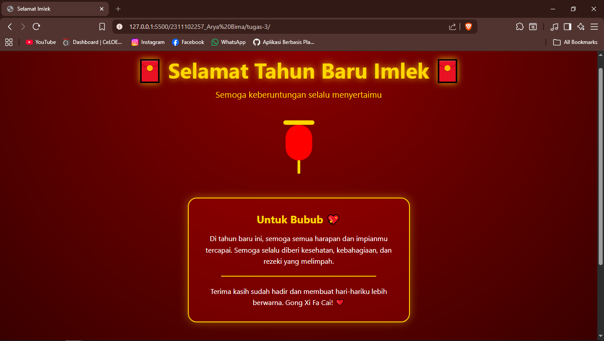
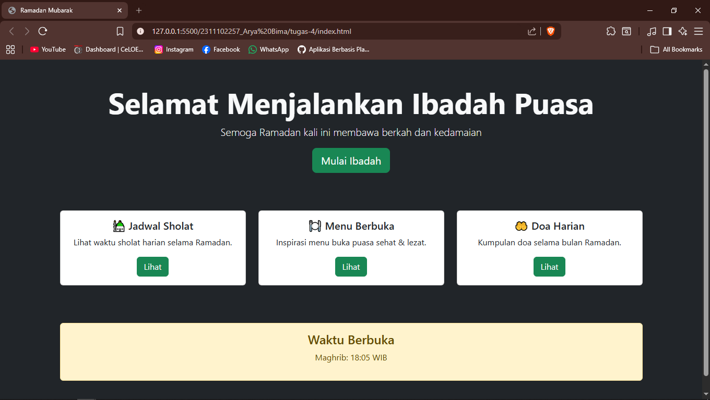
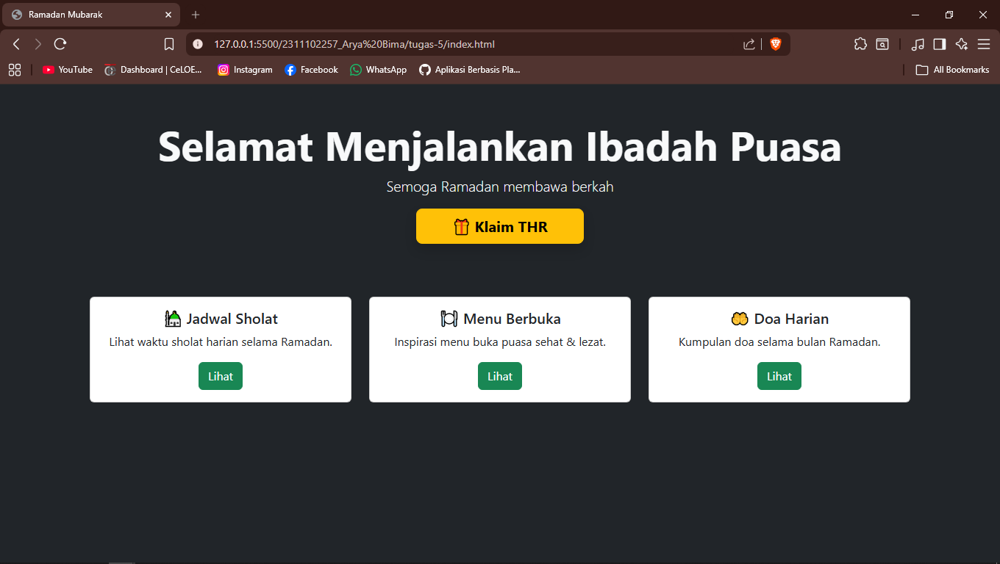
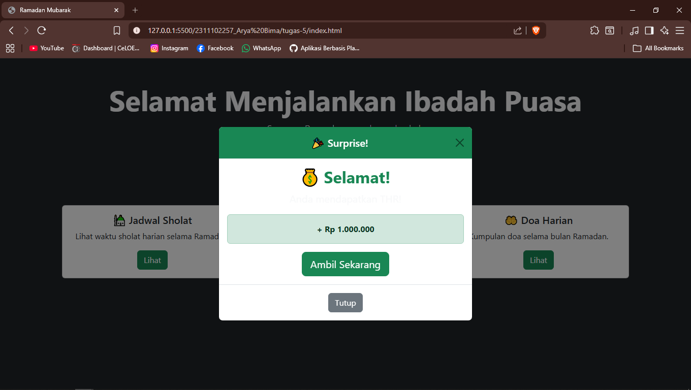
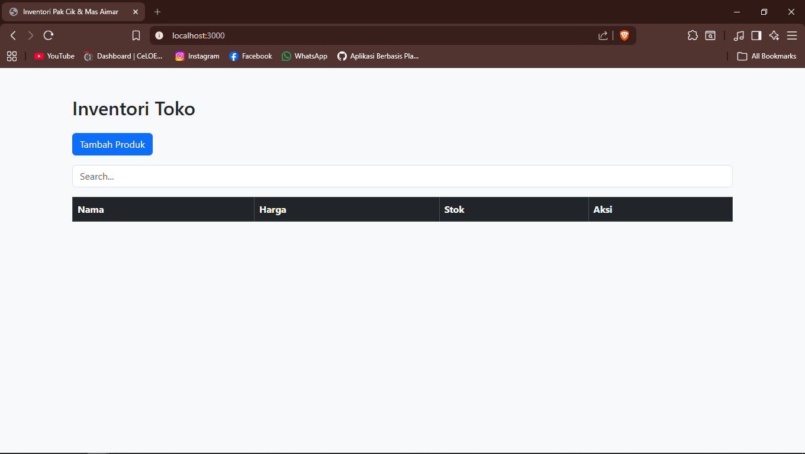
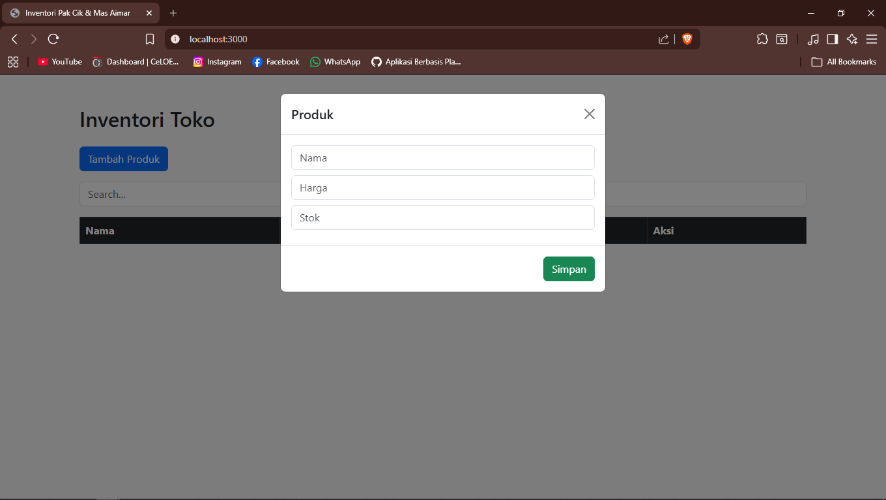
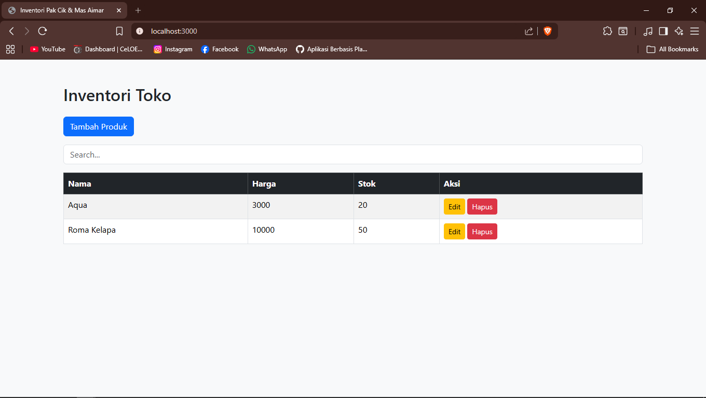
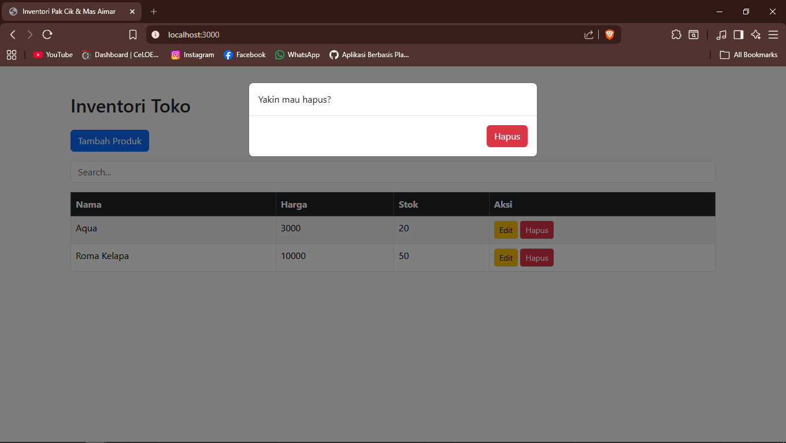

<div align="center">
  <br />
  <h1>LAPORAN PRAKTIKUM <br> APLIKASI BERBASIS PLATFORM </h1>
  <br />
  <h3>MODUL 3 <br> CSS </h3>
  <br />
  
  <br />
  <br />
  <br />
  <h3>Disusun Oleh :</h3>
  <p>
    <strong>Arya Bima</strong>
    <br>
    <strong>2311102257</strong>
    <br>
    <strong>S1 IF-11-REG05</strong>
  </p>
  <br />
  <h3>Dosen Pengampu :</h3>
  <p>
    <strong>Dedi Agung Prabowo, S.Kom., M.Kom</strong>
  </p>
  <br />
  <br />
  <h4>Asisten Praktikum :</h4>
  <strong>Apri Pandu Wicaksono </strong>
  <br>
  <strong>Hamka Zaenul Ardi</strong>
  <br />
  <h3>LABORATORIUM HIGH PERFORMANCE <br>FAKULTAS INFORMATIKA <br>UNIVERSITAS TELKOM PURWOKERTO <br>2026 </h3>
</div>

<hr>

# Dasar Teori

### 1. Pengertian CSS

CSS (Cascading Style Sheets) adalah bahasa untuk mengatur tampilan, warna, ukuran, dan layout halaman web. CSS bekerja bersama HTML untuk memisahkan konten (HTML) dari desain (CSS).

### 2. Cara Menghubungkan CSS ke HTML

- Inline : `style=""` di dalam tag HTML (tidak direkomendasikan)
- Internal : `<style>` di dalam `<head>`
- External : Paling baik => `<link rel="stylesheet" href="style.css">`

### 3. Sintaks Dasar CSS

```css
selector {
  property: value;
  property: value;
}
```

**Contoh:**

```css
h1 {
  color: blue;
  font-size: 32px;
  text-align: center;
}
```

### 4. Jenis Selector Utama

| Selector  | Contoh       | Keterangan                |
| --------- | ------------ | ------------------------- |
| Element   | `p {}`       | Semua tag `<p>`           |
| Class     | `.btn {}`    | Elemen dengan class="btn" |
| ID        | `#header {}` | Elemen dengan id="header" |
| Universal | `* {}`       | Semua elemen              |

### 5. Properti CSS yang Sering Digunakan

- Teks : `color`, `font-size`, `text-align`
- Box Model : `margin`, `padding`, `border`, `width`, `height`
- Layout : `display`, `position`, `flex`, `grid`

### 6. Konsep Penting

- Box Model : Setiap elemen adalah kotak (content + padding + border + margin)
- Cascading : Aturan CSS mengikuti prioritas (specificity)
- Responsive : Menggunakan Media Queries untuk menyesuaikan tampilan di berbagai ukuran layar

### 7. Prinsip Dasar

- Gunakan external CSS sebanyak mungkin.
- Pisahkan konten (HTML) dan tampilan (CSS).
- Gunakan class daripada ID untuk styling.
- Buat kode yang bersih dan mudah dibaca.

---

# Tugas 3: Project Bucin (Edisi Imlek)

`index.html:`

```html
<!-- 2311102257 - Arya Bima -->
<!doctype html>
<html lang="id">
  <head>
    <meta charset="UTF-8" />
    <meta name="viewport" content="width=device-width, initial-scale=1.0" />
    <title>Selamat Imlek</title>
    <link rel="stylesheet" href="style.css" />
  </head>
  <body>
    <header>
      <h1>🧧 Selamat Tahun Baru Imlek 🧧</h1>
      <div class="subtitle">Semoga keberuntungan selalu menyertaimu</div>
    </header>

    <div class="lantern"></div>

    <div class="container">
      <div class="card">
        <h2>Untuk Bubub 💖</h2>
        <p>
          Di tahun baru ini, semoga semua harapan dan impianmu tercapai. Semoga
          selalu diberi kesehatan, kebahagiaan, dan rezeki yang melimpah.
        </p>
        <div class="gold-line"></div>
        <p>
          Terima kasih sudah hadir dan membuat hari-hariku lebih berwarna. Gong
          Xi Fa Cai! ❤️
        </p>
      </div>
    </div>

    <div class="lantern"></div>

    <div class="footer">Made with ❤️ khusus untuk bubub</div>
  </body>
</html>
```

`style.css:`

```css
* {
  margin: 0;
  padding: 0;
  box-sizing: border-box;
  font-family: "Segoe UI", sans-serif;
}

body {
  background: radial-gradient(circle at top, #8b0000, #2b0000);
  color: #fff;
  text-align: center;
  overflow-x: hidden;
}

header {
  padding: 40px 20px;
}

h1 {
  font-size: 3rem;
  color: gold;
  text-shadow: 0 0 15px rgba(255, 215, 0, 0.8);
}

.subtitle {
  margin-top: 10px;
  font-size: 1.2rem;
  color: #ffd700;
}

.container {
  padding: 40px 20px;
}

.card {
  background: rgba(255, 0, 0, 0.2);
  border: 2px solid gold;
  border-radius: 20px;
  padding: 30px;
  max-width: 500px;
  margin: 0 auto;
  box-shadow: 0 0 20px rgba(255, 215, 0, 0.4);
}

.card h2 {
  color: gold;
  margin-bottom: 15px;
}

.card p {
  line-height: 1.6;
}

.lantern {
  width: 60px;
  height: 80px;
  background: red;
  border-radius: 30px;
  margin: 30px auto;
  position: relative;
  animation: float 3s ease-in-out infinite;
}

.lantern::before {
  content: "";
  width: 70px;
  height: 10px;
  background: gold;
  position: absolute;
  top: -10px;
  left: -5px;
  border-radius: 5px;
}

.lantern::after {
  content: "";
  width: 6px;
  height: 30px;
  background: gold;
  position: absolute;
  bottom: -30px;
  left: 50%;
  transform: translateX(-50%);
}

@keyframes float {
  0%,
  100% {
    transform: translateY(0);
  }
  50% {
    transform: translateY(-15px);
  }
}

.footer {
  margin-top: 50px;
  padding: 20px;
  font-size: 0.9rem;
  color: #ffcccb;
}

.gold-line {
  width: 80%;
  height: 2px;
  background: gold;
  margin: 20px auto;
}
```

Output:


---

# Tugas 4: Mode Suci (Edisi Ramadan)

```html
<!-- 2311102257 - Arya Bima -->
<!doctype html>
<html lang="id">
  <head>
    <meta charset="UTF-8" />
    <meta name="viewport" content="width=device-width, initial-scale=1" />
    <title>Ramadan Mubarak</title>
    <link
      href="https://cdn.jsdelivr.net/npm/bootstrap@5.3.3/dist/css/bootstrap.min.css"
      rel="stylesheet"
    />
  </head>
  <body class="bg-dark text-light">
    <!-- Hero -->
    <section class="container text-center py-5">
      <h1 class="display-4 fw-bold">Selamat Menjalankan Ibadah Puasa</h1>
      <p class="lead">Semoga Ramadan kali ini membawa berkah dan kedamaian</p>
      <button class="btn btn-success btn-lg">Mulai Ibadah</button>
    </section>

    <!-- Cards -->
    <section class="container py-4">
      <div class="row g-4">
        <div class="col-md-4">
          <div class="card text-dark">
            <div class="card-body text-center">
              <h5 class="card-title">🕌 Jadwal Sholat</h5>
              <p class="card-text">Lihat waktu sholat harian selama Ramadan.</p>
              <a href="#" class="btn btn-success">Lihat</a>
            </div>
          </div>
        </div>

        <div class="col-md-4">
          <div class="card text-dark">
            <div class="card-body text-center">
              <h5 class="card-title">🍽️ Menu Berbuka</h5>
              <p class="card-text">Inspirasi menu buka puasa sehat & lezat.</p>
              <a href="#" class="btn btn-success">Lihat</a>
            </div>
          </div>
        </div>

        <div class="col-md-4">
          <div class="card text-dark">
            <div class="card-body text-center">
              <h5 class="card-title">🤲 Doa Harian</h5>
              <p class="card-text">Kumpulan doa selama bulan Ramadan.</p>
              <a href="#" class="btn btn-success">Lihat</a>
            </div>
          </div>
        </div>
      </div>
    </section>

    <!-- Countdown / Info -->
    <section class="container py-5 text-center">
      <div class="alert alert-warning">
        <h4 class="alert-heading">Waktu Berbuka</h4>
        <p>Maghrib: 18:05 WIB</p>
      </div>
    </section>

    <script src="https://cdn.jsdelivr.net/npm/bootstrap@5.3.3/dist/js/bootstrap.bundle.min.js"></script>
  </body>
</html>
```

Output:


---

# Tugas 5: Fitur Cairin THR

```html
<!doctype html>
<html lang="id">
  <head>
    <meta charset="UTF-8" />
    <meta name="viewport" content="width=device-width, initial-scale=1" />
    <title>Ramadan Mubarak</title>
    <link
      href="https://cdn.jsdelivr.net/npm/bootstrap@5.3.3/dist/css/bootstrap.min.css"
      rel="stylesheet"
    />
  </head>
  <body class="bg-dark text-light">
    <!-- Hero -->
    <section class="container text-center py-5">
      <h1 class="display-4 fw-bold">Selamat Menjalankan Ibadah Puasa</h1>
      <p class="lead">Semoga Ramadan membawa berkah</p>

      <!-- Surprise Button -->
      <button
        class="btn btn-warning btn-lg fw-bold px-5 shadow"
        data-bs-toggle="modal"
        data-bs-target="#surpriseModal"
      >
        🎁 Klaim THR
      </button>
    </section>

    <!-- Cards -->
    <section class="container py-4">
      <div class="row g-4">
        <div class="col-md-4">
          <div class="card text-dark">
            <div class="card-body text-center">
              <h5 class="card-title">🕌 Jadwal Sholat</h5>
              <p class="card-text">Lihat waktu sholat harian selama Ramadan.</p>
              <a href="#" class="btn btn-success">Lihat</a>
            </div>
          </div>
        </div>

        <div class="col-md-4">
          <div class="card text-dark">
            <div class="card-body text-center">
              <h5 class="card-title">🍽️ Menu Berbuka</h5>
              <p class="card-text">Inspirasi menu buka puasa sehat & lezat.</p>
              <a href="#" class="btn btn-success">Lihat</a>
            </div>
          </div>
        </div>

        <div class="col-md-4">
          <div class="card text-dark">
            <div class="card-body text-center">
              <h5 class="card-title">🤲 Doa Harian</h5>
              <p class="card-text">Kumpulan doa selama bulan Ramadan.</p>
              <a href="#" class="btn btn-success">Lihat</a>
            </div>
          </div>
        </div>
      </div>
    </section>

    <!-- Modal -->
    <div class="modal fade" id="surpriseModal" tabindex="-1">
      <div class="modal-dialog modal-dialog-centered">
        <div class="modal-content text-center">
          <!-- Header -->
          <div class="modal-header bg-success text-white">
            <h5 class="modal-title w-100">🎉 Surprise!</h5>
            <button
              type="button"
              class="btn-close"
              data-bs-dismiss="modal"
            ></button>
          </div>

          <!-- Body -->
          <div class="modal-body">
            <!-- Loading animation -->
            <div id="loadingState">
              <div class="spinner-border text-success mb-3"></div>
              <p class="fw-bold">Sedang memproses THR kamu...</p>

              <div class="progress">
                <div
                  class="progress-bar progress-bar-striped progress-bar-animated bg-success"
                  style="width: 100%"
                ></div>
              </div>
            </div>

            <!-- Result -->
            <div id="resultState" class="d-none">
              <h2 class="text-success fw-bold">💰 Selamat!</h2>
              <p class="fs-5">Anda mendapatkan THR!</p>

              <div class="alert alert-success fw-bold">+ Rp 1.000.000</div>

              <button class="btn btn-success btn-lg">Ambil Sekarang</button>
            </div>
          </div>

          <!-- Footer -->
          <div class="modal-footer justify-content-center">
            <button class="btn btn-secondary" data-bs-dismiss="modal">
              Tutup
            </button>
          </div>
        </div>
      </div>
    </div>

    <script src="https://cdn.jsdelivr.net/npm/bootstrap@5.3.3/dist/js/bootstrap.bundle.min.js"></script>

    <script>
      const modal = document.getElementById("surpriseModal");

      modal.addEventListener("shown.bs.modal", function () {
        const loading = document.getElementById("loadingState");
        const result = document.getElementById("resultState");

        // reset state
        loading.classList.remove("d-none");
        result.classList.add("d-none");

        setTimeout(() => {
          loading.classList.add("d-none");
          result.classList.remove("d-none");
        }, 2000);
      });
    </script>
  </body>
</html>
```

output:



---

# Tugas 6: Toko Kelontong Pak Cik dan Mas Aimar





Aplikasi web sederhana berbasis Node.js (ExpressJS) untuk mengelola inventaris produk toko.
Aplikasi ini menggunakan:

- ExpressJS sebagai backend
- jQuery untuk manipulasi DOM
- Bootstrap untuk tampilan UI
- JSON file sebagai penyimpanan data (tanpa database)

---

## Fitur Utama

- CRUD Produk (Create, Read, Update, Delete)
- Tabel produk interaktif (dengan fitur pencarian)
- Form tambah & edit produk menggunakan modal
- Konfirmasi hapus menggunakan modal
- Tampilan responsive menggunakan Bootstrap

---

## Struktur Project

```
inventory-app/
│
├── data/
│   └── products.json       # Penyimpanan data produk
│
├── public/
│   ├── js/
│   │   └── app.js          # Logic frontend (jQuery)
│   └── index.html          # Tampilan utama
│
├── routes/
│   └── products.js         # API CRUD produk
│
├── app.js                  # Server utama
└── package.json
```

---

## Penyimpanan Data

Semua data produk disimpan dalam file:

```
data/products.json
```

### Format Data Produk

```json
{
  "id": number,
  "name": string,
  "price": number,
  "stock": number
}
```

---

## API Endpoint

### 1. Ambil Semua Produk

```
GET /api/products
```

### 2. Tambah Produk

```
POST /api/products
```

Body:

```json
{
  "name": "Produk",
  "price": 10000,
  "stock": 5
}
```

---

### 3. Update Produk

```
PUT /api/products/:id
```

---

### 4. Hapus Produk

```
DELETE /api/products/:id
```

---

## Cara Menjalankan Project

### 1. Install dependency

```
npm install
```

### 2. Jalankan server

```
npm start
```

### 3. Buka di browser

```
http://localhost:3000
```

---

## 🖥️ Teknologi yang Digunakan

- Node.js
- ExpressJS
- jQuery
- Bootstrap 5
- JSON File Storage

---

#### 1. app.js

```js
const express = require("express");
const bodyParser = require("body-parser");
const path = require("path");

const app = express();
const PORT = 3000;

app.use(bodyParser.json());
app.use(express.static("public"));

const productRoutes = require("./routes/products");
app.use("/api/products", productRoutes);

app.listen(PORT, () => {
  console.log(`Server jalan di http://localhost:${PORT}`);
});
```

#### 2. data/products.json

```json
[]
```

#### 3. routes/products.js

```js
const express = require("express");
const router = express.Router();
const fs = require("fs-extra");

const FILE = "./data/products.json";

// GET all
router.get("/", async (req, res) => {
  const data = await fs.readJson(FILE);
  res.json(data);
});

// CREATE
router.post("/", async (req, res) => {
  const data = await fs.readJson(FILE);
  const newItem = {
    id: Date.now(),
    ...req.body,
  };

  data.push(newItem);
  await fs.writeJson(FILE, data);
  res.json(newItem);
});

// UPDATE
router.put("/:id", async (req, res) => {
  let data = await fs.readJson(FILE);

  data = data.map((item) =>
    item.id == req.params.id ? { ...item, ...req.body } : item,
  );

  await fs.writeJson(FILE, data);
  res.json({ message: "Updated" });
});

// DELETE
router.delete("/:id", async (req, res) => {
  let data = await fs.readJson(FILE);

  data = data.filter((item) => item.id != req.params.id);

  await fs.writeJson(FILE, data);
  res.json({ message: "Deleted" });
});

module.exports = router;
```

#### 4. public/index.html

```html
<!DOCTYPE html>
<html lang="id">
  <head>
    <meta charset="UTF-8" />
    <title>Inventori Pak Cik & Mas Aimar</title>
    <link
      href="https://cdn.jsdelivr.net/npm/bootstrap@5.3.3/dist/css/bootstrap.min.css"
      rel="stylesheet"
    />
  </head>
  <body class="bg-light">
    <div class="container py-5">
      <h2 class="mb-4">Inventori Toko</h2>

      <button class="btn btn-primary mb-3" id="addBtn">Tambah Produk</button>

      <input
        type="text"
        id="search"
        class="form-control mb-3"
        placeholder="Search..."
      />

      <table class="table table-bordered table-striped">
        <thead class="table-dark">
          <tr>
            <th>Nama</th>
            <th>Harga</th>
            <th>Stok</th>
            <th>Aksi</th>
          </tr>
        </thead>
        <tbody id="productTable"></tbody>
      </table>
    </div>

    <!-- MODAL FORM -->
    <div class="modal fade" id="productModal">
      <div class="modal-dialog">
        <div class="modal-content">
          <div class="modal-header">
            <h5 class="modal-title">Produk</h5>
            <button class="btn-close" data-bs-dismiss="modal"></button>
          </div>

          <div class="modal-body">
            <input type="hidden" id="id" />
            <input
              type="text"
              id="name"
              class="form-control mb-2"
              placeholder="Nama"
            />
            <input
              type="number"
              id="price"
              class="form-control mb-2"
              placeholder="Harga"
            />
            <input
              type="number"
              id="stock"
              class="form-control mb-2"
              placeholder="Stok"
            />
          </div>

          <div class="modal-footer">
            <button class="btn btn-success" id="saveBtn">Simpan</button>
          </div>
        </div>
      </div>
    </div>

    <!-- MODAL DELETE -->
    <div class="modal fade" id="deleteModal">
      <div class="modal-dialog">
        <div class="modal-content">
          <div class="modal-body">Yakin mau hapus?</div>
          <div class="modal-footer">
            <button class="btn btn-danger" id="confirmDelete">Hapus</button>
          </div>
        </div>
      </div>
    </div>

    <script src="https://code.jquery.com/jquery-3.7.1.min.js"></script>
    <script src="https://cdn.jsdelivr.net/npm/bootstrap@5.3.3/dist/js/bootstrap.bundle.min.js"></script>
    <script src="js/app.js"></script>
  </body>
</html>
```

#### 5. public/js/app.js

```js
let selectedId = null;

function loadData() {
  $.get("/api/products", function (data) {
    let html = "";

    data.forEach((p) => {
      html += `
        <tr>
          <td>${p.name}</td>
          <td>${p.price}</td>
          <td>${p.stock}</td>
          <td>
            <button class="btn btn-warning btn-sm edit" data-id="${p.id}">Edit</button>
            <button class="btn btn-danger btn-sm delete" data-id="${p.id}">Hapus</button>
          </td>
        </tr>
      `;
    });

    $("#productTable").html(html);
  });
}

// CREATE / UPDATE
$("#saveBtn").click(function () {
  const id = $("#id").val();

  const data = {
    name: $("#name").val(),
    price: $("#price").val(),
    stock: $("#stock").val(),
  };

  if (id) {
    $.ajax({
      url: `/api/products/${id}`,
      method: "PUT",
      contentType: "application/json",
      data: JSON.stringify(data),
      success: () => location.reload(),
    });
  } else {
    $.ajax({
      url: "/api/products",
      method: "POST",
      contentType: "application/json",
      data: JSON.stringify(data),
      success: () => location.reload(),
    });
  }
});

// OPEN CREATE
$("#addBtn").click(function () {
  $("#id").val("");
  $("#productModal").modal("show");
});

// EDIT
$(document).on("click", ".edit", function () {
  selectedId = $(this).data("id");

  $.get("/api/products", function (data) {
    const item = data.find((p) => p.id == selectedId);

    $("#id").val(item.id);
    $("#name").val(item.name);
    $("#price").val(item.price);
    $("#stock").val(item.stock);

    $("#productModal").modal("show");
  });
});

// DELETE
$(document).on("click", ".delete", function () {
  selectedId = $(this).data("id");
  $("#deleteModal").modal("show");
});

$("#confirmDelete").click(function () {
  $.ajax({
    url: `/api/products/${selectedId}`,
    method: "DELETE",
    success: () => location.reload(),
  });
});

// SEARCH
$("#search").on("keyup", function () {
  const value = $(this).val().toLowerCase();

  $("#productTable tr").filter(function () {
    $(this).toggle($(this).text().toLowerCase().indexOf(value) > -1);
  });
});

// INIT
loadData();
```
