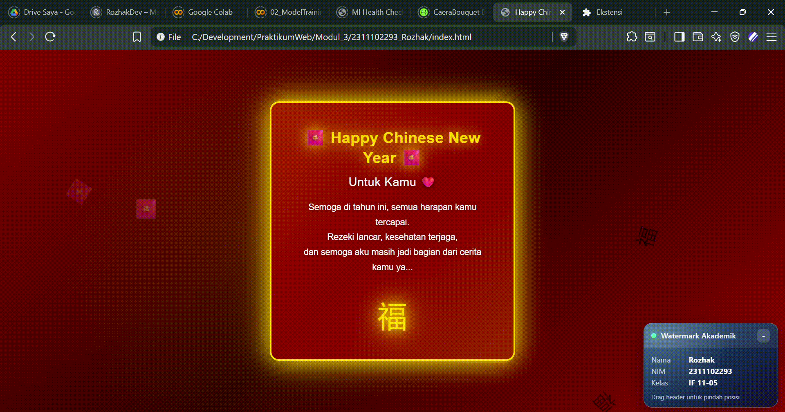

<div align="center">
    <br />
    <h1>LAPORAN PRAKTIKUM <br> APLIKASI BERBASIS PLATFORM </h1>
    <br />
    <h3>MODUL 4 <br> CSS </h3>
    <br />
    
    <br />
    <br />
    <br />
    <h3>Disusun Oleh :</h3>
    <p>
        <strong>Rozhak</strong>
        <br>
        <strong>2311102293</strong>
        <br>
        <strong>S1 IF-11-REG05</strong>
    </p>
    <br />
    <h3>Dosen Pengampu :</h3>
    <p>
        <strong>Dedi Agung Prabowo, S.Kom., M.Kom</strong>
    </p>
    <br />
    <br />
    <h4>Asisten Praktikum :</h4>
    <strong>Apri Pandu Wicaksono </strong>
    <br>
    <strong>Hamka Zaenul Ardi</strong>
    <br />
    <h3>LABORATORIUM HIGH PERFORMANCE <br>FAKULTAS INFORMATIKA <br>UNIVERSITAS TELKOM PURWOKERTO <br>2026 </h3>
</div>
<hr>

## Dasar Teori

**Cascading Style Sheets** (CSS) merupakan bahasa yang digunakan untuk mengatur tampilan dari halaman web yang dibangun menggunakan HTML. CSS bekerja dengan cara mendefinisikan bagaimana elemen HTML ditampilkan di browser melalui kombinasi _selector_ dan _declaration block_, yang berisi pasangan _property_ dan _value_. Dengan CSS, halaman dapat dikontrol secara terpusat sehingga lebih konsisten dan mudah dikelola.

Dalam implementasinya, CSS dapat diterapkan ke dalam HTML melalui tiga cara utama, yaitu _inline_, _internal_, dan _external_. Inline digunakan langsung pada elemen HTML, internal didefinisikan di dalam tag `<style>` pada bagian `<head>`, sedangkan external menggunakan file terpisah dengan ektensi `.css` yang dihubungkan ke HTML. Pendekatan ekternal umumnya lebih direkomendasikan karena mendukung modularitas dan pemisahan antara struktur dan tampilan.

CSS juga menggunakan _selector_ untuk menentukan elemen mana yang akan diberi gaya. Selector dapat berupa tag HTML, atribut `id`, maupun `class`, sehingga memungkinkan pengaturan style yang spesifik maupun reusable. Dengan mekanisme ini, satu aturan CSS dapat diterapkan ke banyak elemen sekaligus.

Selain itu, CSS juga menyediakan berbagai properti untuk mengatur tampilan teks seperti _font-family_, _font-size_, _font-style_, dan _font-weight_, yang berperan penting dalam meningkatkan keterbacaan dan etestika halaman. Pengaturan elemen list juga dapat dikustomisasi menggunakan properti seperti _list-style-type_, _list-style-position_, serta pengaturan jarak menggunakan _margin_ dan _padding_.

CSS juga mendukung pengaturan tata letak teks melalui properti _text-align_ yang memungkinkan perataan teks seperti kiri, kanan, tengah, maupun rata kanan-kiri (_justify_). Dalam aspek visual, CSS memiliki sistem pengaturan warna yang fleksibel, seperti menggunakan _color name_, RGB, HEX, hingga HSL, yang dapat diterapkan pada teks maupun latar belakang elemen.

Terakhir, elemen HTML seperti `<div>` dan `<span>` sering digunakan bersama dengan CSS untuk membangun struktur dan pengelompokan konten. `<div>` digunakan untuk membagi halaman ke dalam beberapa section, sedangkan `<span>` digunakan untuk memberi style pada bagian kecil dari teks dalam satu baris. Kombinasi keduanya memungkinkan pembuatan layout yang lebih terstruktur dan fleksibel dalam pengembangan antarmuka web.

## Tugas 3: Project Bucin (Edisi Imlek)

### 1. Source Code

```html
...
<body>
    <div class="falling">🧧</div>
    <div class="falling">福</div>
    <div class="falling">💰</div>
    <div class="falling">🧧</div>
    <div class="falling">福</div>
    <div class="falling">💰</div>
    <div class="falling">🧧</div>
    <div class="falling">福</div>

    <div class="container">
        <div class="card">
            <h1>🧧 Happy Chinese New Year 🧧</h1>
            <h2>Untuk Kamu ❤️</h2>

            <p>
                Semoga di tahun ini, semua harapan kamu tercapai.<br>
                Rezeki lancar, kesehatan terjaga,<br>
                dan semoga aku masih jadi bagian dari cerita kamu ya...
            </p>

            <div class="symbol">福</div>
        </div>
    </div>
</body>
...
```

**Kode HTML Lengkap:** [index.html](index.html)


```css
...
body {
   ...
}
...
```

**Kode CSS Lengkap:** [css/style.css](css/style.css)

### 2. Penjelasan

Kode HTML membangun struktur halaman dengan dua bagian utama, yaitu elemen dekoratif dan konten utama. Elemen `<div class="falling">` digunakan untuk menampilkan simbol-simbol Imlek seperti 🧧, 福, dan 💰 yang berfungsi sebagai ornamen visual. Eelemen ini tidak memiliki interaksi, namun dikontrol sepenuhnya oleh CSS untuk menciptakan efek animasi jatuh (_falling animation_) sehingga memberikan kesan dinamis pada halaman.

Bagian utama halaman dibungkus dalam `<div class"container">` yang berfungsi sebagai wrapper untuk memusatkan konten. Di dalammnya terdapat `<div class="card">` sebagai komponen utama yang menampilkan ucapan Imlek. Elemen ini berisi (`<h1>`), subheading (`<h2>`), paragraf (`<p>`), serta simbol tambahan (`<div class="symbol">`) untuk memperkuat tema visual.

Pada sisi CSS, digunakan _reset_ dasar untuk menghilangkan margin dan padding bawaan browser agar layout lebih konsisten. Background halaman menggunakan kombinasi _linear-gradient_ dan _radial-gradient_ untuk menciptakan nuansa warna merah khas Imlek dengan efek pencahayaan halus.

Efek animasi menjadi bagian utama pada implementasi ini. Beberapa `@keyframes` seperti `fall-1` hingga `fall-8` digunakan untuk mengatur pergerakan elemen dekoratif dari atas ke bawah dengan variasi awah, rotasi, dan transparansi, sehingga animasi terlihat lebih natural dan tidak monoton. Selain itu, animasi `glow-pulse` dan `border-glow` digunakan untuk memberikan efek cahaya pada teks dan border, sedangkan `rotate-symbol` memberikan pergerakan halus pada simbil.

Layout halaman dipusatkan menggunakan Flexbox melalui properti `display: flex`, `justify-content: center`, dan `align-items: center` pada elemen `body`. Eelemen `.card` didesain menggunakan kombinasi `border`, `border-radius`, `box-shadow`, dan `backdrop-filter` untuk menghasilkan tampilan yang modern dan fokus pada konten utama.

Interaksi tambahan diberikan melalui pseudo-class `:hover` pada `.card`, yang akan memperbesar elemen serta meningkatkan efek glow saat pengguna mengarahkan kursor. Secara keseluruhan, implementasi ini memanfaatkan CSS secara penuh untuk mengatur layout, visual, dan animasi tanpa bantuan JavaScript.

### 3. Output



## Kesimpulan

Penggunaan CSS secara optimal memungkinkan pembuatan halaman web interaktif dan menarik melalui pengaturan layout, visual, dan animasi tanpa memerlukan JavaScript.