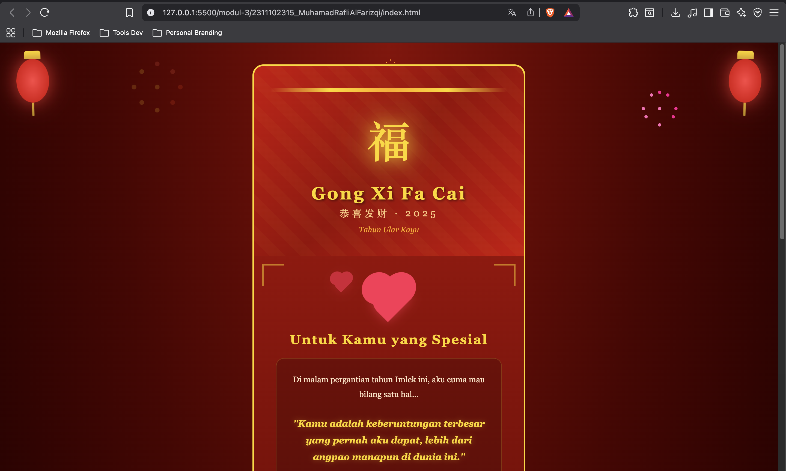

<div align="center">
  <br />
  <h1>LAPORAN PRAKTIKUM <br> APLIKASI BERBASIS PLATFORM </h1>
  <br />
  <h3>MODUL 3 <br> CSS </h3>
  <br />
  
  <br />
  <br />
  <br />
  <h3>Disusun Oleh :</h3>
  <p>
    <strong>Muhamad Rafli Al Farizqi</strong>
    <br>
    <strong>2311102315</strong>
    <br>
    <strong>S1 IF-11-REG05</strong>
  </p>
  <br />
  <h3>Dosen Pengampu :</h3>
  <p>
    <strong>Dedi Agung Prabowo, S.Kom., M.Kom</strong>
  </p>
  <br />
  <br />
  <h4>Asisten Praktikum :</h4>
  <strong>Apri Pandu Wicaksono </strong>
  <br>
  <strong>Hamka Zaenul Ardi</strong>
  <br />
  <h3>LABORATORIUM HIGH PERFORMANCE <br>FAKULTAS INFORMATIKA <br>UNIVERSITAS TELKOM PURWOKERTO <br>2026 </h3>
</div>

<hr>

## Dasar Teori

**Cascading Style Sheets** (CSS) merupakan bahasa yang digunakan untuk mengatur tampilan dari halaman web yang dibangun menggunakan HTML. CSS bekerja dengan cara mendefinisikan bagaimana elemen HTML ditampilkan di browser melalui kombinasi _selector_ dan _declaration block_, yang berisi pasangan _property_ dan _value_. Dengan CSS, tampilan halaman dapat dikontrol secara terpusat sehingga lebih konsisten dan mudah dikelola.

Dalam implementasinya, CSS dapat diterapkan ke dalam HTML melalui tiga cara utama, yaitu _inline_, _internal_, dan _external_. Inline digunakan langsung pada elemen HTML, internal didefinisikan di dalam tag `<style>` pada bagian `<head>`, sedangkan external menggunakan file terpisah dengan ekstensi `.css` yang dihubungkan ke HTML melalui tag `<link>`. Pendekatan external umumnya lebih direkomendasikan karena mendukung modularitas dan pemisahan antara struktur dan tampilan.

CSS juga mendukung berbagai teknik layout modern seperti Flexbox dan Grid yang memungkinkan pengaturan posisi elemen secara fleksibel dan responsif. Selain itu, fitur seperti `@keyframes` dan properti `animation` memungkinkan pembuatan animasi yang menarik tanpa memerlukan JavaScript. Penggunaan properti visual seperti `box-shadow`, `border-radius`, `gradient`, dan `text-shadow` memungkinkan pembuatan desain yang lebih estetis dan interaktif.

## Tugas 3: Project Bucin (Edisi Imlek)

### 1. Source Code

```html
<!DOCTYPE html>
<html lang="id">
<head>
    <meta charset="UTF-8">
    <meta name="viewport" content="width=device-width, initial-scale=1.0">
    <title>Gong Xi Fa Cai - Happy Imlek</title>
    <link rel="stylesheet" href="style.css">
</head>
<body>

    <!-- Lampion kiri dan kanan -->
    <div class="lantern lantern-left"></div>
    <div class="lantern lantern-right"></div>

    <!-- Partikel kembang api CSS -->
    <div class="firework firework-1"></div>
    <div class="firework firework-2"></div>
    <div class="firework firework-3"></div>

    <div class="container">
        <!-- Header -->
        <header class="header">
            <div class="dragon-border"></div>
            <div class="fu-character">福</div>
            <h1>Gong Xi Fa Cai</h1>
            <h2>恭喜发财 · 2025</h2>
            <p class="subtitle">Tahun Ular Kayu</p>
        </header>

        <!-- Kartu Ucapan Bucin -->
        <section class="love-card">
            ...
        </section>

        <!-- Angpao Section -->
        <section class="angpao-section">
            ...
        </section>

        <!-- Footer -->
        <footer class="footer">
            ...
        </footer>
    </div>

</body>
</html>
```

**Kode HTML Lengkap:** [index.html](index.html)

```css
/* Reset & Base */
* {
    margin: 0;
    padding: 0;
    box-sizing: border-box;
}

body {
    font-family: 'Georgia', 'Times New Roman', serif;
    background: radial-gradient(ellipse at top, #8b0000, #4a0000 50%, #1a0000);
    min-height: 100vh;
    display: flex;
    justify-content: center;
    align-items: center;
    padding: 40px 20px;
    overflow-x: hidden;
    position: relative;
}

/* LAMPION */
.lantern {
    position: fixed;
    width: 60px;
    height: 80px;
    background: radial-gradient(ellipse, #ff4444, #cc0000);
    border-radius: 50%;
    top: 30px;
    z-index: 10;
    box-shadow: 0 0 30px rgba(255, 68, 68, 0.6), 0 0 60px rgba(255, 0, 0, 0.3);
    animation: lanternSwing 3s ease-in-out infinite;
}

/* ... */
```

**Kode CSS Lengkap:** [style.css](style.css)

### 2. Penjelasan

Kode HTML membangun struktur halaman ucapan Imlek bertema "bucin" (romantis) dengan beberapa bagian utama. Halaman terdiri dari elemen dekoratif berupa lampion (`lantern-left`, `lantern-right`) dan partikel kembang api (`firework-1`, `firework-2`, `firework-3`) yang ditempatkan secara fixed di layar. Konten utama dibungkus dalam `<div class="container">` yang berisi header, kartu ucapan cinta, section angpao, dan footer.

Pada bagian **header**, ditampilkan karakter Tiongkok 福 (Fu) yang melambangkan keberuntungan, judul "Gong Xi Fa Cai", serta sub-judul dalam aksara Tiongkok 恭喜发财 · 2025. Bagian **love-card** berisi surat cinta dengan ornamen sudut, animasi hati berdetak, kutipan romantis yang di-highlight, serta empat kartu harapan yang disusun dalam grid 2x2. Bagian **angpao** menampilkan amplop merah khas Imlek dengan simbol 囍 (Double Happiness) yang memiliki efek hover interaktif.

Dari sisi CSS, halaman menggunakan `radial-gradient` merah gelap sebagai background utama untuk menciptakan nuansa khas Imlek. Lampion dibuat menggunakan `border-radius: 50%` dengan pseudo-element `::before` dan `::after` untuk bagian atas dan bawah lampion, serta animasi `lanternSwing` untuk efek berayun. Kembang api dibuat murni dengan CSS menggunakan `box-shadow` berlapis untuk menciptakan titik-titik cahaya, dikombinasikan dengan animasi `fireworkBurst` dan `fireworkSparkle`.

Animasi menjadi bagian utama implementasi ini. Terdapat beberapa `@keyframes` yaitu `lanternSwing` untuk efek ayunan lampion, `fireworkBurst` untuk ledakan kembang api, `fuGlow` untuk efek cahaya berkedip pada karakter 福, dan `heartBeat` untuk efek detak jantung pada elemen hati. Semua animasi dibuat menggunakan pure CSS tanpa JavaScript.

Layout halaman menggunakan Flexbox pada `body` untuk memusatkan konten, serta CSS Grid pada section `.wishes` untuk menyusun kartu harapan secara responsif. Halaman juga dilengkapi dengan media query `@media (max-width: 550px)` untuk memastikan tampilan tetap optimal pada perangkat mobile.

### 3. Output



## Kesimpulan

Penggunaan CSS secara optimal memungkinkan pembuatan halaman web interaktif dan menarik secara visual melalui pengaturan layout, warna, dan animasi tanpa memerlukan JavaScript. Kombinasi teknik seperti gradient, box-shadow, pseudo-element, keyframes animation, Flexbox, dan CSS Grid mampu menghasilkan tampilan yang estetis dan responsif, sebagaimana diterapkan pada halaman ucapan Imlek bertema romantis ini.
