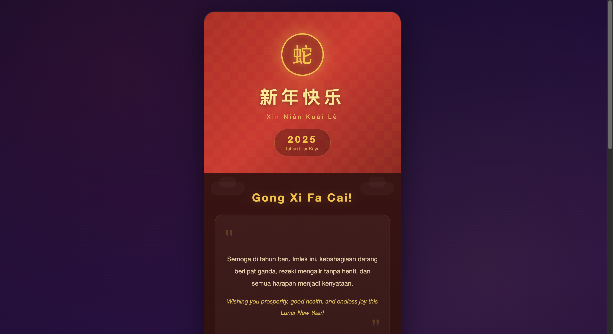

<div align="center">
  <br />
  <h1>LAPORAN PRAKTIKUM <br> APLIKASI BERBASIS PLATFORM </h1>
  <br />
  <h3>MODUL 3 <br> CSS </h3>
  <br />
  
  <br />
  <br />
  <br />
  <h3>Disusun Oleh :</h3>
  <p>
    <strong>Grashela Ayudia Prameswari</strong>
    <br>
    <strong>2311102318</strong>
    <br>
    <strong>S1 IF-11-REG05</strong>
  </p>
  <br />
  <h3>Dosen Pengampu :</h3>
  <p>
    <strong>Dedi Agung Prabowo, S.Kom., M.Kom</strong>
  </p>
  <br />
  <br />
  <h4>Asisten Praktikum :</h4>
  <strong>Apri Pandu Wicaksono </strong>
  <br>
  <strong>Hamka Zaenul Ardi</strong>
  <br />
  <h3>LABORATORIUM HIGH PERFORMANCE <br>FAKULTAS INFORMATIKA <br>UNIVERSITAS TELKOM PURWOKERTO <br>2026 </h3>
</div>

<hr>

## Dasar Teori

**Cascading Style Sheets** (CSS) merupakan bahasa yang digunakan untuk mengatur tampilan dari halaman web yang dibangun menggunakan HTML. CSS bekerja dengan cara mendefinisikan bagaimana elemen HTML ditampilkan di browser melalui kombinasi _selector_ dan _declaration block_, yang berisi pasangan _property_ dan _value_. Dengan CSS, tampilan halaman dapat dikontrol secara terpusat sehingga lebih konsisten dan mudah dikelola.

Dalam implementasinya, CSS dapat diterapkan ke dalam HTML melalui tiga cara utama, yaitu _inline_, _internal_, dan _external_. Inline digunakan langsung pada elemen HTML, internal didefinisikan di dalam tag `<style>` pada bagian `<head>`, sedangkan external menggunakan file terpisah dengan ekstensi `.css` yang dihubungkan ke HTML melalui tag `<link>`. Pendekatan external umumnya lebih direkomendasikan karena mendukung modularitas dan pemisahan antara struktur dan tampilan.

CSS juga mendukung berbagai teknik layout modern seperti Flexbox dan Grid yang memungkinkan pengaturan posisi elemen secara fleksibel dan responsif. Selain itu, fitur seperti `@keyframes` dan properti `animation` memungkinkan pembuatan animasi yang menarik tanpa memerlukan JavaScript. Penggunaan properti visual seperti `box-shadow`, `border-radius`, `gradient`, dan `text-shadow` memungkinkan pembuatan desain yang lebih estetis dan interaktif.

## Tugas 3: Greeting Card Imlek

### 1. Source Code

```html
<!DOCTYPE html>
<html lang="id">
<head>
    <meta charset="UTF-8">
    <meta name="viewport" content="width=device-width, initial-scale=1.0">
    <title>Selamat Tahun Baru Imlek 2025</title>
    <link rel="stylesheet" href="style.css">
</head>
<body>

    <!-- Sakura petals -->
    <div class="petal petal-1"></div>
    <div class="petal petal-2"></div>
    <div class="petal petal-3"></div>
    <div class="petal petal-4"></div>
    <div class="petal petal-5"></div>

    <div class="card">
        <!-- Top Banner -->
        <div class="banner">
            <div class="banner-pattern"></div>
            <div class="zodiac-circle">
                <span class="zodiac-symbol">蛇</span>
            </div>
            <h1 class="title">新年快乐</h1>
            <p class="title-romanji">Xīn Nián Kuài Lè</p>
            <div class="year-badge">
                <span>2025</span>
                <small>Tahun Ular Kayu</small>
            </div>
        </div>

        <!-- Greeting Message -->
        <section class="greeting">
            ...
        </section>

        <!-- Wish Cards -->
        <section class="wish-grid">
            ...
        </section>

        <!-- Lampion -->
        <section class="lampion-row">
            ...
        </section>

        <!-- Lucky Envelope -->
        <section class="envelope-section">
            ...
        </section>

        <!-- Footer -->
        <footer class="footer">
            ...
        </footer>
    </div>

</body>
</html>
```

**Kode HTML Lengkap:** [index.html](index.html)

```css
/* Reset & Base */
* {
    margin: 0;
    padding: 0;
    box-sizing: border-box;
}

body {
    font-family: 'Segoe UI', 'Helvetica Neue', Arial, sans-serif;
    background: linear-gradient(160deg, #1a0a2e, #2d1045, #1a0a2e);
    min-height: 100vh;
    display: flex;
    justify-content: center;
    align-items: center;
    padding: 30px 15px;
    overflow-x: hidden;
    position: relative;
}

/* SAKURA PETALS */
.petal {
    position: fixed;
    width: 12px;
    height: 12px;
    background: radial-gradient(circle, #ffb7c5, #ff8fa3);
    border-radius: 50% 0 50% 0;
    opacity: 0.6;
    animation: petalFall 8s linear infinite;
    z-index: 1;
}

/* ... */
```

**Kode CSS Lengkap:** [style.css](style.css)

### 2. Penjelasan

Kode HTML membangun struktur halaman kartu ucapan Tahun Baru Imlek 2025 (Tahun Ular Kayu) dengan desain modern dan elegan. Seluruh konten dibungkus dalam `<div class="card">` yang berfungsi sebagai kartu utama. Di luar kartu, terdapat lima elemen kelopak sakura (`petal-1` hingga `petal-5`) yang ditempatkan secara fixed sebagai dekorasi latar.

Pada bagian **banner**, ditampilkan lingkaran zodiak berisi karakter Tiongkok 蛇 (Ular) sebagai simbol shio tahun 2025, judul utama 新年快乐 (Xīn Nián Kuài Lè) yang berarti "Selamat Tahun Baru", serta badge tahun 2025 dengan keterangan "Tahun Ular Kayu". Bagian **greeting** berisi pesan ucapan dalam Bahasa Indonesia dan Bahasa Inggris yang ditampilkan dalam kotak kutipan dengan tanda petik dekoratif. Bagian **wish-grid** menampilkan empat kartu harapan (Hoki & Rezeki, Sehat & Kuat, Damai & Bahagia, Sukses & Berkah) yang disusun dalam grid 2x2.

Selain itu, terdapat section **lampion-row** yang menampilkan deretan lima mini lampion dengan animasi naik-turun, serta section **envelope** yang menampilkan amplop angpao merah dengan segel emas berisi karakter 福 (Fu/keberuntungan) yang memiliki efek hover interaktif. Bagian **footer** menampilkan garis emas dekoratif, teks Tiongkok 恭喜发财 · 万事如意, serta identitas pembuat.

Dari sisi CSS, halaman menggunakan `linear-gradient` bernuansa ungu gelap sebagai background utama dengan overlay `radial-gradient` untuk efek pencahayaan halus. Kelopak sakura dibuat dengan `border-radius: 50% 0 50% 0` dan animasi `petalFall` untuk efek jatuh berputar. Kartu utama menggunakan gradient merah gelap dengan `box-shadow` berlapis untuk efek kedalaman.

Animasi menjadi elemen penting dalam desain ini. Terdapat beberapa `@keyframes` yaitu `petalFall` untuk efek kelopak sakura berjatuhan, `circleGlow` untuk efek cahaya berkedip pada lingkaran zodiak, `lampionBob` untuk efek lampion naik-turun, dan `sealPulse` untuk efek berdenyut pada segel amplop. Semua animasi dibuat menggunakan pure CSS tanpa JavaScript.

Layout halaman menggunakan Flexbox pada `body` untuk memusatkan kartu, serta CSS Grid pada section `.wish-grid` untuk menyusun kartu harapan secara responsif. Halaman dilengkapi dengan media query `@media (max-width: 480px)` untuk memastikan tampilan tetap optimal pada perangkat mobile, termasuk penyesuaian ukuran font, padding, dan perubahan grid menjadi satu kolom.

### 3. Output



## Kesimpulan

Penggunaan CSS secara optimal memungkinkan pembuatan halaman web interaktif dan menarik secara visual melalui pengaturan layout, warna, dan animasi tanpa memerlukan JavaScript. Kombinasi teknik seperti linear-gradient, radial-gradient, box-shadow, pseudo-element, keyframes animation, Flexbox, dan CSS Grid mampu menghasilkan kartu ucapan Imlek yang estetis dan responsif, dengan elemen dekoratif seperti kelopak sakura, lampion, dan amplop angpao yang menambah nuansa perayaan Tahun Baru Imlek.
